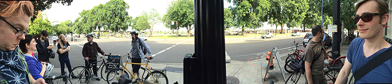

In my ***not so humble opinion*** every conference should have a bike ride. But I realize it isn't always possible. This is one of the ways conferences that Troy & I put on here in Portland are very different. We have a love for Portland; *the energy, the chill, vibrant yet relaxed, laid back, bike like, walking friendly city that it is*. It's a beautiful city that really can only be seen or felt by active transportation. If you walk, run, bike, skate board, dog sled, sled, cross country ski, or otherwise travel around Portland you get to actually see, feel, and hear this city. No other mode really works. Transit is fun, driving is like a cage, and with both you miss the vast majority of the life and blood of what makes Portland a great city!

## .NET Fringe Bike Ride

With all that said, obviously we're having a bike ride at .NET Fringe! I'll be the lead, and give everybody a solid tour around some key parts of the city. I'll show you all some odd things, weird stuff, probably some strange people, architecture and other elements and features of this place called Portland! Here's the details:

1. Anybody can join the ride, even people that aren't attending .NET Fringe. If we have 3 people ride or 500, it doesn't matter, we'll have a good roll about town.
* BYOB - Bring Your Own Bike AKA Bring Your Own Beer. For us, it means both. This might sound complicated, but I promise it's not. There are a zillion places to rent a bike in about 20 seconds. Links below where to pick up a ride of your choice for the ride about the city.
* Show up at the designated location (also listed below) at the designated time (also listed below).
 
***That's it!***

I'll summarize these simple steps to simply say "Just show up!" This isn't a spandex crowd ride, this is a people chillin' in Portland ride, so don't worry nobody is getting left behind. We'll enjoy some coffee, probably a beer, the city, and maybe a chat or three about the latest in tech, code patterns, and other miscellaneous hot topics like IoT not spamming your wifi and burning your muffins!

Before renting a bike though, check out the options at the hotel you're staying. Many if not most hotels in Portland have nice bikes that you can use for free. The Ace Hotel, Hotel Rose, and others all have a number that are freely available to guests of the hotel. 

So, in lieu of a bike access at hotel, home, friends, or otherwise, some great places to get bike rentals:

* [Waterfront Bike](http://www.waterfrontbikes.com/) - Located on [10 SW Ash St #100, Portland, OR 97204](https://www.google.com/maps/place/Waterfront+Bicycle/@45.522373,-122.6809235,15z/data=!4m8!1m2!2m1!1sbike+rentals!3m4!1s0x0:0xbed7f9780615f52d!8m2!3d45.5213399!4d-122.6709741).
* [Pedal Bike Tours](http://www.pedalbiketours.com/) - Located on [133 SW 2nd Ave, Portland, OR 97204](https://www.google.com/maps/place/Pedal+Bike+Tours/@45.522373,-122.6809235,15z/data=!4m8!1m2!2m1!1sbike+rentals!3m4!1s0x0:0x6c1861d1ea8716e0!8m2!3d45.5216706!4d-122.672739)
* [Cycle Portland Bike Tours & Rentals](http://portlandbicycletours.com/) - Located on [117 NW 2nd Ave, Portland, OR 97209](https://www.google.com/maps/place/Cycle+Portland+Bike+Tours+%26+Rentals/@45.522373,-122.6809235,15z/data=!4m8!1m2!2m1!1sbike+rentals!3m4!1s0x0:0xed9ef696a5172958!8m2!3d45.5241437!4d-122.672562)

We'll meet at the waterfront here @ [100 SW Naito Parkway](https://www.google.com/maps/@45.5213697,-122.6699997,19.25z) and depart at **[[UPDATED `5:15pm`]] ** on Sunday.

The ride path is a secret (mostly because we'll be JIT via dynamic path finding along the route). However, I can say it'll be low car volume, easy paths, and minimal hills (Portland is mostly flat by Cascadian standards).

See all of ya out there!