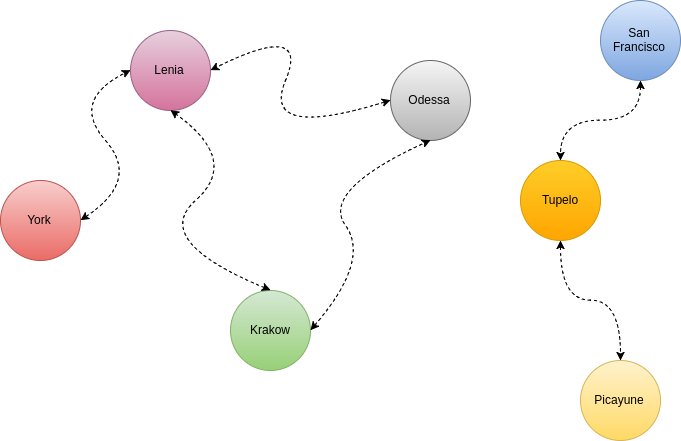

Alright, there's this one algorithm that I've solved before. It popped into my head recently and I wanted to recollect how it went, but my Google-fu wasn't so great. In the end, I didn't find the algorithm problem statement but I've recollected it as best as I could from memory.

There once was a nation with a number of cities. Every citizen has access to every city and every city has a town center for all the citizens to enjoy. Recently the roads were damaged from a lack of maintenance work, ya know, like in real life. So now none of the cities have reachable town centers anymore! The citizens are angry and demand immediate fixes to their roads! The leaders have decided that the roads shall be repaired, and have hired you to assist!

The nation has n cities, we'll number 1 to n. The cities have two way roads, totalling m roads. A citizen has access to the town center if: their city contains a town center and their city has a road to travel from their city with a town center to another city with a town center.

The following is a map of this great nation of cities with currently impassable roads that must be repaired.

The cost of road repair is croad and to build a town center is ctown center. To start off with, you're given q queries, where each query consists of a map of the nation and the value of croad and ctown center. For each of the queries the minimum cost of a town center accessible to all the citizens should be printed on a line.

The input format

Problem kind of like this.

https://www.hackerrank.com/challenges/torque-and-development/problem