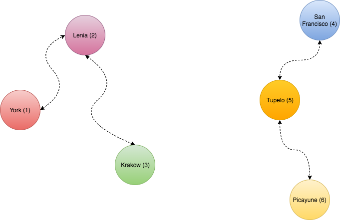
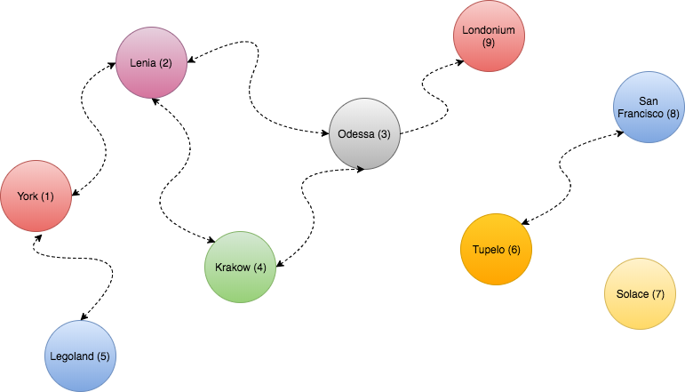

Alright, there's this one algorithm that I've solved before. I've always found it to be a rather fun exercise to work out. It popped into my head recently and I wanted to recollect how it went, but my Google-fu wasn't so great. In the end, I didn't find the algorithm problem statement but I've recollected it as best as I could from memory. If you know what the name of this challenge is I'd love to know what it's called or if I've put it back together correctly. Ping me [@Adron](https://twitter.com/Adron).

So the story goes something like this. There once was a nation with a number of cities. Every citizen has access to every city and every city has a town center for all the citizens to enjoy. Recently the roads were damaged from a lack of maintenance work, ya know, like in real life. So now none of the cities have reachable town centers anymore! The citizens are angry and demand immediate fixes to their roads! The leaders have decided that the roads shall be repaired, and have hired you to assist!

The nation has n cities, we'll number 1 to n. The cities have two way roads, totalling m roads. A citizen has access to the town center if: their city contains a town center and their city has a road to travel from their city with a town center to another city with a town center.

The following is a map of this great nation of cities with currently impassable roads that must be repaired.


<span class="more"></span>

The cost of road repair is c<sub>road</sub> and to build a town center is c<sub>town center</sub>. To start off with, you're given q queries, where each query consists of a map of the nation and the value of c<sub>road</sub> and c<sub>town center</sub>. For each of the queries the minimum cost of a town center accessible to all the citizens should be printed on a line.

## The Input

The first line is an integer, *q*, denoting the number of queries. The subsequent lines describe the queries in a particular format. Each query is basically formatted like this:

* The first line of each set for a query will have four integers describing the number of cities *n*, the number of roads, *m*, and the cost to build a town center c<sub>town center</sub>, and the cost to repair a road c<sub>road</sub>. Each integer is space seperated.

* Each line following that will have two integers describing a road for use between cities *u<sub>i</sub>* and *v<sub>i</sub>*. Each integer is space seperated.

## The Output

Each query should have a result displayed that is the integer denoting the minimum cost of making town centers accessible to all the citizens.

The following example includes three queries (denoted by the first line having a 3). The subsequent queries then have a definition line of [6,4,2,1], [2,2,2,2], and [6,6,2,5] respectively. Then below those query definition lines are the road definitions between the cities, and respectively the town centers.

**Sample Input**

```
3
6 4 2 1
1 2
2 3
4 5
5 6
7 6 2 1
1 2
2 3
3 4
2 4
5 6
6 7
9 7 3 4
1 2
1 5
2 4
2 3
3 9
6 8
```

Alright, this one has a nubmer of elements to resolve. Here’s how I’ve worked through these three samples to get answers. I’ve drawn out the three examples so that there is a visual understanding of where the cities are also.

The first nation described by the section [6 4 2 1] would look something like this based on the road data of [1,2], [2,3], [4,5], and [5,6].



The next nation in section [7,6,2,1] would look like this with the road data of [1,2], [2,3], [3,4], [2,4], [5,6], and [6,7].


The last nation defined as [9,7,3,4] with road data of [1,2], [1,5], [2,4], [2,3], [3,9], and [6,8] looks like this.



**Observations and Solutions**

*Dataset 1*

Here’s how I worked these out. In the first example there are n=6 cities, m=4 roads connecting those cities, with the price of building a town center set at c<sub>town center</sub> = 2 and the price to repair a road set at c<sub>road</sub> = 1. To meet the requirement of having access to a town center in every city, I could acheive this through several options, which I can then pick the cheapest from those options.

Rebuild the roads and build one town center in each connected part of the nation. In this scenario that would included 4 roads at 1 cost each, and one town center in each island of the nation at 2 cost each. The total would equal

roads x c<sub>road</sub> = total

4 x 1 = 4 to rebuild the roads.

cities x c<sub>town center</sub> = total

2 x 2 = 4

total c<sub>road</sub> + total c<sub>town center</sub> = combined total.

4 + 4 = 8

The next option would be to possible just rebuild town centers in each city and not rebuild the roads. This is quick to determine the cost of, as it just requires calculating the town center cost.

cities x c<sub>town center</sub> = total

6 x 2 = 12

Out of the two solutions, the cheapest is to go with option one, rebuilding the roads and building one town center for access in each of the island segments of the nation.

*Dataset 2*

Alright, the next data set shows a city of 7 cities, among two islands, and 6 roads connecting those cities. Just a quick look, I'm guessing this one will work out the same as the first one. Working through I could build town centers in each city.

cities x c<sub>town center</sub> = total

7 x 2 = 14

But I could also rebuild road [1,2], [2,4], and [2,3] on the left island with a single town center build, which would mean I need one town center and three roads for island one. The second I could build one town center in Tupelo and then rebuild road [5,6] and [6,7]. Total is two town centers and five roads.

Town centers would cost 2 x 2 = 4. The roads would be 5 x 1 = 5, adding 5 and 4 gives a total of 9 to rebuild enough so that all cities can regain access to a town center.

*Dataset 3*

This third dataset has three island areas. The first has 6 cities with 6 roads. The next island has 2 cities and 1 road, and then final island has one city with no roads. This last city, Solace, just needs a town center built to gain access to a town center.

For the island with two cities will need at least one town center. But with the prices increased let's take a look to be sure. If I replace one town center, we'll say in Tupelo, and rebuild the road that would be c<sub>town center</sub> of 3 and road cost of 4 giving a total cost of 7. But if I rebuild a town center in San Francisco and Tupelo, that would only be 6. The previous plus this solution gives me three town centers at a cost of 5.

Now considering the last island segment I have 6 cities, and a number of roads that in some cases connect just one city. For the stretch that connects Legoland and York I could rebuild a town center in York, then the road [1,5] and [1,2] which would give Lenia, Legoland, and York direct access to a town center. The total would be 3 + 4 + 4 = 11 for a single town center and two roads. Then looking at things, the cheap scenario would be to rebuild a town center in Odessa and road [3,4] and [3,9] for another 11 total. Overall for this island of cities within the nation I'll have 4 roads rebuilt with 2 town centers, for a total of 22 cost.

Adding that together for the entire nation of Dataset 3, that's 22 + 5 + 3, giving a total cost for direct access to town centers of 30 cost.

The question now is, what's the best algorithm to solve all of this. I'm going to make this algorithm a two parter, because this is such a whopper of a problem to lay out that I'll give readers a chance 

**Sample Output**

With each of these resolved, the output of the algorithm should print to stdout with the following results.

```
8
9
30
```

So... what's your take on this one. If you build a solution, I'll blog it and post in my solution post in a few days. Let me know and we'll sync up on it and talk about what an ideal solution might look like. Ping me [@Adron](https://twitter.com/Adron).