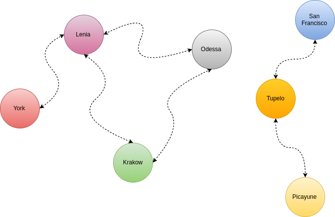

Alright, there's this one algorithm that I've solved before. I've always found it to be a rather fun exercise to work out. It popped into my head recently and I wanted to recollect how it went, but my Google-fu wasn't so great. In the end, I didn't find the algorithm problem statement but I've recollected it as best as I could from memory. If you know what the name of this challenge is I'd love to know what it's called or if I've put it back together correctly. Ping me [@Adron](https://twitter.com/Adron).

So the story goes something like this. There once was a nation with a number of cities. Every citizen has access to every city and every city has a town center for all the citizens to enjoy. Recently the roads were damaged from a lack of maintenance work, ya know, like in real life. So now none of the cities have reachable town centers anymore! The citizens are angry and demand immediate fixes to their roads! The leaders have decided that the roads shall be repaired, and have hired you to assist!

The nation has n cities, we'll number 1 to n. The cities have two way roads, totalling m roads. A citizen has access to the town center if: their city contains a town center and their city has a road to travel from their city with a town center to another city with a town center.

The following is a map of this great nation of cities with currently impassable roads that must be repaired.



<span class="more"></span>

The cost of road repair is c<sub>road</sub> and to build a town center is c<sub>town center</sub>. To start off with, you're given q queries, where each query consists of a map of the nation and the value of c<sub>road</sub> and c<sub>town center</sub>. For each of the queries the minimum cost of a town center accessible to all the citizens should be printed on a line.

## The Input

The first line is an integer, *q*, denoting the number of queries. The subsequent lines describe the queries in a particular format. Each query is basically formatted like this:

* The first line of each set for a query will have four integers describing the number of cities *n*, the number of roads, *m*, and the cost to build a town center c<sub>town center</sub>, and the cost to repair a road c<sub>road</sub>. Each integer is space seperated.

* Each line following that will have two integers describing a road for use between cities *u<sub>i</sub>* and *v<sub>i</sub>*. Each integer is space seperated.

## The Output

Each query should have a result displayed that is the integer denoting the minimum cost of making town centers accessible to all the citizens.

The following example includes three queries (denoted by the first line having a 3). The subsequent queries then have a definition line of [3,2,2,1] and [6,6,2,5] respectively. Then below those query definition lines are the road definitions between the cities, and respectively the town centers.

**Sample**

```
3
3 3 2 1
1 2
3 1
2 3
7 5 2 5
1 2
2 3
3 4
5 6
6 7

```

Alright, this one is kind of an oddball set of elements to resolve.  Here's how I've worked through these samples. I've drawn out the three examples so that there is a visual understanding of where the cities are also.


**Sample Output**

```
```

Alright, so here's how I've worked through these samples. In the sample there are two queries and having two queries I'll get two responses, one for each. The Nation contains 3 cities connected by 3 roads, the cost of a town centers is 2 and the road cost is 1. These are the cheapest roads and town centers on the entire planet full of nations, a great win for us all! The least expensive way to get access to town centers in all of the cities in the first nation is to build or repair two of the roads. That is, I'll build a town center in the city of Lenia, then repair the road from Lenia to Odessa, then the road from Odessa to Krakow. That makes a total cost of 2 + 1 + 1 = 4.

In the second example...


Observation 
We can't build new roads in HackerLand; we can only repair existing ones; however, when repairing roads, we need to be cognizant that there is no guarantee that each and every city is connected, meaning the graph may be disconnected and groups of cities will form. For example, a group of  cities might be connected to each other, but not connected to  other cities that are only connected to one another. We'll call each of these groups components, and in order to solve the whole problem we'll need to solve the components individually.

Observation 
Each component needs at least one library. Without a library in one of the component's cities, there is no way for the cities in the component to access a library.

Conclusion
With these observations taken into account, there are two ways to assemble a component:

A library must exist in at least one city, so  roads must be repaired (where  is the number of cities in the component).
A library must exist in every city in a component, meaning that no roads need to be repaired. We choose this option when the cost of building a library is less than the cost of repairing a road.
The minimum cost for each component will either be  when we repair roads, or  when we build a library in each city. Choosing the option that is smallest and summing it with all of the other smallest options for each component yields the value of the cheapest solution. If the cost for repairing a road and building a library are the same, the two approaches will be equal (meaning both options are equally valid).
