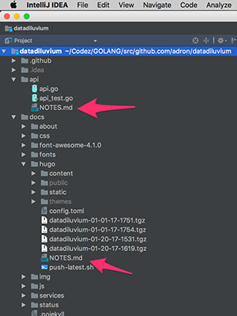

I always aim to be a good a student and teacher. To be a proficient and effective student and teacher, I've realized long ago I must strive to be good at both. Without this effort, I'd never truly understand or gain proficiency in either position.

In addition to striving to improve myself as a student or teacher, I always finds myself continuously learning. There is never a known end, as I'm always searching for a new best, a new level of proficiency, or even a new definition of what these things are. As such, I work diligently to take mental notes during my own efforts to become a better teacher or to improve my study as a student. It's hard work, as most things that are worthwhile in life are. This hard work however, is definitely one of the top things I enjoy in life. Learning to me is something I cherish in the extreme!

On that note, here's a few of the things that I've found that have helped me to learn effectively. I offer them as is, and everybody's use may vary in effectiveness. If you've got any suggestions or practices of your own, please email, tweet ([@Adron](https://twitter.com/adron)), or message me with them. I'm always happy to discuss new ways two to better my learning and teaching.

<span class="more"></span>

## 1. Notes / Note Taking in Projects

One thing I've found very useful in software projects is to find a way to take parallel notes. These could be perceived as *comments* except I've made a few slight modifications. Instead of adding these in code files, they're more project or project folder specific comments, so I don't place the files in comments in actual code files. The following is a list of characteristics of where I put these notes and the practices I follow to create them.

<div class="image float-right">
    [](https://github.com/adron/datadiluvium)
</div>

*Where*

I've found, when working through a project I like to have two specific spaces where notes go. One is in the root and any directories of the project where there are additional snippets of information needed. I usually just title these files *NOTES.md* and encourage anybody involved in the project to add their own personal notes for anybody to read. This adds context of what is going on and helps provide insight for anybody working in a project.

*How*

I tend to write notes as quick blurbs of what is in the directory or project, notes that wouldn't particularly be in a README.md file. They're more of a *[stream of consciousness](https://en.wikipedia.org/wiki/Stream_of_consciousness_(narrative_mode))* style. The primary focus is to write them concise, but quicly, for future reference. Helping to prevent one from forgetting what and why certain things are in a directory, specifically a directory in which is manually created for documentation or something somewhat outside of the normal application code flow, similar to [this](https://github.com/Adron/datadiluvium/blob/master/docs/hugo/NOTES.md).

In a Go, C#, Java, C, C++, or related compilable language these files don't get built into the final binary. However in something like JavaScript the files may get included when zipped up to be deployed or may increase the likelihood of secrets or other information that should not be public becoming public. By association be sure that these files won't cause an actual problem later on in the project. Generally there's a small chance compared to the advantage of actually having some relevant project notes inside the actual project. But one has to keep these responsibilities in mind.


> Take notes in projects (even trash projects, as I write about below). Write from a *[stream of consciousness](https://en.wikipedia.org/wiki/Stream_of_consciousness_(narrative_mode))* style and it will work to reinforce what you're observing and learning in the projects as well as working to provide a path to understanding for prospective maintainers in ongoing projects!

## 2. Trash Projects

When learning, one of the best ways to get used to how parts of a language and respective technology stack perform and behave is to actually build things with the language and respective tech stack. For instance, when learning JavaScript I wrote a lot of completely garbage code just to try out the language. Sure, I had read things like *[JavaScript: The Good Parts](http://shop.oreilly.com/product/9780596517748.do)* and even the gargantuan *[JavaScript: The Definitive Guide](http://shop.oreilly.com/product/9780596805531.do)*, but I really had not set certain things into memory until I started writing code.

One example, if I check for the type of NaN (Not a Number) I get 'number'. That does't really make logical sense based on what NaN stands for. But alright, what about NaN equaling NaN? That's false, even though it clearly appears as if it is the same thing.

```javascript
> typeof NaN
'number'
> NaN==NaN
false
```

These are side effects, while reading the guides and good parts books I wouldn't have realized without actually testing the code and realizing these oddities exist. Of course when I stop and think, having read the material in the books, I realize that NaN does not equal NaN because these are two different actual objects, part of the crux of mutable imperative object creation eh!

So building tons of throwaway trash projects is hugely important. I have to fight against the urge to "build a cool working project that does X and open source it" syndrome and just focus on testing out bits of code a time until I can effectively and proficiently write are large degree of functionality using the features and concepts inherent to a language and the underlying technology stack. The best and quickest way isn't to fight building a larger projet but instead build many small *trash projects*.

> Build lots and lots of trash projects to focus in on the behavior and features of a language or technology.

## 3. When Beginning, Skip Videos

I suppose it depends on what one's learning style really is and it is also odd coming from me that I'd say skip videos (because of [this](https://www.pluralsight.com/authors/adron-hall) and [this](https://vimeo.com/channels/thrashingcode)). Even though I produce Videos and find they can be used to learn things, there's a catch. Video content is generally horrible at providing large amounts of information with specific detail in the time it takes to watch a video. There are certain nuances that video is good at, but overall they just don't work for effective, quick, and intensive deep dives into particular technology.

In that vein, videos are horrible as stand alone learning mediums, skip them. Focus on written material, with details about things and going back to *trash projects* create and work with hands on implementation of code and technologies. If a video is a small complement or has lots of written collateral, testing, and other mediums used in conjunction with the video it might work out ok, but otherwise focus on other things and skip the videos when starting in on a new language or tech.

> Skip videos when starting out and gain some proficiency around actual implementation first, this has worked excellently for me and I've found it tends to work well for gaining productiveness quickly with a language or technology.

## 4. Mixing Theory & Implementation

As above I mentioned focusing on implementation of code, referring to it as *trash projects*, which is a great way to really dig into the nuances of things. However at a certain point the theory of particular design practices and languages must be understood or a solid proficiency just isn't going to be attained. That's where mixing theory and implementation becomes fundamental. I've found that I need to do more reading on the why and what for of a language or technology once I've gotten fairly fluent in implementing things with a language or technology.

> When learning, once proficient with a language, be sure to dive deep into why and how the language actually works to gain even more proficiency with the language.
