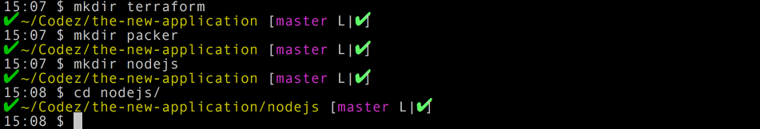
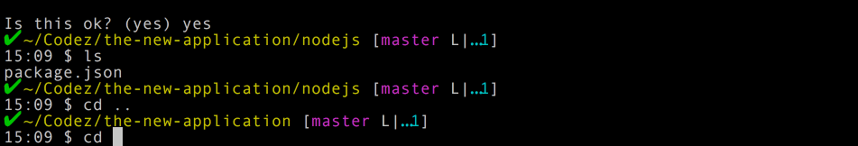

Context: What is the [Autopilot Pattern](http://autopilotpattern.io/#how-do-we-do-it)?

> The autopilot pattern automates the lifecycle of each component of the application. Whether we architect our application as a single container, in tiers, or as microservices, each container that makes up the application has its own lifecycle, and its own set of actions that are necessary during that lifecycle. Each of these application components are often applications in themselves, like a database server, in-memory cache, or the reverse proxy that fronts our application, in addition to the Node.js, Python, Ruby, or other code that makes the set of components a complete application.

The only caveat I would add here is that *containers* are largely irrelevant as long as your infrastructure virtualization is programmatic controlled. Of course, hyper-visor based virtualization can be more troublesome or simplify things when building out infrastructure programmatically or from a configuration based perspective. Whatever the case, use what works for your situation. The larger point of all this is to automate things for consistency, reliability, and repeatability.

The way I have started to break out applications into the autopilot pattern is based on what I've dubbed three eras:

## Iron Throne Era

In this era has a deluge of nightmarish problems. You might as well as just give up the quest for the throne during this era. Hardware that isn't programmatic plagues this era. Networking that needs manually configured or applications that don't even understand basic TCP/IP Networking or related communications throw a massive barrier into full automation in this era.

## Renaissance Era

This era is when things started getting good. I like to think of this era as starting right around 2007, when automation started to take a much bigger step forward with all sorts of things we could actually automate. AWS launched in 07' and from there, more networking automation, tooling, and application tooling exploded with the first semblances of real PaaS coming to fruition.

## Iron Man Era

This era is where we are now. With a plethora of methods to automate networks, applications, deployments, integration, and whatever else that comes up. We've gotten to a stage where having viable technology options aren't the problem anymore. Our question now just lie around how and in which way do we organize, use, and get sorted our various fully automated application deployments.

<span class="more"></span>

Let's take a look at the applications from each of the eras.

# Iron Throne Era Application


Yup, so done with that era's app. It's best left in the past.

# Renaissance Era

So let's talk about this era in respect to the autopilot pattern. There's still likely to be one or two little pieces here or there that *might* not be automated, but it should be an extreme rarity in this era.

In this era we might have an ASP.NET MVC Application with a front end using Node.js to build the UI components for deployment. To specifically distinct build operations need to occur. Often this part of the over solution would at least be in one project repository or working directory. Often, and this is where we run into one of the most common plights of today's devops or developer team. The application is in one directory but the server instances are deployed either manually or in a way that requires regular interaction and manipulation.


Working through this application working toward deployment often looks like this for this application.

*Application Build Starts*

-> Continuous Integration (passes)

-> Pipeline Checks Pass

-> Existing Infrastructure Receives Executing Code

In this era, the infrastructure is autonomous - almost entirely - of the application that actually runs on the infrastructure. The process for deployment of the infrastructure generally follows an approach like this.

*OS Installed or Image Created/Started*

-> Server installed (Apache, Nginx, IIS, Etc)

-> Networking setup appropriately for DNS/Routing/Etc.

-> Structure setup and built/deployment code is placed on server

Of course each of these flows are simplified. What I'm drawing an emphasis to is that they're autonomous but must work in conjunction form the perspective of either repositories (folders or wherever they're stored). Another thing to think about, is that the application cant' actually deploy itself, nor can the infrastructure do anything without the application. This is obvious, but if you think about it for a moment, this is actually how we commonly store and organize our applications today. The code is in one repository and the infrastructure bits are shoved off in some other folder or repository somewhere else. This type of organization defines the very essence of the disconnected nature of this era's efforts to automate application deployment and infrastructure.

# Iron Man Era
***and onward to the Jarvis Era***

Alright, this is the era we're at now. This is the era I'm really looking forward to speaking with people about and coming up with today and tomorrow's solutions!

Forget the disparate nature of the renaissance era. Think of the core principles behind the [Autopilot Pattern](http://autopilotpattern.io/). This is the era where things start to come together. Things are still somewhat in distinct repositories but sometimes might not be (more on that later). But things in this era are brought together via a systemic delivery mechanism, commonly referred to as continuous delivery. The organization of these applications, infrastructure, and related projects are more unclear then some of the limited, vertically developed applications of the renaissance era apps. Why not add the infrastructure markup, code, networking, or other related elements to the code repository? Isn't that the idea behind devops originally anyway? Whatever the intent, here's my proposals for this below, using a Node.js Application.

# Iron Man Era Autopilot Pattern Application Structural Organization

Wow, that was a heckuva section title eh!

First thing I always do is create a directory, change into that directory and run git init and create an ignore file. I generally go ahead and throw in the most important file of all to ignore at this point, the nefarious .DS_Store file.

```shell-script
mkdir whatever-the-app-is
git init
touch .gitignore
nano .gitignore
```

*...add stuff and save it...*

```shell-script
git add -A
git commit -m 'First commit!'
```


After that, I create three directories: terraform, packer, and nodejs.


From here I create the application project that I'll develop from.



Then the final step is to setup the infrastructure parts of the application.



## A Few of the Key Advantages

1. With all of the core elements of the application combined; infrastructure, application code, configuration, and others combined there isn't the confusion about where X or Y repo is located in relation to the overal project. Everything that is needed for the application, for it's deployment, for it's development, and for the future of the application is included in the repository.
2. When working on this code repository, it is in essence practicing what is preached with regard to the ideals of *DevOps*. Having the infrastructure and application code together truly does bring together development and operations.
3. Communication, pending of course source control practices and workflow are followed, is drawn together even more among the individuals who would be working on the code for the application or infrastructure or whatever element of the solution.
4. The continuous integration (CI) and delivery (CD) services now don't need multiple authentication credentials or keys to go out and pull together the code, infrastructure, and related elements. Instead we're down to one repository that then can be deployed via CD to whatever would host the infrastructure.

## The Conversation

So is setting up directories and tossing the respective elements into the project the best way to do this? It may be, it may not be, but it's one possible solution. The idea however to bring these things together in a way where they seamlessly work together demands some type of way to connect the architectural elements. Putting them in one repository is one distinctive solution. Another possible solution might be to have a parent repository that collects other repositories together that would have the respective infrastructure, application, and related glue code.

Recently with the talk "[Organizing Infrastructure Configuration and Workflow](http://blog.adron.me/talks/Organizing-Infrastructure-Config-and-Workflow/)" at HashiConf, Evan, myself and many others have started to discuss additional ways to put together the meat and potato basics of these applications. I believe I might even have to dub it something new, as it appears the collection of these things could bring together a truly better way to build and deploy applications consistently, reliably, with higher levels of quality.
