<div class="image float-right">
    
</div>

* *Part 1* – [Setting up an AWS SQS Queue for Use With Node.js Beanstalk Worker Instances](/articles/setting-up-an-aws-sqs-queue-for-use-with-node-js-beanstalk-worker-instances)
* *Part 2* – [Setting up a Hapi.js App that sends work to a Node.js AWS Worker via SQS](/articles/hapijs-aws-worker-publish/)
* *Part 3* – [AWS Beanstalk Worker with Node.js and SQS](/articles/aws-beanstalk-worker-with-node-js-and-sqs/) (This is the current article you're reading now)

First I created a project for the node.js worker. The first steps for this are identical to that of creating the Hapi.js site that publishes messages to the queue. Go through these three steps for the worker and then I'll continue from there.

* First [create the web application](/articles/hapijs-aws-worker-publish#webapplication) which will act as our worker service. I gave mine the name of [testing-aws-sqs-worker](https://github.com/Adron/testing-aws-sqs-worker), the site publishing to the queue I called [testing-aws-sqs-site](https://github.com/Adron/testing-aws-sqs-site).
* Next [add dependencies needed](/articles/hapijs-aws-worker-publish/#mocha), like mocha.
* Finally make sure the [AWS environment variables](/articles/hapijs-aws-worker-publish/#aws) are set appropriately.

*...and now on to the security, configuration and worker specific parts of this series...*

<span class="more"></span>

**Security Needs**

Before getting the actual worker setup I need to have a role setup in IAM (

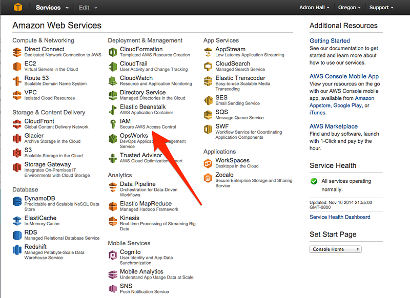

Once here click on the Roles section of IAM. Then click on Create New Role.

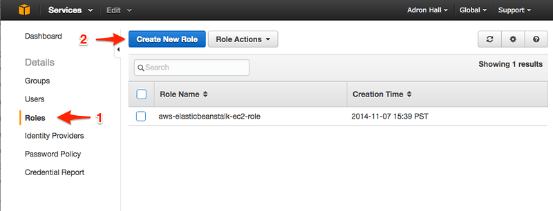

Next set the role name.

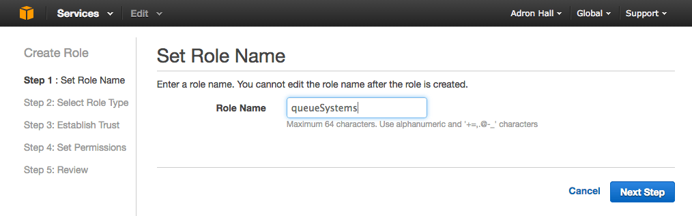

Now select Amazon EC2 here. I noted this wasn't immediately intuitive. But once I realized that the security item I'm looking for is a sub-item under Amazon EC2 things made more sense.

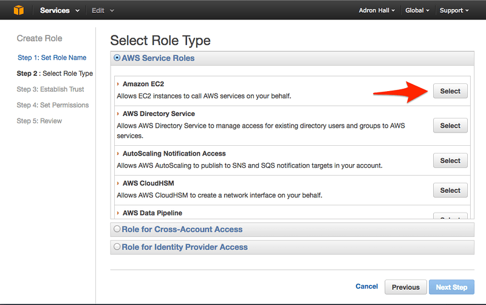

Next next odd thing that occurred in this web wizard was that the number 3 step is skipped. Again, that took me a second to realize maybe that's an optional step. Whatever the case, it shouldn't be displayed unless it's a step that might actually occur in all paths, otherwise just make it disappear. Anyway, step 4 is where the next step awaits.

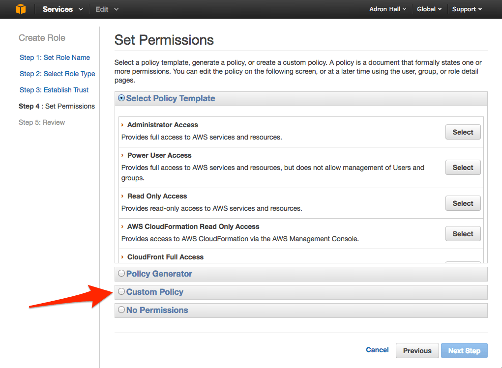

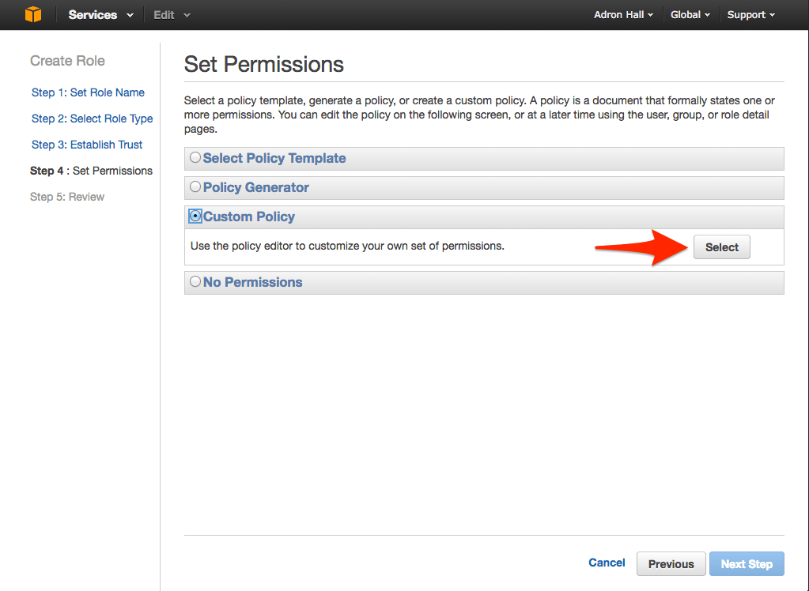

The next step I'll add the JSON that defines this role. It looks like this in the wizard (and I've included the actual JSON just below the image of the wizard). NOTE: In this screen shot I've named the role one thing, but when I select it below I've actually renamed it to "serverComms". These two are indeed the same role, I just didn't want to go back and redo all the screenshots around a minor rename. :)

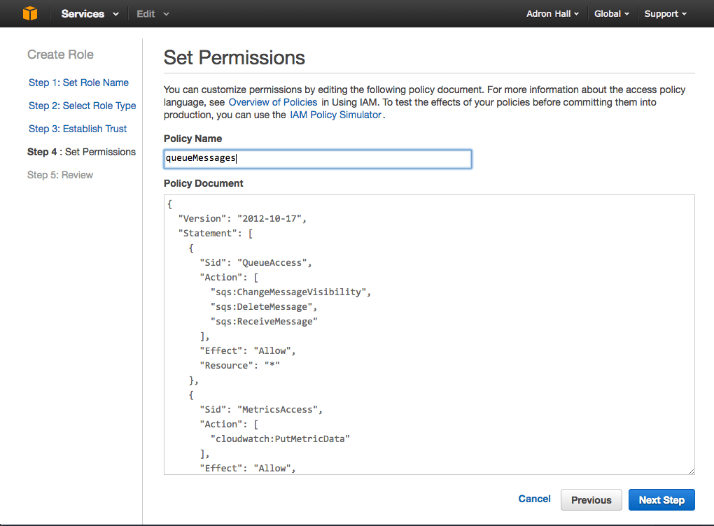

```javascript
{
  "Version": "2012-10-17",
  "Statement": [
    {
      "Sid": "QueueAccess",
      "Action": [
        "sqs:ChangeMessageVisibility",
        "sqs:DeleteMessage",
        "sqs:ReceiveMessage"
      ],
      "Effect": "Allow",
      "Resource": "*"
    },
    {
      "Sid": "MetricsAccess",
      "Action": [
        "cloudwatch:PutMetricData"
      ],
      "Effect": "Allow",
      "Resource": "*"
    }
  ]
}
```

Click next and the summary is provided before final creation of the role.

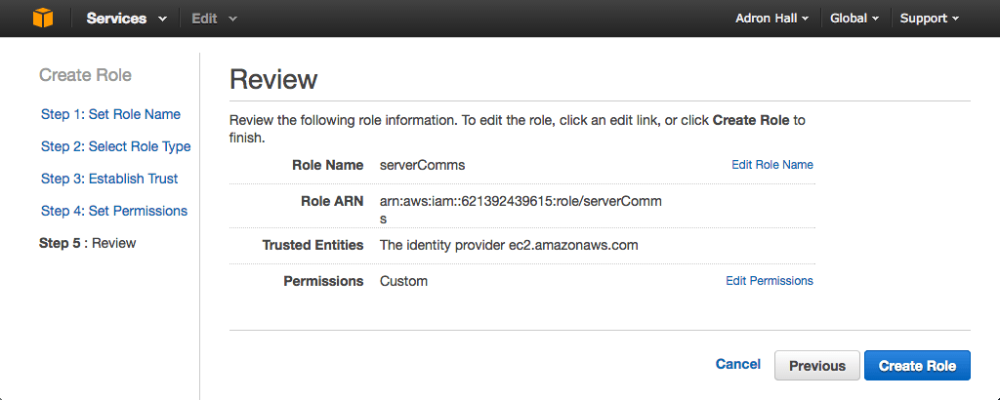

**Web Worker Application**

The first thing I need is to go ahead and get the worker setup in the AWS Management Console. I create a new environment by clicking on Launch New Environment.

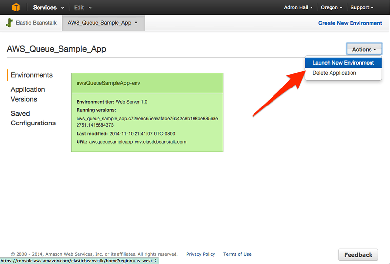

Next up is setting the environment tier and type and the configuration. I set these to Worker, Node.js, and Load Balanced.

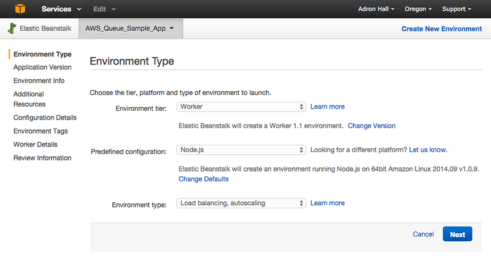

Then upload the project zip file. I zipped and uploaded this file [similarly to the way I did the site for submitting messages to the queue](articles/hapijs-aws-worker-publish/#upload). To see what code I'm uploading - the blog entry is kind of circular - so I added the code part toward the bottom of this entry. For the exact code, check out the later part of the entry and the finished code here in the [github repo](https://github.com/Adron/testing-aws-sqs-worker).

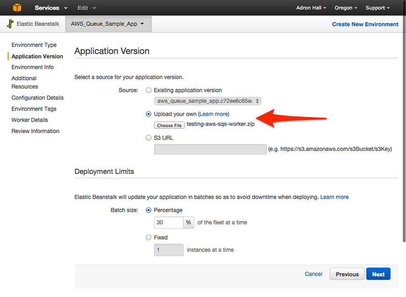

Now click next through environment info and additional resources. In configuration details the main thing I need is to select the IAM security role for the instance being created.

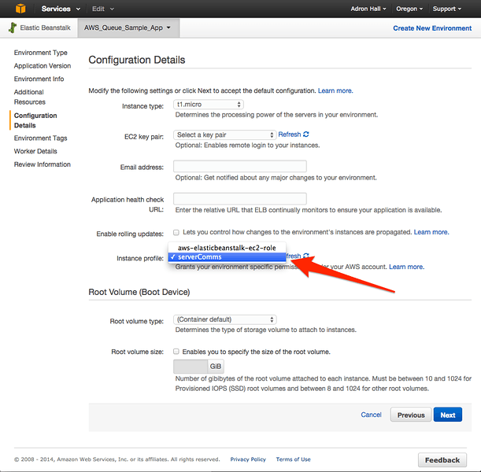

Click through the environment variables and on to Worker Details. Here I select the queue that I created in [part 1 of this series](articles/setting-up-an-aws-sqs-queue-for-use-with-node-js-beanstalk-worker-instances/). Just below that enter the URI end point that the worker will provide the queue to send messages via POST. I'll get to the code later in this article. But for now, I just selected /hi as the end point.

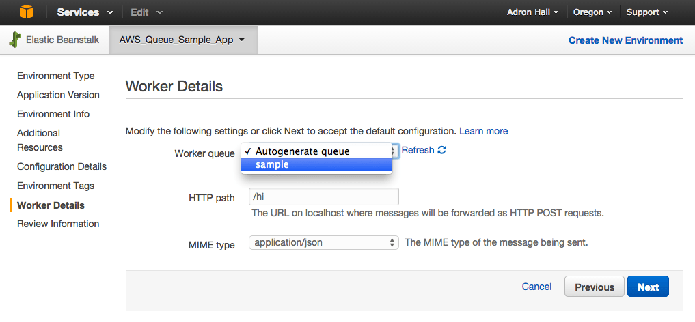

Finally, the last step is to review and Launch the worker instance.

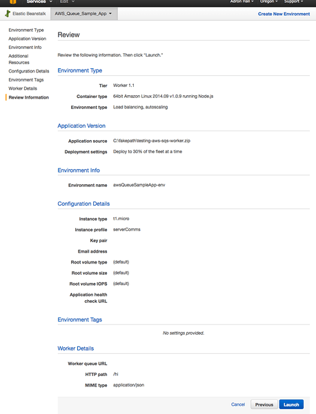

**Codes**

At this point I'll still be using hapi.js and good.js, so I follow the installation of these libraries similar to the ones I used for the site app in [part 2 of this series](articles/hapijs-aws-worker-publish/).

```shell-script
npm install hapi --save
npm install good --save
```

Now, I've setup a [server.js](https://github.com/Adron/testing-aws-sqs-worker/blob/master/server.js) as shown below. This API end point provides an action, in this case a write to the log, and then just finishes. This will prove out a complete movement of message from publisher site to queue to answering worker service.

```javascript
var
  AWS = require('aws-sdk'),
  awsRegion = 'us-west-2',
  sqs = {},
  Hapi = require('hapi'),
  Good = require('good'),
  queueUri = 'https://sqs.us-west-2.amazonaws.com/621392439615/sample';

var server = new Hapi.Server(process.env.PORT || 3000);

server.route({
  method: 'POST',
  path: '/hi',
  handler: function (request, reply) {
    AWS.config.update({
      accessKeyId: process.env.AWS_ACCESS_KEY_ID,
      secretAccessKey: process.env.AWS_SECRET_KEY,
      region: awsRegion
    });
    sqs = new AWS.SQS();

    server.log('response: ', request.payload.name);
    server.log('Starting receive message.', '...a 200 response should be received.');

    reply();
  }
});

server.pack.register(Good, function (err) {
  if (err) {
    throw err;
  }

  server.start(function () {
    server.log('info', 'Server running at: ' + server.info.uri);
  });
});
```

In this code, note that Hapi.js takes the request (read more on [Hapi.js here](http://hapijs.com/)) and sticks the body of the request in the property payload. Since AWS SQS sends across JSON in the way I've set it up (see [part 1](articles/setting-up-an-aws-sqs-queue-for-use-with-node-js-beanstalk-worker-instances/) and [part 2](articles/hapijs-aws-worker-publish/)) the received message coming in looks like this.

```javascript
"name": "April"
```

In the above code, the request.payload.name code gives us the name April. Run this and when the SQS receives input to process it will immediately send the message to the worker which will then process the code. When the worker returns a 200, the message is marked complete and removed from the queue. When I navigate to the nodejs.log in the AWS Beanstalk logs section of the environment, I get the last few items that I submitted to the queue for processing. The code above responds as shown below in the log.

```shell-script
-------------------------------------
/var/log/nodejs/nodejs.log
-------------------------------------
141119/011034.709, response: , Susan
141119/011034.709, Starting receive message., ...a 200 response should be received.
141119/011034.688, request, http://ip-172-31-33-151:8081: [1;33mpost[0m /hi {} [32m200[0m (26ms)
141119/011039.927, response: , April
141119/011039.928, Starting receive message., ...a 200 response should be received.
141119/011039.925, request, http://ip-172-31-33-151:8081: [1;33mpost[0m /hi {} [32m200[0m (6ms)
141119/011045.232, response: , Jessica
141119/011045.232, Starting receive message., ...a 200 response should be received.
141119/011045.229, request, http://ip-172-31-33-151:8081: [1;33mpost[0m /hi {} [32m200[0m (7ms)
```

BOOM! All done. A few notes before I end this entry though. Note that with the worker feature being used for Beanstalk and SQS there really isn't much code that is needed on the receipt end of the worker. I merely needed to respond 200, to complete the request from the point of view of the SQS worker service. Then whatever code I have that I want to act on the process with can work on the data received in the body from the queue. More than a few examples out there don't really show this, but instead show the manual way of writing code that will poll and act upon the messages in the queue. The Beanstalk worker configuration is dramatically simpler in comparison to this practice. If you do want to read more about manually polling and acting on the data check out "[Using SQS With Node](https://milesplit.wordpress.com/2013/11/07/using-sqs-with-node/)", it's the only end-to-end example I've seen with Node.js being used. There is also of course the documentation, but it doesn't provide clear cut examples of what exactly a good practice around working with the queue and requires a lot of RTFMing which quit frankly is a TLDR; scenario for doing something like this.

Hope this blog post is helpful in getting Node.js working with the worker role. If you have any questions, comments or it appears I've missed a step, let me know and I'll edit this and the related posts to make sure they're as accurate and as simple to follow as I can get them.

Cheers!

* *Part 1* – [Setting up an AWS SQS Queue for Use With Node.js Beanstalk Worker Instances](/articles/setting-up-an-aws-sqs-queue-for-use-with-node-js-beanstalk-worker-instances)
* *Part 2* – [Setting up a Hapi.js App that sends work to a Node.js AWS Worker via SQS](/articles/hapijs-aws-worker-publish/)
* *Part 3* – [AWS Beanstalk Worker with Node.js and SQS](/articles/aws-beanstalk-worker-with-node-js-and-sqs/) (This is the current article you're reading now)

**Reference:**

* [Testing AWS SQS Web Worker Github Repo](https://github.com/Adron/testing-aws-sqs-worker)
* [Testing AWS SQS Web App Github Repo](https://github.com/Adron/testing-aws-sqs-site)
