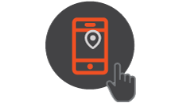
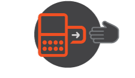
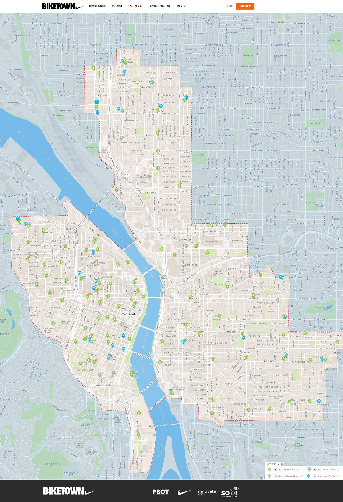
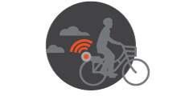

[](https://www.biketownpdx.com)

Good morning Portland! After a few years of hiccups, the Portland Bike Share has finally gotten started! We can thank our corporate overlords over at Nike for kicking in that last chunk of millions to get a bike and station layout that is absolutely superb!

For a little bit more about the opening day and metrics on uses check out [Bike Portland](http://bikeportland.org/) has posted [Over 2,300 trips taken on Biketown bike share in first 24 hours](http://bikeportland.org/2016/07/20/over-2300-trips-taken-on-biketown-bike-share-in-first-24-hours-187922), [“This is awesome!” Photos and notes from the Biketown launch event](http://bikeportland.org/2016/07/19/bike-share-is-alive-photos-and-recap-from-the-launch-event-187867), and others.

<span class="more"></span>

## Biketown PDX!

Alright, before diving into the API, let's discuss the actual way the system works. There are several components to how things go, but it involves the ***workflow*** of ***joining***, then ***unlocking***, ***riding***, and then ***locking*** it back up. At least, that's the basic workflow, but there's obviously a bit more understanding needed to know what to actually do with the bike share. In the next few sections, I'll break this into ***Workflow*** and ***Systemic Geographic Mapping and Stuff***.

### Workflow

<div class="image float-right">
    [](https://www.biketownpdx.com/pricing)
</div>

The first step of the workflow is joining. There's three ways to do this: single ride, day pass, or annual membership. The single ride is $2.50 per trip. The day pass is $12 a day and the annual membership is $12 per month. Now each of these prices are pretty straight forward, but there are indeed a few little gotchas here and there. Nothing that would break the bank, but let's talk more about this first step.

* *Single Ride* - The single ride is good if you've arrived somewhere but have a short distance to go. Like say you arrive at Pioneer Square on the MAX, and want to get over to the east side real quick around area Burnside. Obviously using transit to get back over the Burnside is an awkward mess, so jumping on a Biketown bike is a perfect solution. This is where the quick $2.50 ride comes into play. Now theoretically most human beings could clear Pioneer Square clear up to about 20th & Burnside in under 30 minutes. However, this is one of the gotchas - exceed 30 minutes and it is 10 cents a minute after that. Not a big deal, but if you didn't read the fine print it'll sneak up on ya. There's one more note to this situation though, it isn't all penalty fees. When you bring your bike back to the station you actually get a $1.00 account credit! So really, if you use the bike share even somewhat regularly, such as once or twice a month, your price really ends up being about a $1.50 per ride instead of $2.50.

* *Day Pass* - This basically provides 180 minutes per day and an unlimited number of rides. Which this dual qualifier just doesn't sound right. If I can have unlimited rides, but am limited to 180 minutes, it doesn't sound like unlimited rides. Grumble grumble *nothing bugs me like poor logic applied in real world business*. But anyway, that's what is written. The other add, but benificial thing is that if you get a day pass, you can expand on that day pass to take out 4 additional bikes at a time, the first bike counts as the day pass purchaser's bike, then the other 3 are only $6 per hour, nor do these bikes count toward the 180 minutes. Overall, sounds like a deal, but it's also attached to that oddly worded logic of the day pass deal. I guess it works out. One the 180 minutes is exceed, it's 10 cents a minute (so not unlimited rides, but just this...) and upon returning the bike to a rack station, a $1 is applied back to the account as credit.

* *Annual Membership* - This is the account I bought, partially to get into the founders 1000. Which I'm a proud member of. Basically I get extra benifits, but even purchasing one now, post the first founders round of purchasers gets you a good deal. The $12 a month cost gets you unlimited rides, with 90 minutes of ride time included per day. Over 90 minutes is 10 cents a minute. All the other specs are basically the same, but this is a great deal if you want to insure you have easy access at any time to the bike share.

* *Other Notes* - It's important to note also, that if you don't park the bike back at a Biketown rack it's $2.00 within the system area and $20 outside the system area. The later price can hit the piggy bank a bit. If you're curious what the service area is, check out the *Systemic Geographic Mapping* section below. If you somehow manage to ***lose*** a bike, heaven forbid, you'll owe a  **$1500.00** whopper, which they can and likely would nail your ass in small claims for that.

Alright, so that is the levels of joining you can partake upon, but what about actually joining? One way is to sign up on the [Biketown site itself](https://www.biketownpdx.com/). Signing up on the site is likely the easiest of all the methods. Then you'll get an account number and your passcode, then you can just use that to rent a bike wherever and whenever. The next way is to sign up with the little computer attached to the bike. I've seen one person do this, and I'm to fidgety to even attempt this, I did my registration via the site. Then the other way is via the mobile app ([Android](https://play.google.com/store/apps/details?id=com.biketownpdx) or [iOS](https://itunes.apple.com/us/app/biketownpdx/id1132076989), which is also really easy. Ok, that's basically it for signing up. Now you'll be in the system and able to work with the various aspects of the system, such as obviously the bikes themselves.

<div class="image float-right">
    [](https://www.biketownpdx.com)
</div>

Now comes the part where you go get a bike and unlock it. There are three absurdly easy ways to find the bikes. One, is to simply see the unbelievably orange things sitting about the area locked to whatever. Two, you can go out to the website and check out the [map and go to one of those locations](https://www.biketownpdx.com/map). Third, you can use the mobile application, which is likely the most useful since you'd often be on the go when you get a bike. At least, for me that's the way I generally use the system.

The overall map looks a bit like this...

[](https://www.biketownpdx.com/map)

The other way to find and get a bike at the same time is to actually reserve a bike. This puts a hold on a particular bike as you travel toward the bike to pick it up. To learn more about reserving a bike download the app and give it a try.

If you just go to where a bike or bikes are then you'll click a button, the screen will come alive, then enter your account number and your account code. Once you've done that you've checked out the bike and are ready to ride. Also, feel free to enjoy a video on the matter of unlocking and locking.

<iframe width="560" height="315" src="https://www.youtube.com/embed/mPWZhknfI48?rel=0&amp;showinfo=0" frameborder="0" allowfullscreen></iframe>

So moving right along...

<div class="image float-right">
    [](https://www.biketownpdx.com)
</div>

Riding... ok, ummm, I think this is pretty self-explanatory. You ride the bicycle to where you intend to go. It's really not complicated. But just in case here are a few tips:

* Ride at a steady speed in the bike lane, path, or if there isn't a path or bike lane take the full lane as the law states in Oregon code.
* Don't ride on the sidewalk unless you have to. It's a pretty shitty thing to do in all seriousness, and also illegal in some circumstances.
* Enjoy the ride!
* Don't ride into trees. They're really hard.
* Enjoy the breeze flowing through your hair (or if you're like me, flowing over your scalp!)
* Enjoy the fact you're being super clean, responsible, you're doing your body and everybody else some good by riding a bike, and getting things done at the same time!
* Just take your time and keep an eye out, you'll get there just fine.
* You're not reducing yourself to motor-vehicle usage, be proud of that.
* Also be glad you're not some asshole in a car. Everybody, even me, when we drive we're assholes. It's just the law of physics and the rule of cages is all, don't cry over it or anything.

Ok, enough random rules, observations, and guidelines. You get the idea, ride the bike, have fun, get where you're going. Smile, love one another. Koombayaaaa and stuff.

<div class="image float-right">
    [](https://www.biketownpdx.com/pricing)
</div>

Once you're done with the bike lock it up to a bike kiosk. You can technically just lock it to a post or what not, it's up to you, but note the costs above in the plans I described earlier. If out of zone it's $20 bucks, if inside the zone and not in a kiosk it'll cost you $2.00. So it's usually best to just lock it to a standard bright orange rack kiosk.

*Whew, done with the description. Let's talk about the coding factor now...*

### Systemic Geographic Mapping API Stuff

Ok, I don't really know what "Systemic Geographic Mapping API Stuff" but it sounds like it encompasses the key aspects of what features the API has. So let's talk data.

The first bit of data that is useful is the GBFS. This is the General Bikeshare Feed Specification. This is available here: http://biketownpdx.socialbicycles.com/opendata/gbfs.json

That's a *little* data, an overview of the system one could say. The real meat however is in the authenticate API. It's available at https://app.socialbicycles.com/developer. Give it a try with a curl.

    curl http://biketownpdx.socialbicycles.com/opendata/gbfs.json

The response is as shown. A pretty straight forward JSON data blurb. Showing the pricing, alerts, regions, calendar, hours, free bike status (??), station status, station information, and system information url references.

```javascript
{
  "last_updated": 1469237395,
  "ttl": 60,
  "data": {
    "en": {
      "feeds": [
        {
          "name": "gbfs",
          "url": "http://biketownpdx.socialbicycles.com/opendata/gbfs.json"
        },
        {
          "name": "system_information",
          "url": "http://biketownpdx.socialbicycles.com/opendata/system_information.json"
        },
        {
          "name": "station_information",
          "url": "http://biketownpdx.socialbicycles.com/opendata/station_information.json"
        },
        {
          "name": "station_status",
          "url": "http://biketownpdx.socialbicycles.com/opendata/station_status.json"
        },
        {
          "name": "free_bike_status",
          "url": "http://biketownpdx.socialbicycles.com/opendata/free_bike_status.json"
        },
        {
          "name": "system_hours",
          "url": "http://biketownpdx.socialbicycles.com/opendata/system_hours.json"
        },
        {
          "name": "system_calendar",
          "url": "http://biketownpdx.socialbicycles.com/opendata/system_calendar.json"
        },
        {
          "name": "system_regions",
          "url": "http://biketownpdx.socialbicycles.com/opendata/system_regions.json"
        },
        {
          "name": "system_pricing_plans",
          "url": "http://biketownpdx.socialbicycles.com/opendata/system_pricing_plans.json"
        },
        {
          "name": "system_alerts",
          "url": "http://biketownpdx.socialbicycles.com/opendata/system_alerts.json"
        }
      ]
    }
  }
}
```

Any of the references you can do a simple curl against and get a good chunk of data. For instance.

```shell-script
curl http://biketownpdx.socialbicycles.com/opendata/system_information.json
```

The result returns as such.

```javascript
{
  "last_updated": 1469290649,
  "ttl": 60,
  "data": {
    "system_id": "biketownpdx",
    "language": "en",
    "name": "BIKETOWNpdx",
    "url": "http://biketownpdx.com/",
    "purchase_url": "http://biketownpdx.com/",
    "timezone": "America/Los_Angeles",
    "phone_number": "(866) 512-2453",
    "email": "customerservice@biketownpdx.com"
  }
}
```

When I first looked at this list I got keenly interested in the `free_bike_status`. I'd always want to know where the free bikes are when I want to rent one. A simple curl request and I knew what I could accrue from this end point. The blurb is sizably bigger than the previous two, so I actually cut out the mid section so it didn't take until tomorrow to scroll to the end.

```javascript
{
  "last_updated": 1469290813,
  "ttl": 60,
  "data": {
    "bikes": [
      {
        "bike_id": "bike_6779",
        "name": "0218 BIKETOWN",
        "lon": -122.65348833333333,
        "lat": 45.50477166666667,
        "is_reserved": 0,
        "is_disabled": 0
      },
      {
        "bike_id": "bike_6265",
        "name": "0188 BIKETOWN",
        "lon": -122.70043833333334,
        "lat": 45.535826666666665,
        "is_reserved": 0,
        "is_disabled": 0
      },
      {
        "bike_id": "bike_7160",
        "name": "0131 BIKETOWN",
        "lon": -122.674115,
        "lat": 45.51180333333333,
        "is_reserved": 0,
        "is_disabled": 0
      },
      ``
```

...a whole bunch of entries cut out for brevity...

```javascript
      {
        "bike_id": "bike_7308",
        "name": "0984 AIR TRAINER",
        "lon": -122.64039333333334,
        "lat": 45.55905833333333,
        "is_reserved": 0,
        "is_disabled": 0
      },
      {
        "bike_id": "bike_7301",
        "name": "0971 AIR TRAINER",
        "lon": -122.644855,
        "lat": 45.516286666666666,
        "is_reserved": 0,
        "is_disabled": 0
      }
    ]
  }
}
```

So far this is purely the public facing, non-authentication based API for Biketown. You can get a host of information and do all sorts of useful things with just this information. But, I will be following up in the coming days with a review of the actual authenticated API for Biketown. I'm looking forward to hacking together some cool apps and interfaces myself, but I'm also really interested to see what others put together!

Last thing for this post, if you're curious about the oddly colored bikes that are clearly not orange. You can rent those two, they have a particular theme as detailed here. Something to do with Nike branding and Nike shoes of some sort, I'm not entirely sure as I don't really wear any Nike gear. Ironically, since I bike I need tougher stuff that's oriented toward biking. Nike doesn't really seem to have any market play in that realm.

<iframe width="560" height="315" src="https://www.youtube.com/embed/qs6m9lQ9qRE?rel=0&amp;showinfo=0" frameborder="0" allowfullscreen></iframe>

Until that next API call, cheers!
