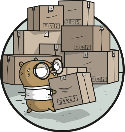
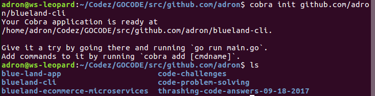
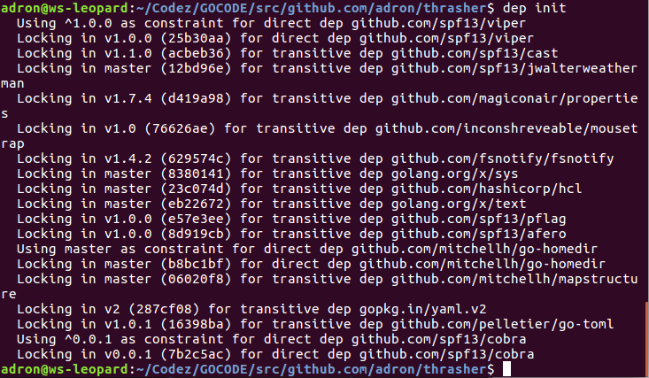
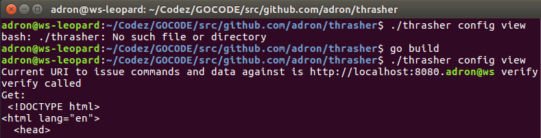

I need a tool just to do some testing against an API end point. I figured I'd throw one together real quick in Go.  With a few libraries it's just a few steps to get the job done. The following is that project. Eventually I'll create the services that will run in some containers I'll throw into a Kubernetes cluster, but for now, it's all CLI. Onward.

The first thing I'll need is Cobra.

<div class="image float-right">
    [](https://github.com/spf13/cobra)
</div>

<span class="more"></span>

<div class="image float-right">
    [](https://github.com/golang/dep)
</div>

Before Cobra, there was one prerequisite that I already installed. I had the Go `dep` command installed for dependency management. You can install or upgrade your `dep` with brew, with the following commands.

```
brew install dep
brew upgrade dep
```

If you're not using MacOS and brew, you can just use the standard go get route and run `go get -u github.com/golang/dep/cmd/dep`. The first command at that point to start managing dependencies within the root directory of your project is `dep init`. More on that in a minute.

First I need to insure I have the Cobra CLI to use to generate out the initial code for the CLI itself. To get Cobra installed use the standard go get for this too with `go get -u github.com/spf13/cobra/cobra`. Now I can type `cobra init github.com/adron/thrasher` to generate the initial skeleton of my CLI.



The folder is now generated in my Go directory, under the standard convention */src/github.com/adron/blueland-cli/*. Now I navigate into that directory and get some of the command stubs started. I want the following commands available with my CLI.

```
thrasher thrash
```

This command I'll use to start calls of generated data against an API end point.

```
thrasher config set
```

This command can be used to set the end point in which to send data to.

```
thrasher config view
```

This command can be used to check what the URI is that the requests will be sent against.

```
thrasher config verify
```

This command can be used to verify that the configured URI is set appropriately.

At this point, this seems to be all I'll need. The commands I'll issue to get these are as follows.

```
cobra add thrash
cobra add config
cobra add set -p 'configCmd'
cobra add view -p 'configCmd'
cobra add verify -p 'configCmd'
```

To test these commands out, verifying the skeleton code is in place, build the CLI with a simple `go build` in the root. The result looks like this.

```
$ go build
$ ./thrasher thrashthrash called
$ ./thrasher configconfig called
$ ./thrasher config set
set called
$ ./thrasher config view
view called
$ ./thrasher config verify
verify called
$ 
```

Now a quick `git init` and addition of a *.gitignore* file with he following contents.

```
# Binaries for programs and plugins
*.exe
*.dll
*.so
*.dylib

# Test binary, build with `go test -c`
*.test

# Output of the go coverage tool, specifically when used with LiteIDE
*.out

.idea
.DS_Store
```

Wrapping that up I added the code to the repository [here](https://github.com/Adron/thrasher).

Next thing I setup the project with the dependencies I have so far. Using `dep` that included the `dep init` command. That looks something like this on the first pull of dependencies.



When I ran this command, `dep` completed the folowing actions.

1. Looked for existing dependency management files to convert.
2. Checked if the dependencies use `dep`.
3. Identified the dependencies.
4. Backed up the existing vendor directory if it existed to *_vendor-TIMESTAMP/*
5. Picked the highest compatible version for each dependency.
6. Generated Gopkg.toml (the manifest) and Gopkg.lock files.
7. Installed the dependencies in *vendor/*.

For more information on `dep` check out the project [README.md](https://github.com/golang/dep).

The next dependency I'll add is *[faker](https://github.com/bxcodec/faker)* with the following `dep` command.

```
dep ensure -add github.com/bxcodec/faker
```

Now I'm ready to get started with some actual implementation. First let's setup the configuration. This is a simple single setting that needs to be set, or retrieved from a configuration setting. Here's the basic flow for the configuration.

## Managing Configuration

The CLI starts with one of two states. It either has a testing URI that the CLI will execute tests against or it doesn't. The CLI need to check for this every time a command is executed. If it doesn't have or can't find the configuration a message should appear stating what is missing and then exit out. If the configuration information exists then we can continue forward.


<div class="image float-right">
    [](https://github.com/spf13/viper)
</div>

For this, I did a quick search and realized that I would likely benefit from using the [Viper Project](https://github.com/spf13/viper). This project is already included with the Cobra Project so I can just dive right in. Which is exactly what I'll do now, *but* I must add that I'll elaborate more extensively on what all has been generated for us after a little code is written.

First I'll open up the main CLI code that I'll use just to try out some fake data examples. The generated code file that Cobra built for me looks like what is below. It's located where Cobra generates it, inside the *cmd* directory of the project, in a file called *root.go*.

``` javascript
// Copyright © 2017 Adron Hall <adronhall@gmail.com>
//
// Licensed under the Apache License, Version 2.0 (the "License");
// you may not use this file except in compliance with the License.
// You may obtain a copy of the License at
//
//     http://www.apache.org/licenses/LICENSE-2.0
//
// Unless required by applicable law or agreed to in writing, software
// distributed under the License is distributed on an "AS IS" BASIS,
// WITHOUT WARRANTIES OR CONDITIONS OF ANY KIND, either express or implied.
// See the License for the specific language governing permissions and
// limitations under the License.

package cmd

import (
	"fmt"
	"os"

	homedir "github.com/mitchellh/go-homedir"
	"github.com/spf13/cobra"
	"github.com/spf13/viper"
)

var cfgFile string

// RootCmd represents the base command when called without any subcommands
var RootCmd = &cobra.Command{
	Use:   "thrasher",
	Short: "This CLI is built around testing API end points by submitting data, " +
		"etc, generated at time of testing.",
	Long: `This CLI is built around sending randomly generated data at API end points for testing.
The idea is for the data to be issued against end points using various HTTP verbs such as GET, POST, or others.

For example a similar command using curl.
  curl -d "param1=value1&param2=value2" -X POST http://localhost:3000/data
  curl -d "param1=value1&param2=value2" -H "Content-Type: application/x-www-form-urlencoded" -X POST http://localhost:3000/data`,
}

// Execute adds all child commands to the root command and sets flags appropriately.
// This is called by main.main(). It only needs to happen once to the rootCmd.
func Execute() {
	if err := RootCmd.Execute(); err != nil {
		fmt.Println(err)
		os.Exit(1)
	}
}

func init() { 
	cobra.OnInitialize(initConfig)

	// Here you will define your flags and configuration settings.
	// Cobra supports persistent flags, which, if defined here,
	// will be global for your application.
	RootCmd.PersistentFlags().StringVar(&cfgFile, "config", "", "config file (default is $HOME/.thrasher.yaml)")

	// Cobra also supports local flags, which will only run
	// when this action is called directly.
	RootCmd.Flags().BoolP("toggle", "t", false, "Help message for toggle")
}

// initConfig reads in config file and ENV variables if set.
func initConfig() {
	if cfgFile != "" {
		// Use config file from the flag.
		viper.SetConfigFile(cfgFile)
	} else {
		// Find home directory.
		home, err := homedir.Dir()
		if err != nil {
			fmt.Println(err)
			os.Exit(1)
		}

		// Search config in home directory with name ".thrasher" (without extension).
		viper.AddConfigPath(home)
		viper.SetConfigName(".thrasher")
	}

	viper.AutomaticEnv() // read in environment variables that match

	// If a config file is found, read it in.
	if err := viper.ReadInConfig(); err == nil {
		fmt.Println("Using config file:", viper.ConfigFileUsed())
	}
}
```

In this file there's a number of things to notice, but again, I'll get back to that. For now, I went ahead and added some code in the `init` function to initialize and set a default for the environment variable. The `init` function now looks like this.

``` javascript
func init() { 
	cobra.OnInitialize(initConfig)

	defaultUri := "localhost:3000"
	viper.SetEnvPrefix("thrasher")  // Uppercased automatically? Maybe just make it uppercase?
	viper.BindEnv("uri")

	uri := viper.Get("uri")

	if uri == nil {
		os.Setenv("THRASHER_URI", defaultUri)
		fmt.Printf("Set environment variable THRASHER_URI to %s.\n\n", defaultUri)
	}

	// Here you will define your flags and configuration settings.
	// Cobra supports persistent flags, which, if defined here,
	// will be global for your application.
	RootCmd.PersistentFlags().StringVar(&cfgFile, "config", "", "config file (default is $HOME/.thrasher.yaml)")

	// Cobra also supports local flags, which will only run
	// when this action is called directly.
	RootCmd.Flags().BoolP("toggle", "t", false, "Help message for toggle")
}
```

Using Viper I set an environment variable prefix to *thrasher*. This means that any environment variables I set with a prefix of *thrasher* will be picked up as environment variables specifically for my application. I then set a bind to the environment variable I want to name *uri*. This will give me the value of the environment variable named *uri*. To set this value I'll need to actually set the value *THRASHER_URI* since the Viper library automatically uppercases the environment variables. It's all just slightly confusing, but in the end I end up with an environment variable that I can set in my *~/.bashrc* or *~/.bash_profile* settings locally and if I don't set it, the if control structure will set the environment variable *THRASHER_URI* for me to the default that I've set in code *localhost:3000*.

Also notice in the code above, the generated section shows a config file default location for `$HOME/.thrasher.yaml`. Currently I'm not using this default, but it's setup that way by convention.

I'll want to be able to find out what my configuration setting is for the environment variable using the `thrasher config view` command. To do this, I add a few lines of code in the *view.go* file. Inside the *view.go* file there is the variable assigned to the pointer location of the command, which I've edited to print out the evnironment variable that is set for the URI.

``` javascript
var viewCmd = &cobra.Command{
	Use:   "view",
	Short: "The view command is used to retrieve the configuration settings.",
	Long: `The view command can be used to retrieve and view the configuration
		settings that the thrasher CLI currently has active and in use.`,
	Run: func(cmd *cobra.Command, args []string) {
		uri := viper.Get("uri")
		fmt.Printf("Current URI to issue commands and data against is %s.", uri)
	},
}
```

Alright, view is setup, now I want to setup verify. In verify I want the uri checked, an HTTP get issued against the URI for verification, and a respective response from the API end point. If that doesn't come back, and an error occurs I want to handle the issues that might come up.

The first bit of code I'll add is getting the URI path with viper and issuing a get request against the URI end point. I'll add this to the verify command pointer func.

``` javascript
uri := viper.GetString("uri")
resp, err := http.Get(uri)
```

I want some of the body to display, so I've written a small function to handle the processing and return of some of the body. That code looks like this.

``` javascript
func keepTopVariableLines(s string, n int) string {
	bodyResult := strings.Join(strings.Split(s, "\n")[:n], "\n")
	return strings.Replace(bodyResult, "\r", "", -1)
}
```

Now I'll add some error and if else logic to display appropriate messages, display of response, and related information.

``` javascript
if err != nil {
	fmt.Printf("Configured URI has errors: \n\n%s", err)
} else {
	defer resp.Body.Close()

	body, err := ioutil.ReadAll(resp.Body)

	if err != nil {
		fmt.Printf("Response body caused error: %s", err)
	} else {
		fmt.Println("Get:\n", keepTopVariableLines(string(body), 2))
		fmt.Println("\n\nURI has been retrieved, URI verified.\n\n")
	}
}
```

Now, I've got all the pieces for verify in place. The completed keeptTopVaribleLines and verify command pointer func look like this now.

``` javascript
func keepTopVariableLines(s string, n int) string {
	bodyResult := strings.Join(strings.Split(s, "\n")[:n], "\n")
	return strings.Replace(bodyResult, "\r", "", -1)
}

// verifyCmd represents the verify command
var verifyCmd = &cobra.Command{
	Use:   "verify",
	Short: "Verify will test the URI end point with a get call issued.",
	Long: `Verify will test the URI end point with an HTTP get call request against the end point.`,
	Run: func(cmd *cobra.Command, args []string) {
		fmt.Println("verify called")

		uri := viper.GetString("uri")
		resp, err := http.Get(uri)

		if err != nil {
			fmt.Printf("Configured URI has errors: \n\n%s", err)
		} else {
			defer resp.Body.Close()

			body, err := ioutil.ReadAll(resp.Body)

			if err != nil {
				fmt.Printf("Response body caused error: %s", err)
			} else {
				fmt.Println("Get:\n", keepTopVariableLines(string(body), 3))
				fmt.Println("\n\nURI has been retrieved, URI verified.\n\n")
			}
		}
	},
}
```

Alright. Now with a quick `go build` this will give me a partially functioning CLI tool.



In the next post I'll wrap this up and get some of the data generation to post data against the end point. For now, happy Go hacking. Any questions, ping me via the Twitters [@Adron](https://twitter.com/Adron).

**Posts for this series.**

* This post "[Building a Data Thrashing CLI Tool in Go](/articles/building-cli-data-thrasher/)"
* Part 2 - "[Building a Data Thrashing CLI Tool in Go, Data Generation](/articles/building-cli-data-thrasher-part-duex/)"