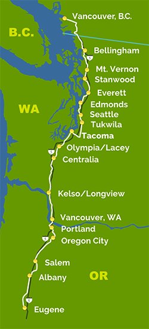

    

Today kicks off something I've not for a long while. That is, go adventuring about the countryside, while working remotely, and coding solutions while disconnected from the chains of the rat race. It's a tricky thing to balance between getting shit done and actually enjoying the adventure. But this is the chronicle of the adventure, and this is part one of the chaos among the rigid discipline of the trip.

Logistical Details:

This trip will consist of the following logistical destinations, trip consists, and related measures.

* Leaving Redmond on Sound Transit Express #545 with Rocket Pop headed to King Street Station.
* Next up is the 11:15am departure of [Amtrak Cascades](http://www.amtrakcascades.com/) #513 south bound to Portland.
* 

