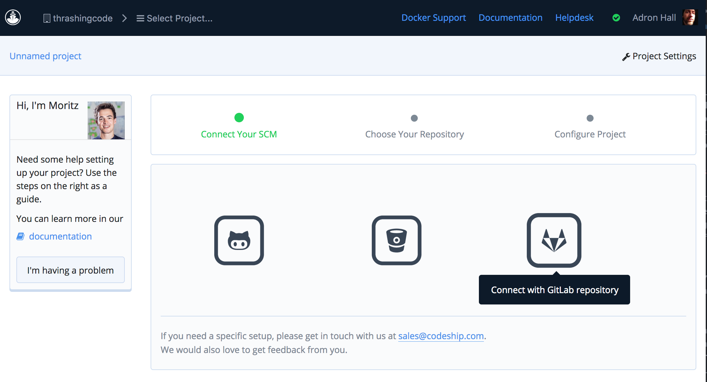
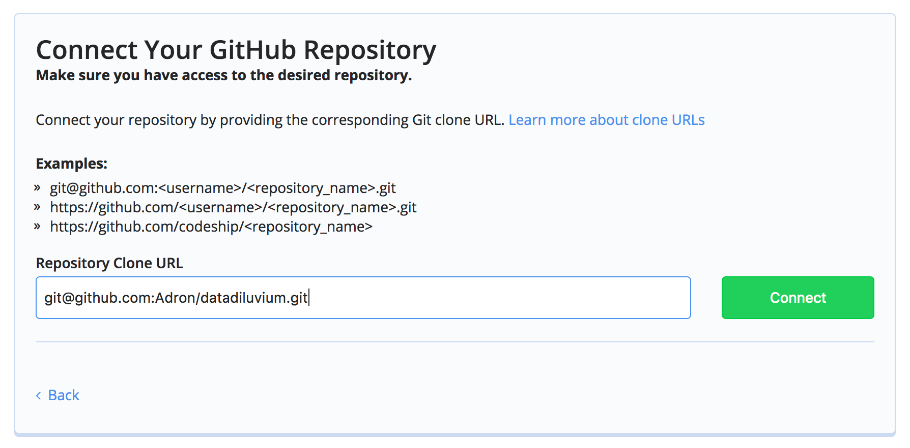
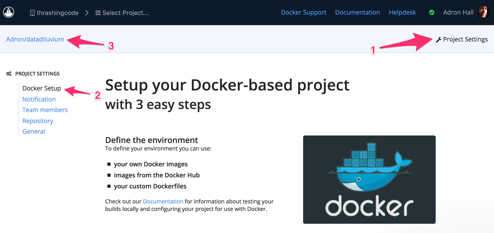

Welcome to the first of more than a few blog entries on Data Diluvium. Data Diluvium is a project I've started focused around generating data for the purposes of testing, capacity, or whatever other needs might arise.

Definition of ***data***

1. :  factual information (as measurements or statistics) used as a basis for reasoning, discussion, or calculation <the data is plentiful and easily available — H. A. Gleason, Jr.> <comprehensive data on economic growth have been published — N. H. Jacoby>
2. :  information output by a sensing device or organ that includes both useful and irrelevant or redundant information and must be processed to be meaningful
3. :  information in numerical form that can be digitally transmitted or processed

Definition of ***deluge*** which is the English version of the latin ***diluvium***.

1. a :  an overflowing of the land by water. b :  a drenching rain "a deluge causing mudslides in the area".
2. :  an overwhelming amount or number <received a deluge of angry phone calls>

...thus ***Data Diluvium***.

<span class="more"></span>

The idea is to build a data generation service. Something that will generate random data in usable chunks; name generation, addresses, and related data. To get a wide range of use out of this capability I needed to build a web service application and a respective CLI (Command Line Interface) to go along with the web application.

## A Microservice is Born!

The web service is going to generate pseudo-random data around name, addresses, phone numbers, and location. Over the course of this series I'll add more data generation types and implement a schema for the actual data generation. This web service will be created based on microservice architectural and design ideas. However in the early stages of this effort I'll keep it simple and will stick to implementing a minimally viable product (MVP). From here on out I'll refer to this project as the *Data
Diluvium* project.

## Microservice Client CLI

For the client side, I want to provide a CLI in which to interface with the microservice itself. With this CLI I want to be able to provide basic configuration or passed parameters that will allow me to take the generated data and pass it directly into terminal output, out to a file, or prospectively as things develop directly into databases of various kinds themselves.

## The Tooling & Language

Overall this could be built in a number of technology stacks. I could use Node.js, .NET, Java, Erlang, or Go to build both the CLI and the microservice. With the multitude of choices it can be somewhat difficult picking the right stack to get things done as quickly, efficiently, well organized, and cleanly as possible. For this particular effort I'm going to go with Go to implement the microservice and the CLI.

Why Go you might ask? For the CLI, I'd want a cleanly built, fast, and responsive CLI that I can setup on any machine with minimal fuss. For Node.js for instance, one doesn't get a built executable, but instead a kind of morass of tooling, and preinstallation software required. For Java and .NET one ends up with a great array of tooling to build a microservice and CLI, but the knowledge and time just to setup the initial development environments leads me away from those. With Erlang, maybe a day in the future, since it is indeed hugely and almost mystically powerful (yes, I just wrote mystically, it sounds appropriate).

## Kick Off

First things first, I need the projects themselves. Here are the steps I took to get some basic parts building together for the two projects. The first step was simply to create two directories for each of these projects, one I named *Data
Diluvium* and one *Colligere*. Inside both of those directories I put together a basic structure for each of these folders.

### Basic Project Files

The frame of each included the following:

* I created a folder titled *[.github](https://github.com/Adron/datadiluvium/tree/master/.github)* and placed the following files: *[CONTRIBUTING.md](https://github.com/Adron/datadiluvium/blob/master/.github/CONTRIBUTING.md)*, *[ISSUE_TEMPLATE.md](https://github.com/Adron/datadiluvium/blob/master/.github/ISSUE_TEMPLATE.md)*, and *[PULL_REQUEST.md](https://github.com/Adron/datadiluvium/blob/master/.github/PULL_REQUEST_TEMPLATE.md)*.

* Next the standard [.gitignore](https://github.com/Adron/datadiluvium/blob/master/.gitignore) file with the following contents. This is the basic file Github starts a Go project with if selected during the creation of the repository. It has the minor addition of *.DS_Store* to keep that OS-X file out of the repository and the *.idea* director to keep out the IntelliJ, WebStorm, or Goland IDE (or any Jetbrains IDE) settings directory.

```
# Compiled Object files, Static and Dynamic libs (Shared Objects)
*.o
*.a
*.so

# Folders
_obj
_test

# Architecture specific extensions/prefixes
*.[568vq]
[568vq].out

*.cgo1.go
*.cgo2.c
_cgo_defun.c
_cgo_gotypes.go
_cgo_export.*

_testmain.go

*.exe
*.test
*.prof

.DS_Store
.idea
```

* I added the *[LICENSE](https://github.com/Adron/datadiluvium/blob/master/LICENSE)* file with the standard Apache 2.0 license legalese.

* Finally the *[README.md](https://github.com/Adron/datadiluvium/blob/master/README.md)*.

### Build Files

It is important at this stage to create a build and get that build passing with some basic element of code. At this point I need some basic executing code and the respective build configuration files. For this I'll create three files and name them respectively: *[main.go](https://github.com/Adron/datadiluvium/blob/master/main.go)*, *[codeship-steps.yml](https://github.com/Adron/datadiluvium/blob/master/codeship-steps.yml)*, and *[codeship-services.yml](https://github.com/Adron/datadiluvium/blob/master/codeship-services.yml)*. In addition to the code, since I was going to be pulling in dependencies I'd need something to handle that, which I went ahead and chose [glide](https://github.com/Masterminds/glide).

I installed glide with the following commands on my OS-X machine, but since I am doing a lot of development on my new [Leopard WS]() machine I installed glide with the curl command below.

Install with brew.

```shell-script
brew update
brew install glide
```

The curl installation step.

```shell-script
curl https://glide.sh/get | sh
```

With glide installed I ran the default initialization command `glide create` to get a `glide.yaml` and `glide.lock` file setup. Running this command will display the following via the CLI.

```shell-script
$ glide create
[INFO]  Generating a YAML configuration file and guessing the dependencies
[INFO]  Attempting to import from other package managers (use --skip-import to skip)
[INFO]  Scanning code to look for dependencies
[INFO]  --> Found reference to github.com/Masterminds/semver
[INFO]  --> Found reference to github.com/Masterminds/vcs
[INFO]  --> Found reference to github.com/codegangsta/cli
[INFO]  --> Found reference to gopkg.in/yaml.v2
[INFO]  Writing configuration file (glide.yaml)
[INFO]  Would you like Glide to help you find ways to improve your glide.yaml configuration?
[INFO]  If you want to revisit this step you can use the config-wizard command at any time.
[INFO]  Yes (Y) or No (N)?
n
[INFO]  You can now edit the glide.yaml file. Consider:
[INFO]  --> Using versions and ranges. See https://glide.sh/docs/versions/
[INFO]  --> Adding additional metadata. See https://glide.sh/docs/glide.yaml/
[INFO]  --> Running the config-wizard command to improve the versions in your configuration
```

I then ran `glide get github.com/icrowley/fake` to get the fake library I would need. The `glide.yaml` and `glide.lock` looked like this after I pulled in this library.

glide.yaml

```yaml
package: github.com/adron/datadiluvium
import:
- package: github.com/icrowley/fake
```

glide.lock

```yaml
hash: 2fd78ca8369405d5998e65ea4cfce94c6599e878c36fec39b85fd385552392d7
updated: 2017-01-09T01:04:18.134993358-08:00
imports:
- name: github.com/icrowley/fake
  version: 84bff6d01560fb0b5a396ba29534e93fd00d09c6
testImports: []
```

If you're curious about the hash, and related properties of this file check out the glide [README.md](https://github.com/Masterminds/glide/blob/master/README.md), it's useful in understanding what's stored here.

At this point, it was time to actually sling some Go code! At this point, I do indeed mean sling some too. Splat!

### Some Go Code

In the main.go file I wrote some basic Go code just to have something to build. I wanted a little bit more than just a *Hello World!* code sample so I added a little bit more. I did some research and found the [Fake](https://github.com/icrowley/fake) library written by Dmitry Afanasyev from Ulyanovsk, Russia. I used `Go get` to pull that into the project and then added an `import` after `package main` with the various bits of code I'd want for my getting started code.

```javascript
package main

import (
    "encoding/json"
    "fmt"
    "io/ioutil"
    "os"
    "github.com/icrowley/fake"
    "time"
)
```

The other libraries I knew I would need for various other output, date stamps, and other library features I'd want. Then I went to coding, my first sample of working code to prove out key functionality of the libraries looked like this.

```javascript
type Page struct {
    Title string `json:"title"`
    Schema   string `json:"schema"`
}

func (p Page) toString() string {
    return toJson(p)
}

func toJson(p interface{}) string {
    bytes, err := json.Marshal(p)
    if err != nil {
        fmt.Println(err.Error())
        os.Exit(1)
    }
    return string(bytes)
}

func main() {
    pages := getPages()
    for _, p := range pages {
        fmt.Println(p.toString())
    }

    fmt.Println(toJson(pages))

    fmt.Println("\nSome Russian Random Data")
    fake.SetLang("ru")
    fmt.Println(fake.FirstName())
    fmt.Println(fake.FullName())

    fmt.Println("\n\n\nSome English Random Data")
    fake.SetLang("en")
    fmt.Println(fake.FirstName())
    fmt.Println(fake.FullName())

    thisMany := 10
    counter := 1
    t := time.Now().Format(time.RFC850)

    fmt.Println("\n\n\nPrinting", thisMany)

  	for i := 0; i < thisMany; i++ {
      fmt.Println(counter, fake.FirstName())
      counter += 1
      fake.FirstName()
  	}

    fmt.Println("Start Time: ", t)
    t = time.Now().Format(time.RFC850)
    fmt.Println("End Time: ", t)
}

func getPages() []Page {
    raw, err := ioutil.ReadFile("./deluge.json")
    if err != nil {
        fmt.Println(err.Error())
        os.Exit(1)
    }

    var c []Page
    json.Unmarshal(raw, &c)
    return c
}
```

Now, this all was a small mess at this point. I know I needed to get it cleaned up. However the *priority* at this point is to get a build working that will provide a trusted basis to continue work from. Since I intend to use this to teach, for everyday testing, and hopefully to gain contributors (want to help?) it needs to have a good build, end of story.

## Continuous Integration Build

At this point I have the main.go file executing with some Go code that pulls together some functionality on random data generation, file I/O (at least reading) with a JSON file for config, and displaying this out the console. So far, so good.

I've decided to use [Codeship](https://codeship.com) for this particular project. They're a service provider the specializes in continuous integration and delivery services, and I might add that they're good at it (* Also note declarations, etc at the bottom of this blog entry).

Two significant reasons I like to use Codeship are: remote builds & deploys with Docker and local builds with Docker. Having that combination is very effective, providing the capability to effectively to builds that include systemic deployments to my own local machine in addition to combining efforts with a prospective team together via the remote build.

### CI Service Setup at Codeship

To setup the repository on Codeship for *Docker* support I went through these steps.

First select create new project. This is up on the Select Project bar or if you've just signed up it is available as the default screen when navigating to builds. Codeship just added [Gitlab](https://about.gitlab.com/) as a repository option recently, which I opted for the Data Diluvium Client, [Colligere](https://gitlab.com/adron/colligere), using Gitlab just to test it out. At this time I really like my experience with Gitlab, but that's for another blog entry, for now, onward!



Next enter the path for the git repo.



Select pro infrastructure. This will provide Docker capabilities.


Then it is time to setup the Docker configuration and yaml files for the build. The page at this point on Codeship has some links and such, for the two yaml files needed, but I'll describe them here in detail a bit. In the image below a quick review of each element of the page: (1), the project settings, which will navigate to an area to setup notification, configure and add team members, repository details or reconnecting to a different repository, and general settings, which can be navigated to via (2), and (3) lists the current project the settings are displaying and available for changing.



Once the build project is setup in Codeship there are two files that are needed in the repository itself. Both of these files are simple yaml files. Each are given a default name of `codeship-steps.yaml` and `codeship-services.yaml`.

The `codeship-steps.yaml` file has the following steps listed for this project. I've associated these to a service called *deluge_svc* which will be defined in the `codeship-services.yaml` file. Then the commands, in order, are `go clean`, `go test ./...`, and `go build`.

```shell-script
- name: deluge
  service: deluge_svc
  command: go clean
- name: deluge_tests
  service: deluge_svc
  command: go test ./...
- name: deluge_build
  service: deluge_svc
  command: go build
```

The next file is `codeship-services.yaml` and has the following contents.

```shell-script
deluge_svc:
  build:
    image: deluge
    dockerfile_path: Dockerfile
```

This simply gives the service a name, which in this case is `deluge_svc` and then points to which Docker image will be used and which Dockerfile will build that image. Here I've just placed Dockerfile as the file, and next will put together the Dockerfile.

### Dockerfile

The Dockerfile I put together is based off of the official golang image, with the tag specific for the 1.7.4-alpine build. The Alpine build is basically a Linux image that is about ~10MB, maybe a little more or a little less depending on what needs to be added to the image to run the service.

In the case of the Data Diluvium App I've added a few things that will be needed in order to get the build working. The complete Dockerfile is below, but below that I'll break out what is going on and what I needed to do to implement this Docker image to run as a container for the build (and by proxy any production use of the same image).

```docker
FROM golang:1.7.4-alpine

ENV GOPATH /go

RUN mkdir /app && \
    apk add --update curl && \
    rm -rf /var/cache/apk/*

ADD . /app/
WORKDIR /app
RUN apk update && apk upgrade && \
  apk add --no-cache git && \
  curl https://glide.sh/get | sh

RUN glide up && go get github.com/icrowley/fake && \
  go build
CMD ["/app/datadiluvium"]
```

The first part of the file sets the official golang image and immediately after that I set the actual $GOPATH environment variable on the image.

```docker
FROM golang:1.7.4-alpine

ENV GOPATH /go
```

Next, I install curl with Alpine's apk and clear out the apk cache.

```docker
RUN mkdir /app && \
    apk add --update curl && \
    rm -rf /var/cache/apk/*
```

Next are some very specific steps, which I'm not sure really meet a good practice, but it's what I needed to do in the moment to get things working. The first steps here is simply adding the app directory, then setting it as the WORKDIR. Next I update apk again and upgrade the cache before installing glide. I'm not sure if this is absolutely necessary but I was running into errors and things not executing until I broke apart this section from the aforementioned section.

```docker
ADD . /app/
WORKDIR /app
RUN apk update && apk upgrade && \
  apk add --no-cache git && \
  curl https://glide.sh/get | sh
```

With glide installed it was time to grab the dependencies for the Docker image with `glide up` and for some reason, even though it's in the glide yaml file I still had to specifically call out the `go get github.com/icrowley/fake` library before executing the `go build` step.

```docker
UN glide up && go get github.com/icrowley/fake && \
  go build
CMD ["/app/datadiluvium"]
```

With that done, I could then finally run a build that encompassed all elements of what I've built so far. I did this simple with a `jet steps` command and realized I'd missed the steps needed to actually [install the jet CLI](https://documentation.codeship.com/pro/getting-started/installation/#jet). Since this first build I was working on, was actually on Ubuntu Linux, I followed these steps for getting the Jet CLI installed.

```shell-script
curl -SLO "https://s3.amazonaws.com/codeship-jet-releases/1.15.4/jet-linux_amd64_1.15.4.tar.gz"
sudo tar -xaC /usr/local/bin -f jet-linux_amd64_1.15.4.tar.gz
sudo chmod +x /usr/local/bin/jet
```

However there is a brew cask that can be used to install jet with too. It's a one line command.

```
brew cask install jet
```

Ok, that should get those following along with a running build too. There is of course the prereq of having git and docker installed too, I'll admit I keep making the mistake of assuming those things are installed everywhere. So if you hit a hiccup at this point, it may be because those two things need installed - which likely will have caused errors far before this.

With `jet steps` running the build locally, I can now navigate to Codeship and check out the build when I commit all of this work.

```shell-script
git add -A
git commit -m 'First code all wrapped up.'
git push origin master
```

...and that's it for this entry. Hope that's useful for getting your own Go project started. If you're interested, definitely ping me if you'd like to work on Data Diluvium some too. I'm looking for help.

Cheers!  -Adron

#### Declarations & References

* Codeship - I've worked for Codeship providing technical writing and good coding fun with the crew there. They're not currently paying me, but I will likely do more work for them, so take that into account when judging my judgement of their products. As always, I'm not into any shill work and wanted you dear reader, to have full clarity into my use of the tech. Cheerio!
* Collected Links - [Codeship](https://codeship.com/), [Data Diluvium](http://datadiluvium.com/), [Data Diluvium Github Project](https://github.com/Adron/datadiluvium), [Colligere](https://gitlab.com/adron/colligere).
