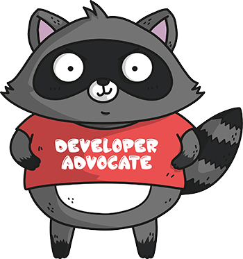

    

I wrote a little bit about the amazing developer advocate build up at Microsoft recently ["The Developer Advocates - Microsoft's New Competence"](http://blog.adron.me/articles/the-developer-advocate-observations-of-microsofts-new-competence/). Today I want to delve into some of the complexities of being a developer advocate.

This article is split into two parts: *first* I'll cover a lot of the work and projects that developer advocates tend to do and *second* I'll dive headlong into the often brutal conflicts and nature of actually being a developer advocate.

Questions are also omnipresent in this type of work. What does a developer advocate do? What exactly makes a developer advocate an *ideal* developer advocate?

## Developer Advocate Work

There are a number of words for an *ideal* developer advocate; effective, mentor, technical, entertaining, friendly, competent, timely, responsive, breadth & depth knowledge, and others. This descriptor list can get long very quickly. I'd also argue that, beyond the *technical* descriptor, developer advocates have a long list of adjectives that are just impossible to find intermixed all together. We're all human, albeit we seem strangely and excessively productive sometimes, other times we're super technical, other times we may disappear off the face of the earth for a while or become strangely incapable of describing some of the simplest technical concepts in existence. Whatever the case, it's a job that has a lot of very loosely coupled requirements that mesh together in various ways to form an *ideal* developer advocate.

Let's tackle some of the characteristics that make a good developer advocate. Some things on this list aren't things you'll read about on the corporate approved descriptions, this list is more about the real aspects of developer advocacy.

    

1. Having a **Thick Skin** & the respective **Grace** to deal with it. Sometimes someone is going to be in a poor mood and will imply via questioning that you have no clue what you are doing. These people are derailments waiting to happen. Have you ever seen an oil train derail? It's catastrophically horrible and these question askers are wedging a spike to cause the derailment into your talk.

2. Having actual **technical chops** combined with an **entertaining** style of presentation, interaction with others, and overall pleasant person. This ability is one of those things where the saying "*you can't make all the people happy all of the time, but you might be able to make some people happy some of the time*" becomes prescient. Some people are pissed or envious that they're even listening to you (no seriously, there are people that feel this way). These people are not the people as an advocate you'll be able to make happy today, but everybody else are apt candidates to learn from you, show them a new tech or help them get to a next step in their efforts. These are the people you want to advocate to, the pissed and envious just ignore and move on. Basically, just ignore *Gamergate* cry babies as best you can and move onward with actually helping people learn new and better ways to develop technology and to use the technology you're advocating.

3. Having the natural ability of an **[autodidact](https://www.merriam-webster.com/dictionary/autodidact)** and personal mindset of a **[polymath](https://www.merriam-webster.com/dictionary/polymath)**. If your idea of learning consists of taking dedicated time to find a tutor, stop working, and study during 9-5 hours developer advocacy is not something you'll want to partake upon. Being a developer advocate puts you in a position to help and teach others, to provide guidance and insight, but largely, to maintain this, you must be an autodidact. In turn many of the people that will look to you for guidance will also be autodidacts, but you'll also need to understand and work with teaching people who likely aren't. Having the flexibility to switch between these styles of interaction while being an advocate is very important, and something to ramp up on as an autodidact, it'll contribute to your ability as a polymath. Speaking of, I even wrote a few ideas on my approaches in ["Autodidact Learning, For the Hacker at Heart"](/articles/autodidact-learning/).

4. Be a **logistical mastermind**. Some companies will attempt to book flights, manage hotels, and related travel for you. They will be bad at it if you want to travel, fly, and stay in places that are awesome. My staunch advice is to make the travel, accommodations, and places you travel, as much of a real personal trip as possible. If you can't or don't travel because of family or other reasons it is best to not even attempt a developer advocacy position that requires travel (which most do). But all that aside, I have lots of thoughts, opinions, and fun stories about gaining skills around being a logistical mastermind that I'll share at a later time.

5. **Time management** and **task switching** master! If you like to have different projects, love to task switch between travel logistics, implementation of today's latest fancy pants tech, and then flip around for social interactions and a beer in the evening you are aligned perfectly for developer advocacy. This is, at the core of it, one of the more brutal aspects of the job. I'd even make the case that this is more of a stress inducer than logistical planning or dealing with miscreant actors at conferences and such (again, that is for me, for women and others in the industry I'm sure other things rank higher as stress inducers)

6. Be able to broach **deep tech topics** while skirting **political chaos** while not being denigrated and discredited as an appeaser of X'ists' all while you're trying to stay on topic. But sometimes you can't appease, and you have to **stand against 'ists'** of various sorts. It's more prevalent now than appears to have been in recent history, partly because of how grossly aware we as a society have become of the sickening underbelly of society. I'd argue most people know you are there to talk tech, not about the latest roiled idiocy coming out of Trump's yapper, but sometimes people will want more from you. I've personally found this to be easy as I'll take a stand for ideals and to protect others without needing to contemplate the action, largely because of privileges I hold in this world. I have the fortunate position to do that, and will continue to, but it also has cost me a lot too. Sometimes as an advocate it is just to risky to take a stand (*for instance, read about [Peter Norman](http://www.cnn.com/2012/04/24/sport/olympics-norman-black-power/index.html) who stood for equity and human rights, then got railed for it by Australia.*). Not that you'll have the podium of the olimpics, but sometimes even as a mere developer advocate you'll be called on to take a stand. Sometimes at the most inappropriate times, and you'll have to make a call. Sometimes this will happen and you'll even lose your job (as has happened to many people to times to count).

7. Be prepared for **massive rewards** if you can keep up and manage effective developer advocacy. Unfortunately, not always from the company that you're advocating for, but instead from the many companies that you'll talk to, people you'll meet, and other awesome things you'll get to do.

Summary for *Developer Advocate Work* is that this can be a hugely rewarding job, but you've really got to be prepared for an extremely fast paced, lonely, life among lots of people with task switching and related rough work. The experience you'll gain, the insight into the industry you'll see, and the technology you'll get to play with generally outweigh all of the negative aspects. Again, it's kind of easy for someone who really likes learning and loves playing with technology.

## Eternal Conflict State

You may ponder, "Adron, you just wrote about a lot of the characteristics requirements of a developer advocate and they sure sounded like a lot of eternal conflict states!" You're right! One has a lot to deal with as a developer advocate, and there's more!

1. **Team value** is always questioned and rarely understood by anybody. As an advocate, you can test out the difficulty of understanding this by asking, "what value do I provide the company?" and then "what value do I provide the tech community?" The answers that come from that will show how difficult it is to determine what a developer advocates value is to both. It's a hard question to answer, and company's often screw up developer advocacy in many ways. Determining this value for yourself as a developer advocate and the company determining how you do or don't provide value is a tough and stressful question to answer. It's also a question that will often come up almost every quarter. Be prepared for this eternal conflict state.

2. People **won't understand** exactly what you do ever. Nope, don't pretend or trick yourself into thinking management or anybody knows what you're doing or what you're up to. Why do I say this? Just ask yourself, "what am I working on today and what are my goals I'll accomplish by 4pm?" and if you can answer that with 100% accuracy for more than 1-2 days in a row, you're a God amongst us mortals. Seriously though, it's hard enough to understand what needs to be done on a day to day basis let alone explaining our outlining what a developer advocate does to someone not actually undertaking the effort. But all in all, stay productive and effective, as close to *ideal* as possible and you'll find this is an eternal conflict state too.

3. Your position is always **fungible**. More than others, a company could at whim just decide the developer advocates don't provide the value they want to so ***BAM!*** The axe comes down and you're shuffled into some other odd department, annexed off to marketing, horrifyingly shoved into sales, luckily stumbling into engineering, or maybe in a fit of grace you're just now unemployed and looking for new awesome work! Again, just one of the top three eternal conflict states I and many others see in developer advocacy.

# The Details on Developer Advocacy

With all that said, it is indeed one of the most rewarding jobs in the technology industry. You so often as a developer advocate get to work with, play around, and create things with the latest and greatest of products. At Google you may get to dive directly into Go and Kubernetes, at Microsoft you'll slide right into Azure and fight the fight alongside engineering to improve product, or maybe at Apple you get the details on the latest tech or SDK they're releasing before it's even officially released. The benefits of being a developer advocate really do far outweigh any of the negatives, but one has to be very seriously prepared to deal with the complexity of the job.

With that this post is a wrap, but I'll be elaborating on developer advocacy in the future; the social elements, time management of the job, more on logistics, thoughts, suggestions, and the entire systemic nature of the work. Until then, cheers! Happy advocating!
