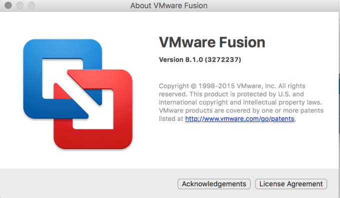
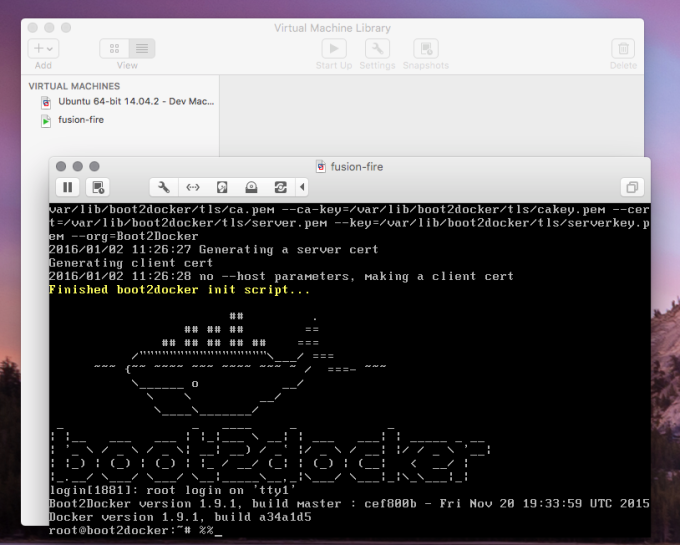

In this article I'm going to cover a few steps in getting started with VMware and Docker instead of the default VirtualBox and Docker. The basic prerequisites for this are:

* VMware Fusion >= v8.x 

* Docker Toolbox w/ Docker```shell-script$ docker --version
Docker version 1.9.0, build 76d6bc9```

<span class="more"></span>

To start with, one of the things I didn't find super intuitive was finding out where boot2docker's URL is. I then attempted to create the virtual machine several times with what I thought it would be and then realized, to my dismay, that it defaulted to what it generally would need to be. A serious case of <a href="https://en.wikipedia.org/wiki/RTFM" target="_blank">RTFM</a>.

Once the prereqs are met, just run the following command.

```shell-script
docker-machine create nameOfTheVirtualMachine --driver vmwarefusion
```

You'll see the creation results display to the terminal then. They should look something like this.

```shell-script
Running pre-create checks...
Creating machine...
(fusion-fire) Creating SSH key...
(fusion-fire) Creating VM...
(fusion-fire) Starting fusion-fire...
(fusion-fire) Waiting for VM to come online...
Waiting for machine to be running, this may take a few minutes...
Machine is running, waiting for SSH to be available...
Detecting operating system of created instance...
Detecting the provisioner...
Provisioning with boot2docker...
Copying certs to the local machine directory...
Copying certs to the remote machine...
Setting Docker configuration on the remote daemon...
Checking connection to Docker...
Docker is up and running!
To see how to connect Docker to this machine, run: docker-machine env fusion-fire
```

After that, just run that last command from the creation results.

```shell-script
docker-machine env fusion-fire
```

Then again you'll get another results as shown below with another command.

```shell-script
export DOCKER_TLS_VERIFY="1"
export DOCKER_HOST="tcp://192.168.244.159:2376"
export DOCKER_CERT_PATH="/Users/adron/.docker/machine/machines/fusion-fire"
export DOCKER_MACHINE_NAME="fusion-fire"
# Run this command to configure your shell:
# eval "$(docker-machine env fusion-fire)"
```

Execute the command.

```shell-scripteval "$(docker-machine env fusion-fire)"```

If you take a look at the Virtual Machine Library on VMware now you should see your machine, and pop the actual VM open and you should see that standard boot2docker screen with wide open root access to that virtual machine.




At this point I wanted to take the virtual machine for a little spin. I issued the following commands to pull an elasticsearch container, run it, and then get the bash prompt of that running container.

```shell-script
docker pull elasticsearch
docker run -it elasticsearch
```
At this point I saw the log displaying so I killed the run with Ctrl+C, got a list of the just exited container so I could get the Container ID to restart it.

```shell-script
docker ps -a
```

Then with everything in place I started it and logged into the container instance.

```shell-script
docker exec -it 257e98847bbb bash
```

Which then shows...

```shell-script
root@257e98847bbb:/#
```

I'm in. At this point I could work with the container however I'd need to.