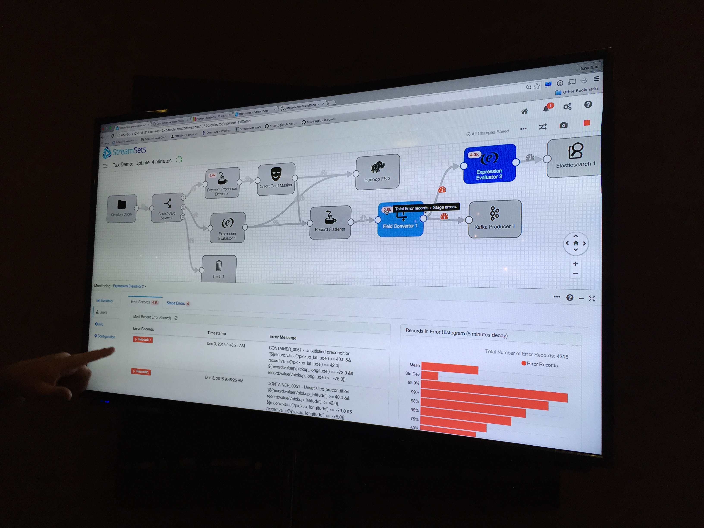
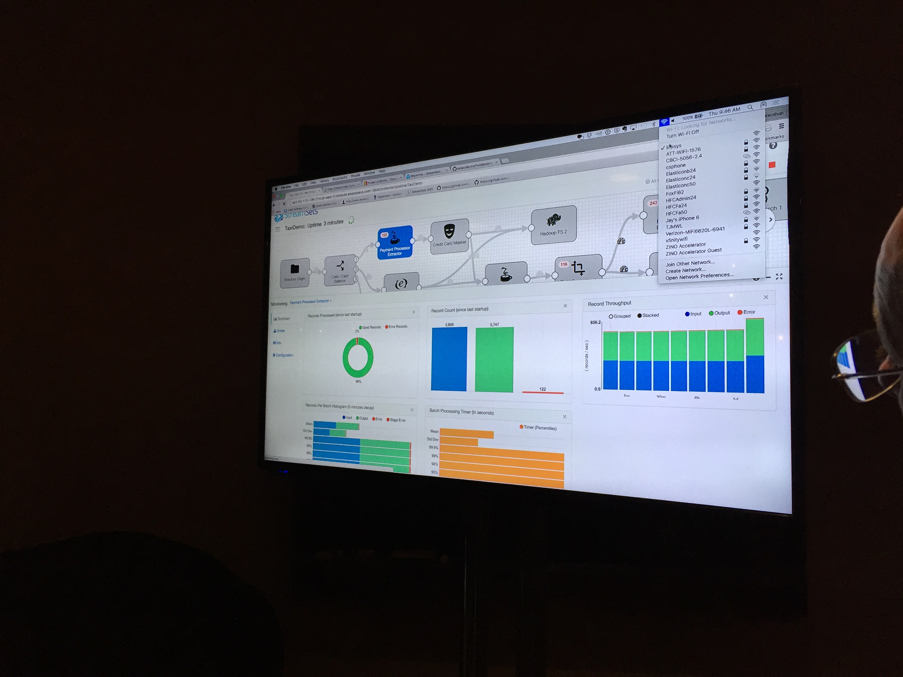

Today is the tour stop of the <a href="https://www.elastic.co/elasticon/tour/2015" target="_blank">Elasticon Tour</a> that swung into Seattle. Myself and some of the <a href="http://hdquotecenter.com/" target="_blank">Home Depot Quote Center</a> team headed up via the <a href="http://www.amtrakcascades.com/" target="_blank">Geek Train</a> for the event. We arrived the night before so we could get up and actually be awake and ready for the event.

Just to note, a good clean place to stay, that isn’t overpriced like most of Seattle is the <a href="https://www.google.com/search?q=Pioneer+Square+Hotel&amp;oq=Pioneer+Square+Hotel&amp;aqs=chrome..69i57j69i60l3.216j0j7&amp;sourceid=chrome&amp;es_sm=91&amp;ie=UTF-8#safe=off&amp;q=Pioneer+Square+Hotel&amp;rflfq=1&amp;tbm=lcl&amp;rlfi=hd:;si:10477062606859836019" target="_blank">Pioneer Square Hotel</a> - usually about $110-120 bucks. If you’re in town for a conference, sometimes it’s even worth skipping the “preferred hotels” and staying here. But I digress...

When the team and I walked in we waited a little bit for registration to get started. We stood around and chatted with some of our other cohort. Once the registration did open, we strolled into the main public space and started checking out some demos.

## StreamSets

The first thing I noticed of the demos is something that’s catching a lot of attention. It’s a partner of <a href="https://www.elastic.co/" target="_blank">Elastic’s</a> called <a href="http://streamsets.com/" target="_blank">StreamSets</a>.

From what I could figure out from just watching the demo is that StreamSets is a ingest engine. That’s simple enough to determine just taking a look at their site. But being able to watch the demo also enlightened me to the way the interface IDE (the thing in the dark pictures above) worked.

The IDE provided ways to connect to ingestion data with minimal schema and actually start to flow the ingestion of this data through the engine. One of the key things that caught my attention at this point was the tie in with <a href="http://kafka.apache.org/" target="_blank">Kafka</a> and <a href="https://hadoop.apache.org/" target="_blank">Hadoop</a> with the respective ingest and egress of data to sources ranging from AWS S3 to things like Elastic’s engine or other various sources that I’ll be working with in the coming months.

For more information about StreamSets here are a few other solid articles:

* <a href="http://streamsets.com/blog/elasticsearch-plus-streamsets-for-reliable-data-ingestion/" target="_blank">Elastic Search Plus StreamSets for Reliable Data Ingestion</a></li>
* <a href="http://streamsets.com/blog/introducing-the-streamsets-data-collector/" target="_blank">Introducing the Streamsets Data Collector</a></li>

…and connect to keep up with what StreamSets is doing:

* <a href="https://twitter.com/streamsets" target="_blank">Twitter</a></li>

…and install instructions:

* <a href="http://streamsets.com/resources/installing-streamsets/" target="_blank">All The Installations</a></li>
* <a href="http://streamsets.com/resources/installing-streamsets/#install-docker" target="_blank">Run via Docker</a></li>

…and most importantly, the code:

* <a href="https://github.com/streamsets" target="_blank">Github StreamSets</a></li>

## Beats (<a href="http://lifehacker.com/are-beats-by-dre-headphones-any-good-1509805994" target="_blank">Not</a> <a href="http://lmkprod.com/9-reasons-to-not-buy-beats-by-dre-headphones/" target="_blank">the</a> <a href="http://forums.macrumors.com/threads/why-not-to-buy-the-beats-by-dre.1376663/" target="_blank">Dumb</a> <a href="http://www.viewpoints.com/expert-reviews/2013/11/08/why-i-will-never-buy-beats-by-dre/" target="_blank">Lousy</a> <a href="https://youtu.be/XkVZwj4pZ7A" target="_blank">Headphones</a>)

Recently I <a href="http://compositecode.com/2015/11/25/nagios-and-ubuntu-64-bit-14-04-lts-setup-configuration/">installed Nagios</a> as I will be doing a lot of systems monitoring, management, and general devops style work in the coming weeks to build out solid site reliability. Nagios will theoretically do a lot of the things I need it to do, but then I stumbled into the recently released <a href="https://www.elastic.co/products/beats" target="_blank">Beats</a> by <a href="https://www.elastic.co/" target="_blank">Elastic Search</a> (not by Dre, see above links in the title).

I won't even try to explain Beats, because it is super straight forward. I do suggest checking out the site if you're even slightly interested, but if you just want the quick lowdown, here's a quote that basically summarizes the tool.
<blockquote>"Beats is the platform for building lightweight, open source data shippers for many types of operational data you want to enrich with Logstash, search and analyze in Elasticsearch, and visualize in Kibana. Whether you’re interested in log files, infrastructure metrics, network packets, or any other type of data, Beats serves as the foundation for keeping a beat on your data."</blockquote>
So there ya go, something that collects a ton - if not almost all of - the data that I need to manage and monitor the infrastructure, platforms, network, and more that I'm responsible for. I'm currently diving in, but here's a few key good bits about Beats that I'm excited to check out.
<h3>#1 - PacketBeat</h3>
This is the realtime network packet analyzer that integrates with Elasticsearch and provides the respective analytics you'd expect. It gives a level of visibility with Beats between all the network servers and such that will prospectively give me insight to were our <em><a href="https://youtu.be/f99PcP0aFNE" target="_blank">series of tubes</a> or getting clogged up</em>. I'm looking forward to seeing our requests mapped up with our responses!  ;)
<h3>#2 - FileBeat</h3>
This is a log data shipper based on the Logstash-Forwarder. At least it was at one point, it appears to look like it is less and less based on it. This beat monitors log directories for log files, tails the fails, and forwards them to Logstash. This completes another important part of what I need to systemically monitor within our systems.

<strong>Random fascinating observations:</strong>
<ul>
* Did I mention Beats is written in Go? Furtherering Derek's tweet from 2012!  ;)</li>
</ul>
https://twitter.com/derekcollison/status/245522124666716160
<ul>
* Beats has a cool logo, and the design of the tooling is actually solid, as if someone cared about how one would interact with the tools. I'll see how this holds up as I implement a sample implementation of things with Beats &amp; the various data collectors.</li>
</ul>
<strong>More References &amp; Reading Material for Beats:</strong>
<ul>
* <a href="https://www.elastic.co/blog/beats-1-0-0" target="_blank">Beats 1.0.0 Release</a></li>
* <a href="https://github.com/elastic/beats" target="_blank">Beats on Github</a></li>
</ul>
That's it for the highlights so far. If anything else catches my eye this evening at the Elasticon Tour, I'll get started rambling about it too!

    

