<div class="image float-right">
    
</div>

* *Part 1* – [Setting up an AWS SQS Queue for Use With Node.js Beanstalk Worker Instances](/articles/setting-up-an-aws-sqs-queue-for-use-with-node-js-beanstalk-worker-instances)
* *Part 2* – [Setting up a Hapi.js App that sends work to a Node.js AWS Worker via SQS](/articles/hapijs-aws-worker-publish/) (This is the current article you're reading now)
* *Part 3* – [AWS Beanstalk Worker with Node.js and SQS](/articles/aws-beanstalk-worker-with-node-js-and-sqs/)

<a name="webapplication"></a>

First I created a project for the node.js web application.

```shell-script
$ npm init
This utility will walk you through creating a package.json file.
It only covers the most common items, and tries to guess sane defaults.

See `npm help json` for definitive documentation on these fields
and exactly what they do.

Use `npm install &pkg& --save` afterwards to install a package and
save it as a dependency in the package.json file.

Press ^C at any time to quit.
name: (testing-aws-sqs-site)
version: (0.0.0) 0.0.1
description: This project that will feed data to the queue for the AWS SQS sample.
entry point: (index.js) server.js
test command: mocha
git repository: (https://github.com/Adron/testing-aws-sqs-site.git)
keywords: aws, sqs, elastic, elastic beanstalk, queue, worker
author: Adron Hall
license: (ISC) Apache 2.0
```

<span class="more"></span>

<a name="mocha"></a>

**Installing Dependencies**

Next I installed some dependencies like mocha and whatever else I'd need down the line and the next major dependency, the AWS SDK. To see a complete list of the dependencies just check out the [package.json](https://github.com/Adron/testing-aws-sqs-site/blob/master/package.json).

```shell-script
npm install aws-sdk --save
```

Next step is to create a test directory which I'll use to test out some of the services as I move forward. Some of these tests will not fit into the BDD, TDD, or any other style of tests, as I will write them in a way that they'll test the SDK, system and related elements for future use in continuous delivery. So just follow me here and don't freak out, they're not as frivolous as they seem at first.

I added mocha as my test framework, and since it uses a folder called test as the default to execute tests, I added a folder and placed a file in that folder called aws_sdk.js. I then added the following test just to have an example test to work from.

```javascript
var should = require ('should');

describe ( 'When trying out this sample application in AWS you', function () {

  it ( 'should have an environment variable set for AWS_ACCESS_KEY_ID', function () {
    process.env.AWS_ACCESS_KEY_ID.should.exist;
  });

  it ( 'should have an environment variables set for AWS_SECRET_KEY', function () {
    process.env.AWS_SECRET_KEY.should.exist;
  })

});
```

Then execute that with a call to mocha, and the two tests will fail.

```shell-script
$ mocha

  When trying out this sample application in AWS you
    1) should have an environment variable set for AWS_ACCESS_KEY_ID
    2) should have an environment variables set for AWS_SECRET_KEY

  0 passing (4ms)
  2 failing

  1) When trying out this sample application in AWS you should have an environment variable set for AWS_ACCESS_KEY_ID:
     TypeError: Cannot read property 'should' of undefined
      at Context.&amp;amp;amp;amp;amp;amp;amp;amp;anonymous&amp;amp;amp;amp;amp;amp;amp;amp; (/Users/adron/Codez/testing-aws-sqs-site/test/aws_sdk.js:12:34)
      at callFn (/usr/local/lib/node_modules/mocha/lib/runnable.js:249:21)
      at Test.Runnable.run (/usr/local/lib/node_modules/mocha/lib/runnable.js:242:7)
      at Runner.runTest (/usr/local/lib/node_modules/mocha/lib/runner.js:373:10)
      at /usr/local/lib/node_modules/mocha/lib/runner.js:451:12
      at next (/usr/local/lib/node_modules/mocha/lib/runner.js:298:14)
      at /usr/local/lib/node_modules/mocha/lib/runner.js:308:7
      at next (/usr/local/lib/node_modules/mocha/lib/runner.js:246:23)
      at Object._onImmediate (/usr/local/lib/node_modules/mocha/lib/runner.js:275:5)
      at processImmediate [as _immediateCallback] (timers.js:336:15)

  2) When trying out this sample application in AWS you should have an environment variables set for AWS_SECRET_KEY:
     TypeError: Cannot read property 'should' of undefined
      at Context.&amp;amp;amp;amp;amp;amp;amp;amp;anonymous&amp;amp;amp;amp;amp;amp;amp;amp; (/Users/adron/Codez/testing-aws-sqs-site/test/aws_sdk.js:16:30)
      at callFn (/usr/local/lib/node_modules/mocha/lib/runnable.js:249:21)
      at Test.Runnable.run (/usr/local/lib/node_modules/mocha/lib/runnable.js:242:7)
      at Runner.runTest (/usr/local/lib/node_modules/mocha/lib/runner.js:373:10)
      at /usr/local/lib/node_modules/mocha/lib/runner.js:451:12
      at next (/usr/local/lib/node_modules/mocha/lib/runner.js:298:14)
      at /usr/local/lib/node_modules/mocha/lib/runner.js:308:7
      at next (/usr/local/lib/node_modules/mocha/lib/runner.js:246:23)
      at Object._onImmediate (/usr/local/lib/node_modules/mocha/lib/runner.js:275:5)
      at processImmediate [as _immediateCallback] (timers.js:336:15)
```

<a name="aws"></a>

At this point I'll go ahead and set these environment variables in my ~/.bash_profile file. On other machines this may just be a .bashrc file or something else you've configured for your bash. Add the environment variables.

```shell-script
# AWS Credentials
export AWS_ACCESS_KEY_ID=YOUR_AWS_ACCESS_KEY
export AWS_SECRET_KEY=YOUR_SUPER_SECRET_AWS_KEY
```

Once you've added these to your bash, source the file to activate and set these new environment variables. My command is to source my local .bash_profile file, but you'd need to source whichever file you've set the variables in that starts up with your bash.

```shell-script
source ~/.bash_profile
```

Now executing the mocha tests I get a beautiful confirmation that I do have the environment variables in place and set.

```shell-script
$ mocha

  When trying out this sample application in AWS you
    ✓ should have an environment variable set for AWS_ACCESS_KEY_ID
    ✓ should have an environment variables set for AWS_SECRET_KEY

  2 passing (4ms)
```

Now that I have these two passing I've added another that shows the SDK to have the settings have actually been set. The main reason here is also to just discover how it is set and where those values are stored on the AWS object. I discovered that to set the config, just issue a call to update({}) and pass in the respective configuration as name value pairs using JSON.

```javascript
before(function () {
  AWS.config.update({
    accessKeyId: process.env.AWS_ACCESS_KEY_ID,
    secretAccessKey: process.env.AWS_SECRET_KEY,
    region: awsRegion});
})

it('should have the AWS Access Key set in the AWS config', function () {
  var config = AWS.config;
  config.credentials.accessKeyId.should.equal(process.env.AWS_ACCESS_KEY_ID);
  config.credentials.secretAccessKey.should.equal(process.env.AWS_SECRET_KEY);
})

it('should have the AWS region set to us west 2', function () {
  AWS.config.region.should.equal(awsRegion);
})
```

The configuration data is then stored in the config credentials for the access key and secret access key. The region is stored as a value on the config object. Those should pass and then let's move straight on to setting up a basic site that can send the queue some data.

For more information about the configuration and setup of the AWS SDK check out the [SDK Documentation on the topic](http://docs.aws.amazon.com/AWSJavaScriptSDK/guide/node-configuring.html).

**The Web Site Application**

To create this web site application I'm going to use hapi.js. You can of course use anything you want to for this part of the example such as express, geddy or whichever. The general premise of what I'm going to put together for the front end of this whole application is going to be extremely simple. By proxy it will then be easily applied to any of the other framework options.

```shell-script
npm install hapi --save
```

Once that was done I installed the good library.

```shell-script
npm install good --save
```

First part of the site I spooled up was to create a server.js file in the root of the project and add the following code.

```javascript
var AWS = require('aws-sdk')

var Hapi = require('hapi');
var Good = require('good');

var server = new Hapi.Server(3000);

server.route({
  method: 'GET',
  path: '/',
  handler: function (request, reply) {
    reply('Hello, world!');
  }
});

server.route({
  method: 'GET',
  path: '/{name}',
  handler: function (request, reply) {
    reply('Hello, ' + encodeURIComponent(request.params.name) + '!');
  }
});

server.pack.register(Good, function (err) {
  if (err) {
    throw err; // something bad happened loading the plugin
  }

  server.start(function () {
    server.log('info', 'Server running at: ' + server.info.uri);
  });
});
```

The dependency I added, good, brings some logging features to the project now. So with this, when executing the server file to get the server running, I get the following response on the command line.

```shell-script
$ node server.js
141020/004110.009, info, Server running at: http://adrons-mbp:3000
```

Next I issued some curl commands against the end points.

```shell-script
17:42 $ curl localhost:3000
Hello, world!~
17:42 $ curl localhost:3000/Frank
Hello, Frank!~
17:42 $ curl localhost:3000/Sally
Hello, Sally!~
```

With the logging on, the following results proved out that everything was running ok.

```shell-script
$ node server.js
141020/004219.213, info, Server running at: http://adrons-mbp:3000
141020/004230.236, request, http://adrons-mbp:3000: get / {} 200 (10ms)
141020/004236.850, request, http://adrons-mbp:3000: get /Frank {} 200 (2ms)
141020/004240.514, request, http://adrons-mbp:3000: get /Sally {} 200 (1ms)
141020/004254.937, request, http://adrons-mbp:3000: get /Cat {} 200 (0ms)
```

The next thing I need to actually do is send a message to the queue to be processed. In the server.js file I added the following code, with the entire server.js file shown below.

```javascript
var should = AWS = require('aws-sdk'),
  awsRegion = 'us-west-2',
  sqs = {},
  Hapi = require('hapi'),
  Good = require('good');

var server = new Hapi.Server(process.env.PORT || 3000);

server.route({
  method: 'GET',
  path: '/',
  handler: function (request, reply) {
    reply('Hello, world!');
  }
});

function sendSqsMessage() {
  'use strict';

  AWS.config.update({
    accessKeyId: process.env.AWS_ACCESS_KEY_ID,
    secretAccessKey: process.env.AWS_SECRET_KEY,
    region: awsRegion
  });
  sqs = new AWS.SQS();

  var params = {
    MessageBody: 'The Message Body Goes Here',
    QueueUrl: 'https://sqs.us-west-2.amazonaws.com/588271471917/a_sample',
    DelaySeconds: 0
  };

  sqs.sendMessage(params, function (err, data) {
    if (err) {
      console.log(err, err.stack);
    } // an error occurred
    else {
      console.log('Victory, message sent for ' + encodeURIComponent(request.params.name) + '!');
    }
    ;
  });
}

server.route({
  method: 'GET',
  path: '/{name}',
  handler: function (request, reply) {
    sendSqsMessage(encodeURIComponent(request.params.name));
    reply('Your message ' + encodeURIComponent(request.params.name) + ' has been sent to queue!');
  }
});

server.pack.register(Good, function (err) {
  if (err) {
    throw err; // something bad happened loading the plugin
  }

  server.start(function () {
    server.log('info', 'Server running at: ' + server.info.uri);
  });
});
```

I'll step through the key lines above to detail where and what the functionality is.

The line below is important, as AWS Beanstalk assumes the PORT environment variable will be set and used.

```javascript
var server = new Hapi.Server(process.env.PORT || 3000);
```

I added the sendMessage function. In this function I update the configuration, which is required to get the appropriate variables set. On the AWS instance itself, which I'll cover shortly, these are where the environment variables will be picked up to instantiate the AWS configuration for the SQS object.

```javascript
function sendSqsMessage() {
  'use strict';

  AWS.config.update({
    accessKeyId: process.env.AWS_ACCESS_KEY_ID,
    secretAccessKey: process.env.AWS_SECRET_KEY,
    region: awsRegion
  });
  sqs = new AWS.SQS();

  var params = {
    MessageBody: 'The Message Body Goes Here',
    QueueUrl: 'https://sqs.us-west-2.amazonaws.com/588266671666/the_path_to_the_queue',
    DelaySeconds: 0
  };

  sqs.sendMessage(params, function (err, data) {
    if (err) {
      console.log(err, err.stack);
    } // an error occurred
    else {
      console.log('Victory, message sent for ' + encodeURIComponent(request.params.name) + '!');
    };
  });
}
```

So all in all, the code is kind of dirty, but it gets the point across. Whenever I send an HTTP GET request against domain/name a post to the queue with the /name part of the URI will be sent. Now it's time to get the actual instance deployed in AWS and test this.

In the example above, as a reminder where the URL for the queue is located, navigate to the SQS part of the AWS console and click on the actual queue itself. In the information section of the queue you'll see the URL listed.

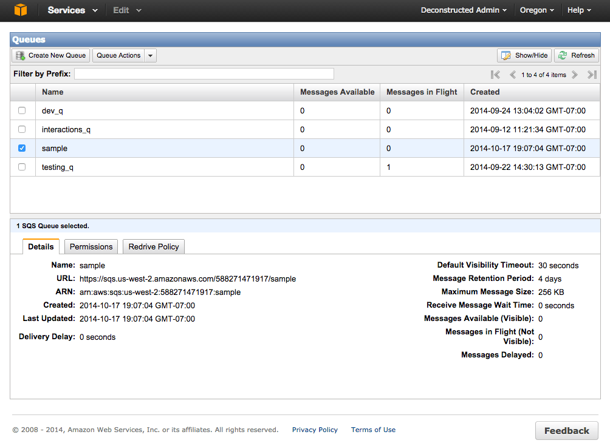

For more information on the queue and how to set it up check out the preview article here.

## Setting up an AWS Beanstalk Instance

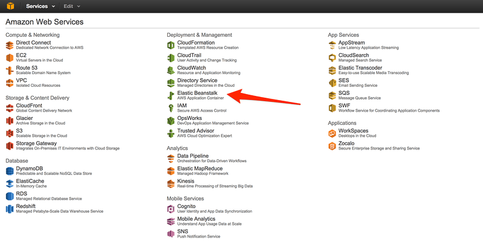

If you've not used AWS Beanstalk the console interface will automatically show a display screen that only has options to create an application. If there are already applications running the Beanstalk Environment the create application button will be toward the top right of the console.

It's important to note I'll be creating two environments within a single application within the Beanstalk environment. Both of them will be their own load balanced, environments acting just as if they were located in different geographical regions in AWS.

The first step once I've clicked the create application button is to set the application name and description. The name, is required, the description is not.

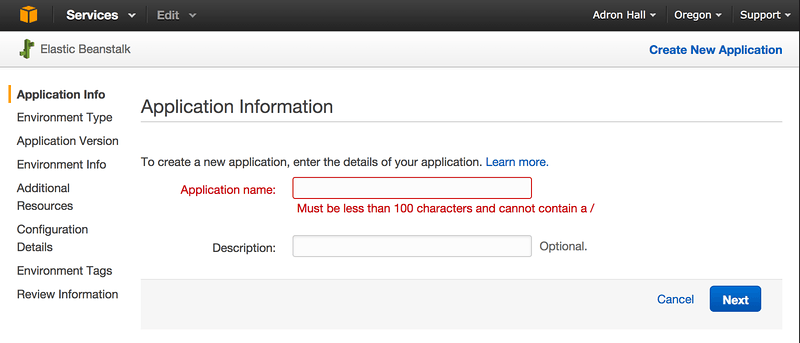

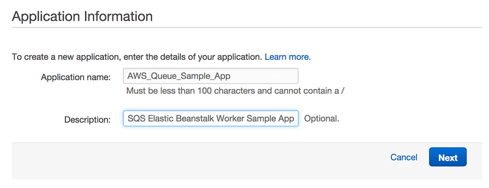

Clicking on next then puts me on the environment creation screen. I've set the environment tier to web server, the predefined configuration is using Node.js, and the environment type is a load balanced with autoscaling environment. With these set, click next.

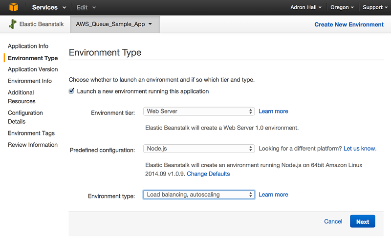

<a name="upload"></a>

For the next step I'll need to upload the application. I've got the cloned application repo navigated to in bash, execute '*open .*' [1] against it to open the finder [2] to that location, right click and compress [3] the folder and all of the contents. I now have a ready to upload and deploy file package.

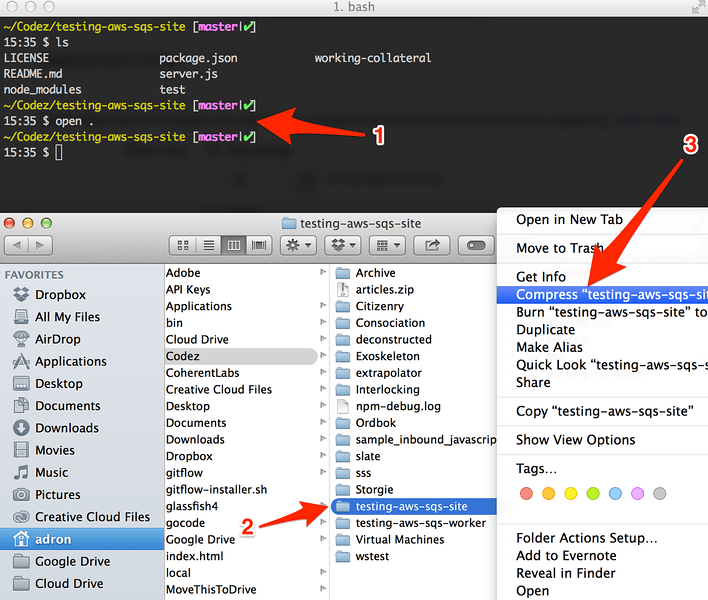

Now select the file, make sure the radio button is selected also, as selecting a file doesn't automatically select the radio button. Then click on next. The application deployment file will then upload.

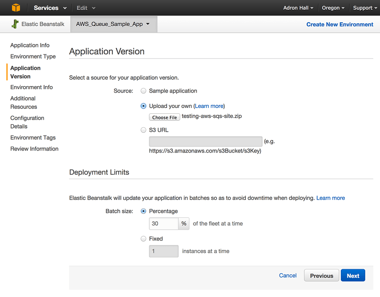

The next dialog will provide a form to set the environment name, URL, and description. Click on the *Check availability* button to determine if the URL is available that is chosen.

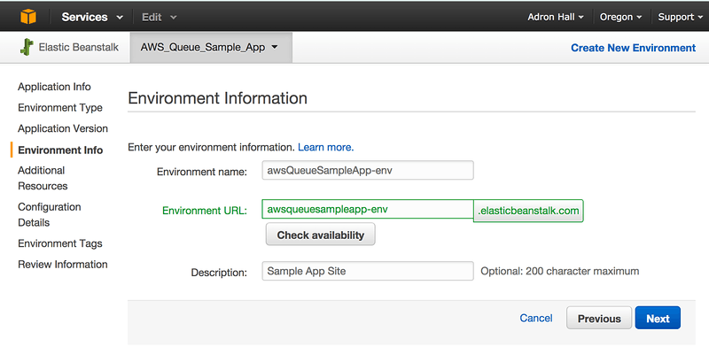

Next I click through the additional resources, configuration details and environment tags leaving the default settings. The on the final review information screen I'll click the launch button and the status of deployment will show.

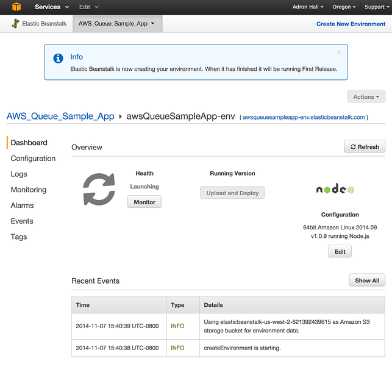

Once that spools up, click on the URL to navigate the browser to the URL that the site is now available publicly at and add a name to the URL. Here's the default *Hello World!* display.

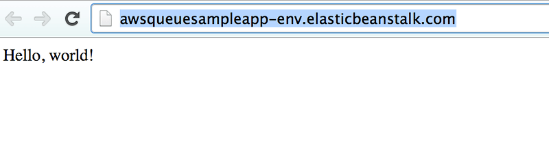

The display when adding a name (or any set of strings) to the URL, in this particular case to this URL here *http://awsqueuesampleapp-env.elasticbeanstalk.com/* with a name attached like this *http://awsqueuesampleapp-env.elasticbeanstalk.com/April* the following displays and sends the name to the AWS SQS Queue we have setup.

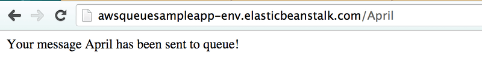

To determine if everything I've done has worked ok, I navigate back to the AWS console and then into the SQS section. On the queue list I pick the queue that is being used and there sits the queue items I've added by hitting the URL shown above.

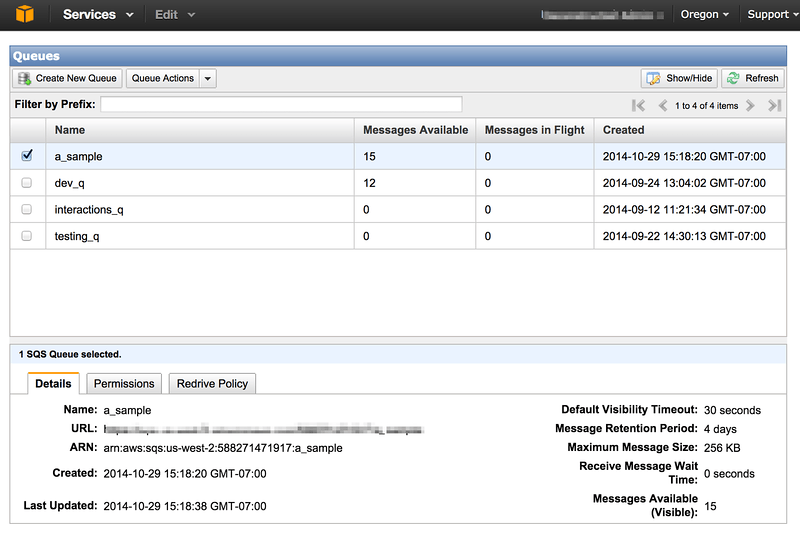

Check under the Messages Available, which I've submitted 15 messages and they sit there in the queue, waiting for the next stage of this series - building the worker node. Keep reading, that's up next. Cheers!

* *Part 1* – [Setting up an AWS SQS Queue for Use With Node.js Beanstalk Worker Instances](/articles/setting-up-an-aws-sqs-queue-for-use-with-node-js-beanstalk-worker-instances)
* *Part 2* – [Setting up a Hapi.js App that sends work to a Node.js AWS Worker via SQS](/articles/hapijs-aws-worker-publish/) (This is the current article you're reading now)
* *Part 3* – [AWS Beanstalk Worker with Node.js and SQS](/articles/aws-beanstalk-worker-with-node-js-and-sqs/)

**Reference:**

* [Testing AWS SQS Web Worker Github Repo](https://github.com/Adron/testing-aws-sqs-worker)
* [Testing AWS SQS Web App Github Repo](https://github.com/Adron/testing-aws-sqs-site)
