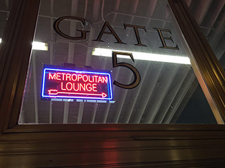
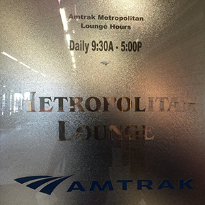
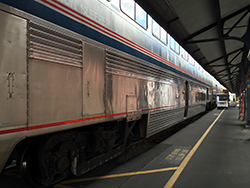
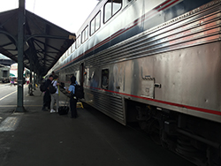
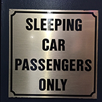
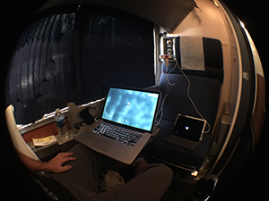

This week, my trip to [HashiConf](https://hashiconf.com) kicked off officially at 2:25pm, when the Amtrak Coast Starlight departed Portland.

I had more than a few goals for the trip down to Napa Valley for HashiConf. By priority, the top 5 goals:

    

1. Give a talk with Evan and respectively get a conversation started around organizing immutable infrastructure projects along the lines of 12-factor apps and the autopilot pattern.
2. Meet as many of the HashiConf Team as I can.
3. Make something like a documentary video short of the trip, the conference, and whatever else might be pertinent. It's an experiment, it'll work or it won't.
4. Blog the event. Maybe just a couple entries, or three, or more.
5. Have a relaxing, chill, introspective, educational, and laid back trip while enjoying some wine at the [Meritage](http://meritagecollection.com/meritageresort/) (this is where the conference is being held).

## [Organizing Infrastructure Config and Workflow](http://blog.adron.me/talks/Organizing-Infrastructure-Config-and-Workflow/)

I wrapped up a few more things for the talk, which are now 98% done. I just have a 1% review with my co-presenter [Evan](https://twitter.com/evandbrown/), and then the other 1% a few tweaks to the repositories I'll be showing and speaking from. You can already find the slide deck and material for the talk [here](talks/Organizing-Infrastructure-Config-and-Workflow/). There will however be more information and details once the talk is over.

After that I headed down with [Lena](@lenadroid) and discussed a few things, including giving her the first rough presentation via iPad with the v1 of the Retina Display. This reminded, hot damn that version of the iPad is ridiculously heavy, don't give presentations with it. Afterwards she gave me a critique of things I ought not to forget. With that done, I finished packing up, and we both headed toward the train station.

I detrained at Union Station and went in to wait for my train. At this point I have a little aside for this blog entry. It's just a philosophy I have about things which makes the way I approach life very different than the way much of humanity seems to approach life.

    

## Approaching Life on My Terms

One of the things I'm very particular about is how, when, where, and in which way I travel to places. I do everything I can to follow a few principle ideals:

* Don't hurry. Otherwise I miss the important moments.
* Enjoy those moments. They only happen once.
* Live my life, there's only this one I have.
* Demand respect for my time, if others don't, fire them.

Sometimes I get stuck in the rat race of airports, but I try to travel by train whenever possible. The experiences I've had are too amazing to outline here, but suffice it to say, train travel has been very rewarding for me and a dramatically more human experience than the meat-tubes of the modern airliner.

## Onto The Flanged Wheel

    

    

Flanged wheels are what train use btw, it's that lip on the wheel keeps them on the tracks. At 2:25 pm the south bound Amtrak Coast Starlight pulled out of Portland's Union Station on time. Something this train does about 94% of the time these days. A marked improvement over the abysmal 40% on-time arrival and 6% non-arrivals that were happening back in 2010 and before. Union Pacific straightened it's grumpy-ass out and started running the trains better, but I digress.

    

    

I got comfortable and settled into an evening of blog writing, reading further on Go, enjoy the views, and review the talk. Dinner was served at a punctual 6:00pm reservation I'd attained, and by then I'd accomplished almost every one of these things. In addition to these a *fire* occurred at work where our Stash Git Server went to shit on us. It's a bit difficult to manage a *fire* when one is between Klamath Eugene, Oregon and Mount Shasta, where the mountain isn't really kind to one's internet connectivity. But I did what I could and recovered from some server images. With that up and running I settled in for the night by re-watching Captain America Civil War, ya know, primarily for the hilarious comments Peter Parker makes. Until tomorrow... adieu.
