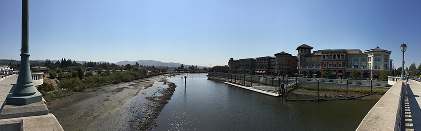
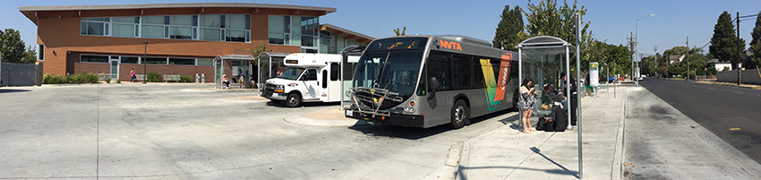
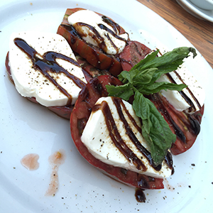
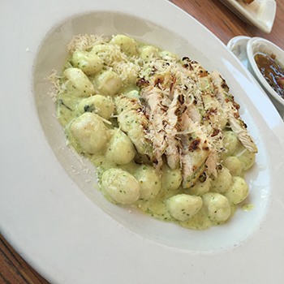

Almost to Napa, but not yet. The train pulled in and I detrained. I will admit, I know of nothing about Martinez, California except for two things: It's a stop on the way to Jack London Square (AKA Oakland) and thus San Francisco and it's got a lot of knarly looking industrial plants spewing stuff into the air. Poisonous, I've no idea, but I know the one's just west of the city (or town?) are. I enjoyed the ghost fleet at mooring, the sun rising from the east, and the smooth roll of the train. Now I was standing here ready to be on my way to Napa.

However I have a 2 hour layover (is it a layover, transfer, or something else in train-speak-ese?). So I decided I was going to learn a thing or three about Martinez, California. I walked a few blocks into town and found a Starbucks. I felt like such a filthy tourist walking into a Starbucks in Martinez, hoping they've got the local joint somewhere nearby, I gave in and enjoyed the Seattle sugar drink anyway.

There I noticed three police officers, somewhat jubilant about whatever day they were going to have. I chatted with them a bit and it seemed there was some easy work they'd be doing at a fair or festival type event. Another few people sat down and enjoyed the fact I'd brought my standard 3 prong adapter along for the ride. Ya see, shockingly, there wasn't enough outlets for the phones, laptops, and other devices everybody wanted plugged in. So the strip was a welcome addition.

I sat down and dorked out on some Terraform templates and started reading up on some blog entries about Terraform Modules. I was pleasantly surprised to find solid material on page 2 of the google results (where I look every other year or so). I found blog entries by [@serialseb](https://twitter.com/serialseb), [Tom](https://github.com/bobtfish), and [Bart Spaans](https://opencredo.com/author/bart/) (*links below in references*). Those along with a host of other materials I started to get more of a picture around how, what, where, when, and why Terraform Modules. Stay tuned in a subsequent blog entry I'll have thoughts, hacks, and other collections of things on what I learned and hacked together.

### Word Absurdities Over Triple Grande Caramel Macchiatos

I penned this blog entry while sipping at my *triple grande caramel macchiato*. All the while pondering the absurdity of how English is constructed to identify such a thing as triple grande caramel macchiato and for the millionth time thought about the desecration in re-defining the word macchiato that Starbucks committed. A macchiato is not this strange sugared perverse creation that they serve, but whatever, it tastes good. It's just a disingenuous and deceitful disrespect, combined with adding confusion to the naive, to taint a word that has existed for over a century which means something entirely different.

But whatever, it's almost time for the final 45 minute ride to Napa.

I boarded the bus. The driver greeted me, scanned my ticket, and we discussed shortly the logistics of getting to Napa from Martinez. A timely departure and barely any traffic had me arriving on time.

Since the Soscol Transit Center was located just a few blocks from downtown Napa Valley I decided to spend lunch there and take a walk around.

### Oh Lunch!

    

    

Lunch was awesome. Caprese with heirloom tomatoes, actual fresh mozzarella and a thick, sweet, and rich balsamic reduction. Simply, caprese done right! I followed that with some gnocchi and a glass of white wine. It was time after all, being in Napa Valley, that I had some wine.

    

I hung out downtown for a short time after lunch and then boarded the [Vine](http://www.ridethevine.com/vine) Route 11 Bus from downtown Napa out to the [Meritage](http://meritagecollection.com/meritageresort/). I arrived and walked up to the front desk and checked in. Lo and behold there stood [Evan](https://twitter.com/evandbrown/), a most fortuitous timing indeed.

### Synching Up

We immediately introduced ourselves to some of the great staff handling HashiConf and plotted to meet and synch up our talk. The deck of course being basically done (and available [here](http://blog.adron.me/talks/Organizing-Infrastructure-Config-and-Workflow/)) but we needed to insure some of the surprises that we have are ready. Yes, that's right, there are surprises we'll have at the talk itself. So it's worth tuning in if you're working with HashiCorp's Terraform and Google Cloud Platform.

**References:**

Those I referred above:

* [Working Around the Lack of Count in Terraform Modules](https://serialseb.com/blog/2016/05/11/terraform-working-around-no-count-on-module/)
* [Terraform from the Ground Up](http://bobtfish.github.io/blog/2015/03/29/terraform-from-the-ground-up/)
* [Terraform Infrastructure Design Patterns](https://opencredo.com/terraform-infrastructure-design-patterns/)

Other Good Entries on Terraform Modules & Related Material:

* [Terraform Conditionals, Sort of](http://www.davekonopka.com/2016/terraform-conditionals.html) by [Dave Konopka](https://twitter.com/davekonopka).
* [Terraform: Beyond the Basics with AWS](https://aws.amazon.com/blogs/apn/terraform-beyond-the-basics-with-aws/)
