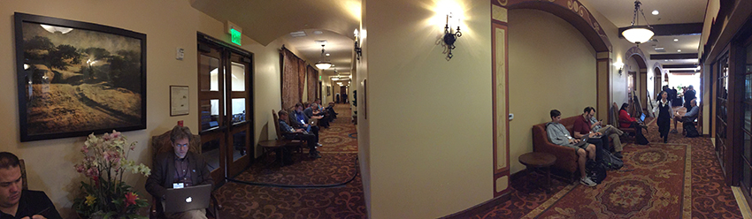
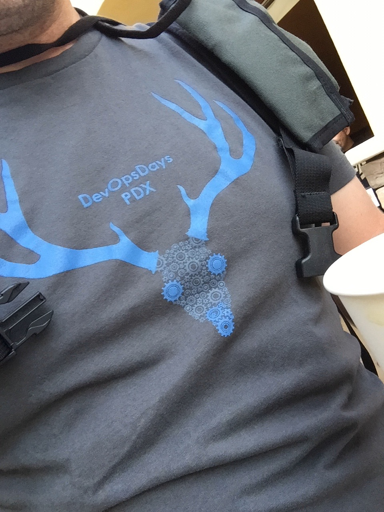
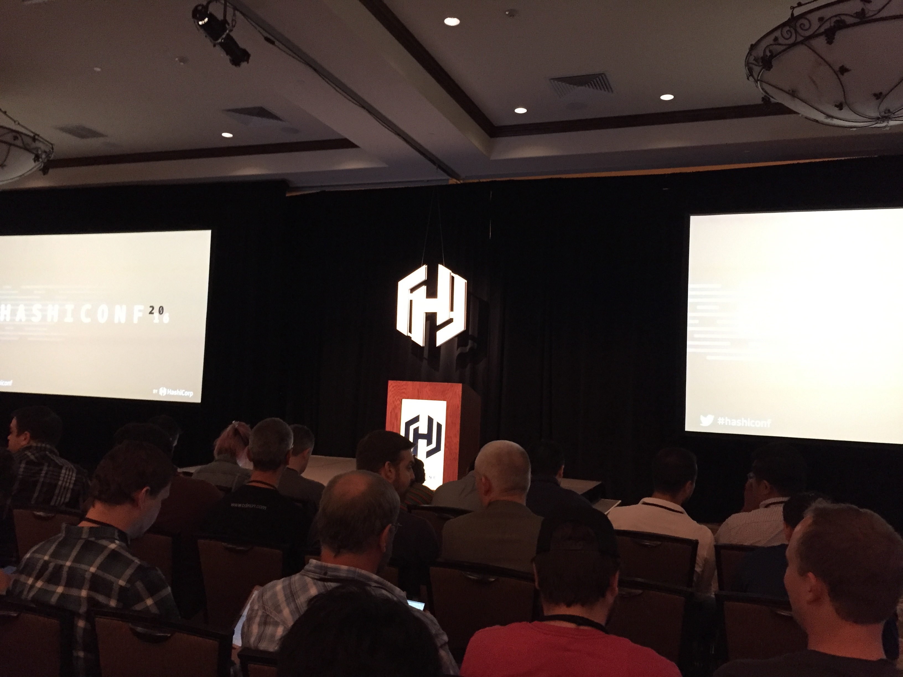

Day 3 of my trip, and day 1 of the conference kicked off calmly. I made a cup of coffee with my [Aeropress](http://www.aerobie.com/product/aeropress/) & props to [Aneel](https://twitter.com/aneel) for planting the idea a bunch of months ago by showing me how he uses it.

<blockquote class="twitter-tweet" data-lang="en">
Good morning <a href="https://twitter.com/hashtag/HashiConf?src=hash">#HashiConf</a>. Cheers! <a href="https://t.co/TxfqtBVmCS">pic.twitter.com/TxfqtBVmCS</a>
&mdash; Λdrøn (@Adron) <a href="https://twitter.com/Adron/status/773545481704124417">September 7, 2016</a></blockquote>

    

While picking up some breakfast, I realized, how one could create a conference of just hallway activity. I always find myself hacking in a hallway at every conference I've ever been to.

For my respective tshirt of the day, I had to give some love and rep for Devops Day PDX. It was also an excellent conference that a number of organizers did a great job with.

After breakfast all of the speakers, attendees, and everybody went into the main room for the keynote. We gathered, two big screens displayed beside the podium. Once everyone got seated [Seth Vargo](https://twitter.com/sethvargo) came out to kick off they keynote and introduce the speakers.

After the keynote I chatted about some thoughts on Vault and related security technology.

I started to walk onward toward the speakers room again but ran into Bryan Cantrill (CTO @ Joyent, lover of Oracle) and James Nugent. They discussed a number of things, one being certain failings of Go. This was interesting to me as I'm just starting to hack around with the language and now have a list of things I will ensure I look into within the toolchain itself. I also wish I could have recorded this conversation for you dear reader, because let me tell ya, Bryan has more overheards (you know, OH on twitter) that need to be published on Twitter than I could even hope to record. We're talking about 10-20 notable overheard quotes per second, he's boss on phrasing.

I'll have more on Vault, some of the topics that came up in conversation, and more in subsequent blog entries. But for now I was happy with the simple things in life, like tweeting via paper. :-o  #shocks #muchsmartass

<blockquote class="twitter-tweet" data-lang="en">
Paper <a href="https://t.co/vFBkijD8Io">pic.twitter.com/vFBkijD8Io</a>
&mdash; Λdrøn (@Adron) <a href="https://twitter.com/Adron/status/773594438195027968">September 7, 2016</a></blockquote>

As scheduled (thanks for wrangling us speakers Kristen, you did an excellent job!) Evan and I were setup and ready precisely on time. We kicked off our presentation at exactly 3:35pm. More details (slide deck, code, links, etc) on the talk can be found on the page I've created for the talk [here]() and whenever the video of the talk is available I'll post a link there and update with a link here.

The talk went exceptionally. Both Evan and I were happy with how things turned out. Namely, here are a few high points:

* Code was committed live on Github for features related to create GCP Projects with Terraform. The respective resources will be available soon as they're ready for a subsequent build.
* Evan did not suffer any consequences from the heat of standing behind the curtain, as wizards sometimes do.
* Our key points of conversation topics came across well, funny parts delivered with laughs, but more importantly there were more than a few people after the talk that also wanted to contribute and discuss further these ideas. The notion of bridging together one's autopilot pattern based, 12-factor app style, intelligently monitored systems style architectures into application projects was something that is on more than a few people's minds. I'll have more on this as conversations continue, and hope you dear reader may want to jump into that conversation too.

<blockquote class="twitter-tweet" data-lang="en">
Literally hiding behind the curtains at <a href="https://twitter.com/hashtag/hashiconf?src=hash">#hashiconf</a> as <a href="https://twitter.com/Adron">@adron</a> does his part of the talk. <a href="https://twitter.com/hashtag/spooky?src=hash">#spooky</a> <a href="https://t.co/9w65aQ916T">pic.twitter.com/9w65aQ916T</a>
&mdash; Evan Brown (@evandbrown) <a href="https://twitter.com/evandbrown/status/773664064333492224">September 7, 2016</a></blockquote>

After the presentation conversations went on for another 2 hours or so. But after that a number of Googlers and myself headed off for Oxford Market, Pliny the Elder, and adventure in Napa.

If you'd like to dive into the conversations around application organization, configuration, maintenance, and management of said projects, do sign up to [Thrashing Code](http://blog.adron.me/thrashingcodenews.html) and I'll be pushing forward that conversation and herding all of us cats into a medium in which we can discuss these things further.
