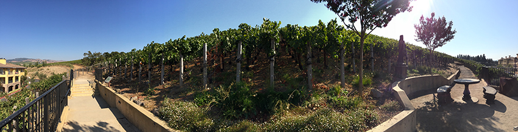
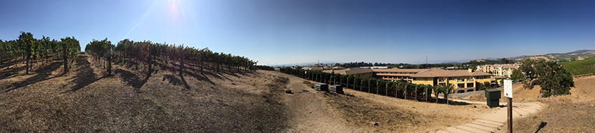
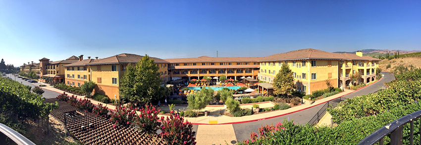
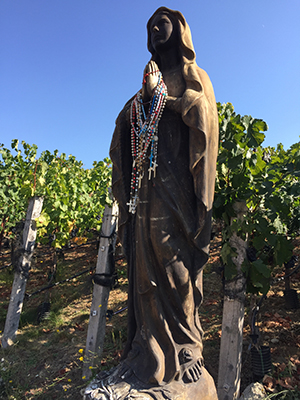
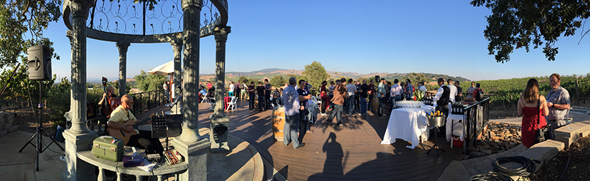
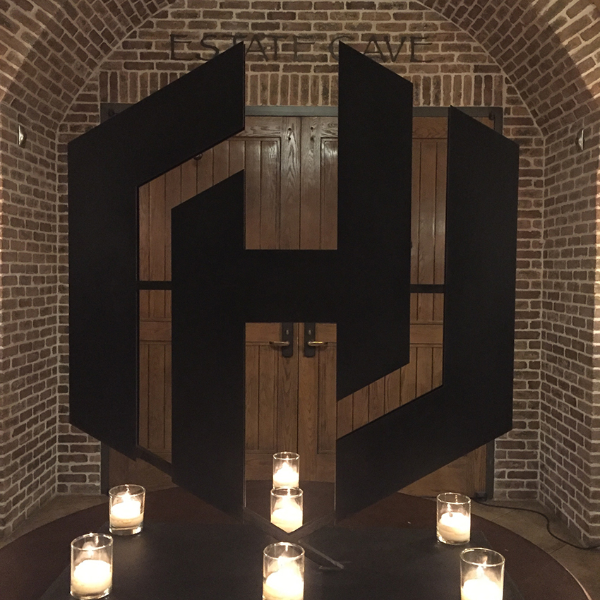
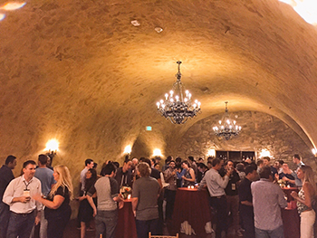
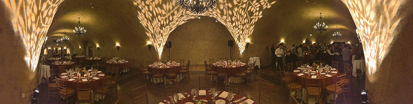

Before diving in to day 3 of my trip, I need to do justice to the awesome reception, speakers dinner, and conversations of the night before.

After arriving and synching up with Evan on our presentation, I wandered around the [Meritage](http://meritagecollection.com/meritageresort/) for a little while and just explored what was around. The resort had several bars, a bowling alley, coffee shop, and a host of other amenities along with their endless supply of wine. The views around the vineyard, up on the view point atop the hill next to the resort was very nice.

I walked up toward where the reception would be to take the picture above. About two thirds of the way to the top I turned around and took this panoramic shot. Then I walked back down to the mid-point and got this panoramic shot of the Meritage itself.

    

While standing there taking the panoramic I turned around and saw a statue of Mary covered in rosaries. I guess that's a thing, one I've never really understood not being Catholic and all. But I digress, I continued onward.

Eventually I returned to my room, finished up a few tweaks to my latest Terraform Project and then headed back out for the reception. I walked back up the hill and strolled into the reception area. There were about 100+ people there already hangout out, enjoying a glass or three of vino, and musicians were playing on the raised section of the patio area.

I didn't really chat to much with anybody at first as I really needed to wind down after the trip. So for the first 20 minutes of the reception I just kind of zoned out. Taking a few pictures and listening to the music was perfect for this. Eventually I walked around a bit and end up chatting with a number of people.

Evan was out, and we found some of his fellow Googlers [Kelsey Hightower](https://twitter.com/kelseyhightower/) and [Eric Johnson](https://twitter.com/erjohnso/), and eventually were joined by a number of others. We all talked shop, containers, some wine, the view, and all sundry of topics.

<iframe src="https://player.vimeo.com/video/182030548?title=0&byline=0&portrait=0" width="850" height="478" frameborder="0" webkitallowfullscreen mozallowfullscreen allowfullscreen></iframe>

I stopped and took a short video of them playing and the overall view. It was super chill, easy to talk, and a nice breeze was blowing over the hill. A perfect match to the warm day.

After the reception the speakers dinner kicked off inside the very hill we had just been atop. Entering the cave, as it was logically called, we were greeted by an epic HashiCorp Logo as we speakers walked in.

    

There we entered a grand room with a number of tables. Enjoyed a round or two of wine, then all took seats at round tables. Conversations were excellent, and we all continued enjoying the evening with a richly and perfectly prepared filet mignon and lobster, surf and turf indeed.

After the dinner I walked out the entrance and conversation continued among [Josh Kodroff](https://twitter.com/joshkodroff), several other people, and myself. After a while I bid all goodnight and headed off to get some sleep before conference day one!

A most excellent day, and here the conference hasn't even started yet. I've got to say, this is definitely the way to get ready for any conference though! Good food, good drinks, good conversation, among an excellent atmosphere.

