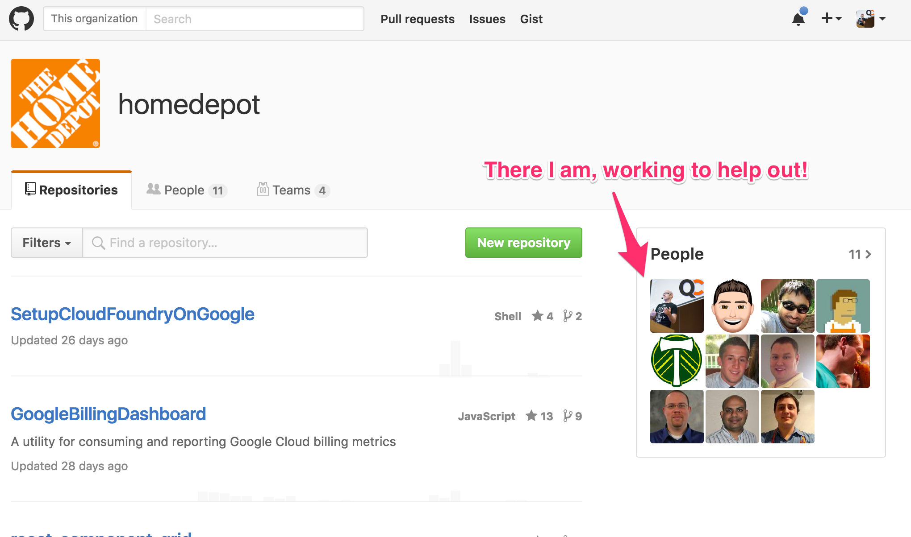

This blog entry is going to be the conjoined events of open source work at Home Depot, enterprise open source in general, and the ideas and punch lists for a talk I have coming up in London on open source enterprise practices. So this will be a hard drifting whirlwind, buckle up!

In the last year there's been several specific projects I've led and consulted on:

* My work at Home Depot included efforts to bring various closed sourced solutions into the open, some which have been and others that have not been - but may be on their way! Read to the end to see how you might be able to help with this.
* I've provided consulting to several enterprise efforts over the last year as they've looked toward bolstering their experience and effort providing a coordinated participation within the open source community.
* Putting together a talk related specifically to helping enterprises bridge the gap between insular, closed source, limiting internal development to a inclusive, open source, community oriented contributor and user of software solutions.

## Enterprise software

First let's talk a little bit about enterprise software in general. There is an extremely wide range of disparity in Enterprise software. Some software turns out pretty good, others are complete catastrophes to the point the projects are cancelled and the software is deleted without remorse.

Just recently this disparity in quality was brought up on via some tweets.

<blockquote class="twitter-tweet" data-lang="en">
I don&#39;t understand how huge companies with major $$$ can release software that&#39;s such a shit-show - don&#39;t they test it, dogfood, etc.?
&mdash; Dave Glick (@daveaglick) <a href="https://twitter.com/daveaglick/status/786247215660621824">October 12, 2016</a></blockquote>

Dave Glick stated this and it spiraled into a conversation about how big companies, with seemingly endless budgets still produce such horrible applications sometimes. It reminds me of this article I read on the Pivatol Blog by Stacey Schneider ([@sparkystacey](https://twitter.com/sparkystacey) ), "Quiz Your Company: How Well Are You Setup to Develop Great Software?"

Over time this horrible disparity can be narrowed, and the band of good to bad can move toward the "good software" end of the spectrum for enterprises. One of the key steps that helps to produce a better culture around good software for enterprises is moving the effort toward a more open practice with transparent communications, public involvement, and of course actual open source code and licensing.

## Open Source Enterprise

Let's take a look at one of the best examples of an open source enterprise. Let's talk about [Netflix](https://www.netflix.com). Ok, you may be screaming in your head that Netflix doesn't count, but at 19 years old (August 29th, of 1997 it was founded), $6.78 billion in 2015 revenue, $10.2 billion in assets, 83 million worldwide users, and 3,500 employees Netflix absolutely counts as a large enterprise.

    

Netflix has gone hard core into the OSS realm. They've [written about it](http://techblog.netflix.com/2015/10/evolution-of-open-source-at-netflix.html) on their [Netflix Tech Blog](http://techblog.netflix.com/). They've even gone so far as to create a [Netflix Open Source Software Center](https://netflix.github.io/) too. Of course all of this is is rolled together in the repositories on Github under the [Netflix Organization](https://github.com/Netflix).

This has given Netflix massive credibility within the world of developers, providing a true resource and partner to the developer community. But what does that give Netflix from a more tactical point of view? I'll list a few things:

1. More eyes on their code that they use to run production. Which translates into more ideas on improvements, catching issues faster, bug fixes inside and outside of the company, and more from this angle.
2. Credibility in the industry translates to gaining the eye of the top tier people that Netflix wants and needs for their organization.
3. Massive clout as a leader in innovation and technological change, which provides even more of both 1 and 2.

## Home Depot, Open Source Enterprise

Ok, so Netflix is a big enterprise that has done it right. They've also been reaping the rewards in a huge way, and they've set a kind of guidance to others trying to tread that path. At Home Depot it's been a bit work, but the effort has started with some tangible progress. Since software development and computer tech things is not the focus point at Home Depot, it is a logical path for the company to shift with it's IT and related resources. As you probably know very well dear reader, Home Depot is a large brick and mortar storefront operation, and it's best for Home Depot to focus on this, where their customers are!

With that in mind, the idea for Home Depot to begin using more open source was super easy. But to start providing open source of their own and to get involved has been a dramatically larger challenge. The leadership has a very smart view of the matter, they want to be part of the community and provide and gain the advantages of going open source. Just like Netflix, there's a lot to be gained.

## Our Efforts So Far!

[Home Depot's OSS Manifesto](http://allspark-thd.github.io/manifesto/) reads with the intent of the efforts with a break out of six specific points:

* We Value
* We Believe
* Have an Idea?
* README
* Trade Secrets
* Tactical Process

**References:**

* [Netflix](https://www.netflix.com) and [Netflix Wikipedia](https://en.wikipedia.org/wiki/Netflix).
* [Home Depot](https://www.homedepot.com) and [Home Depot Github Org](https://github.com/homedepot).
