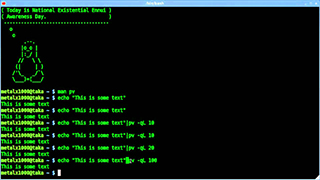

    

When Linux starts up (or most Unix variants or OS-X for that matter, which is after all a kind of Unix variant) there are particular scrips that execute. The key two are ~/.bash_profile and ~./bashrc. When you log in the ~/.bash_profile executes and when you startup a shell then the ~/.bashrc executes.

These two files are standard executable script files, so any bash will do. For instance, some of the bash script I end up in my ~/.bash_profile includes a git prompt, as shown below.

    if [ -f "$(brew --prefix)/opt/bash-git-prompt/share/gitprompt.sh" ]; then
        source "$(brew --prefix)/opt/bash-git-prompt/share/gitprompt.sh"
    fi

Another few lines of code actually load my nvm, which is my Node.js Version Manager.

    export NVM_DIR="/Users/axh6454/.nvm"
    [ -s "$NVM_DIR/nvm.sh" ] && . "$NVM_DIR/nvm.sh"  # This loads nvm

I also have a few functions I’ve created, that load and are ready for my use at  any location I open the terminal at.

    gimmedocker() { if [ $1 ]; then
        docker-machine start $1
        docker-machine env $1
        eval $(docker-machine env $1)
        docker ps -a
    fi };

    cleandocker() {
        # Wipe out the images and containers.
        docker rm $(docker ps -a -q)
        docker rmi $(docker images -q)
    };

The first function executes simply by entering `gimme docker nameOfDockerVirtualMachineImage`. It then checks for the virtual machine image parameter (the $1) and then executes various docker-machine commands against that image. Then ends with the evaluation and execution of the docker machine terminal connection.

The second function deletes my docker containers and then deletes my images. This way I can start fresh without deleting an entire docker virtual machine (sometimes the later may actually be easier). It’s a quick way to start fresh with docker images and containers when working through a lot of minor changes.

The last thing I’ll cover real quick that is commonly located in these startup scripts are some environment variables being set. For instance, I use Terraform to build out infrastructure. For that, sometimes I setup some Terraform variables, that are built to work specifically when prefaced with TF_VAR_. So my variables look something like this when set in script.

export TF_VAR_username="root"
export TF_VAR_password="someSecretPassword"

So that’s some examples and the basic gist of things you might see, and what you might want to run with your ~/.bash_profile or ~/.bashrc files. Happy bash hacking!