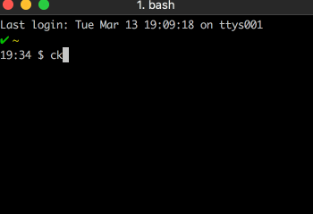

This is the first of a few posts around research I've done around observability over the last month. This post I'm specificaly focusing the details of what you do or don't get during ingest of data into systems used to build observable software. In this post I'm going to reference two specific tool & service providers: Elastic.co with Elasticsearch and Honeycomb.io.

<div class="image float-right">
    
</div>

For both of these I've created an individual simple CLI app for each to send data to the service providers: the **[data-writer-honeycomb](https://github.com/Adron/data-writer-honeycomb)** and **[data-wrtier-elasticsearch](https://github.com/Adron/data-writer-elasticsearch)** repositories. 

Each record was created through data generation using a Go random generation library. I did this to ensure that no excessive record outliers were introduced. Using multiple threads, or Go Routines specifically, each record of randomly generated data is then sent to the respective provider. This was done to find the peak that one instance could send and get ingested by the provider system.

<span class="more"></span>

### The Accounts

For the Elasticsearch Cluster I used a default free cluster with Elastic.co's Cloud Service. It sets up a cluster with the following specifications:

* Platform Provider: AWS
* Region: US West (Oregon)
* Memory: 4 GB
* Storage: 96 GB 
* SSD: Yes
* High Availability: Yes, Replicated to 2x Regions.
* Elasticsearch Version: 6.2.2

For the Honeycomb.io Account I simply signed up for the 5 GB Account.

### Generated Data

I created a simple type as shown below to generate and feed into the systems.

``` javasceript
type logRecord struct {
    Time time.Time    `json:"time"`
    Version string    `json:"@version"`
    ActConn string    `json:"actconn"`
    BackendName string   `json:"backend_name"`
    BackendQueue string   `json:"backend_queue"`
    BytesRead string    `json:"bytes_read"`
    CaptReqCookie string   `json:"captured_request_cookie"`
    CaptResCookie string  `json:"captured_response_cookie"`
    ClientIp string    `json:"client_ip"`
    ClientPort string   `json:"client_port"`
    Facility string    `json:"facility"`
    FacilityLabel string   `json:"facility_label"`
    Feconn string    `json:"feconn"`
    FrontendName string   `json:"frontend_name"`
    Host string    `json:"host"`
    HostName string    `json:"hostname"`
    HttpRequest string   `json:"http_request"`
    HttpStatusCode string   `json:"http_status_code"`
    HttpVerb string    `json:"http_verb"`
    HttpVersion string   `json:"http_version"`
    LogSource string    `json:"logsource"`
    Pid string     `json:"pid"`
    Priority string    `json:"priority"`
    Program string    `json:"program"`
    ReqHdrHost string   `json:"request_header_host"`
    ReqHdrUsrAgent string  `json:"request_header_user_agent"`
    Retries string    `json:"retries"`
    ServerName string   `json:"server_name"`
    Service string    `json:"service"`
    Severity string    `json:"severity"`
    SeverityLabel string   `json:"severity_label"`
    SourceHost string   `json:"source_host"`
    SrvQueue string    `json:"srv_queue"`
    SrvConn string    `json:"srvconn"`
    Tags string    `json:"tags"`
    TermState string    `json:"termination_state"`
    TimeBackendConn int   `json:"time_backend_connect"`
    TimeBackendRes int   `json:"time_backend_response"`
    TimeDuration int    `json:"time_duration"`
    TimeQueue int    `json:"time_queue"`
    TimeReq int    `json:"time_request"`
    TimeStamp time.Time   `json:"timestamp"`
    Type string    `json:"type"`
}
```


break down instrumentation and talk through events themselves.

answer what an event is...

answer what basic instrumentation is...

the goal is to be able to understand what the application or service is doing versus wasting time chasing through metrics of unrelated things that simply cause distractions.

<div class="image float-right">
    
</div>
