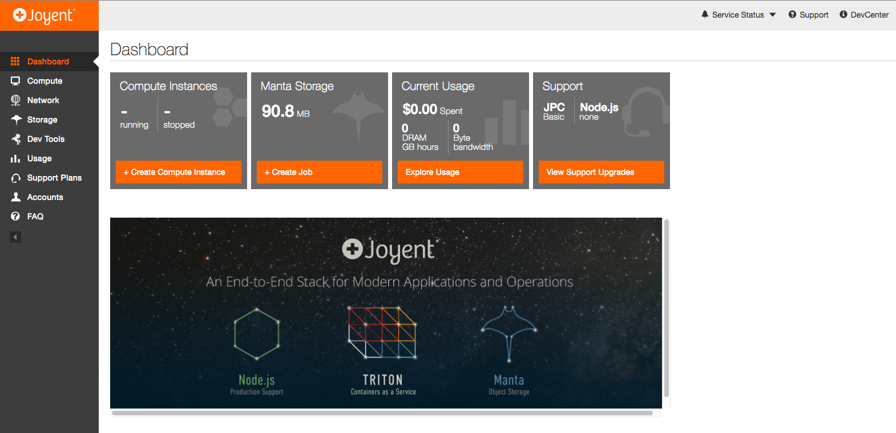

***A Quick Dive into Joyent & Triton Container Tech***

Joyent is one of the cloud providers that isn't always super well known. Albeit that is folly on behalf of us users more than anything. You see, Joyent has invented and built more elements of technology that are fundamental to today's forward progress then we as an industry often realize. For instance, they and their acquihire of the past per the faltering of Sun Microsystems provided the company many extremely smart and amazing individuals. I'm not going to dive into their history, it's out there if you want to dig in, but let's talk about two technologies that Joyent and their respective individual contributors have had a huge role in their invention.

*Technology One: Node.js*

I'm not sure Node.js even needs introduced. But the simple fact that it exists, and that development continued and grew was because of Joyent financing and support of Ryan Dahl. Yes, Ryan slung the code that led to its creation, but Joyent as an organization was and had been right there by his side during those early days. They still continue to play a role in the overall progress but a much less known one compared to those early days. As the community has taken over it's forward momentum and day to day development, Ryan and Joyent have ceded a dominant role in Node.js.

*Technology Two: Containers (i.e. those things Docker is making hugely popular now)*

Back a bunch of years, a company called Sun Microsystems had individuals working on inventing technologies to help with a number of virtualization ideas. One of those technologies was called Sun Containers (including Solaris Zones) as an operating system-level virtualization technology for Sun's SPARC and x86 Computers. Joyent now has an iteration of that container technology in SmartOS. Some of my specifics may be off, so feel free to re-check with wikipedia or someone like [Bryan Cantrill](https://twitter.com/bcantrill), he's their current CTO and knows the history of the technology far better than I recall. After all, he was amidst the battle and I was merely slinging hardware at GIS systems in the Government when this tech was in its infancy.

I mention these two technologies to put emphasis on some of the great technologies the people at Joyent have put together. But I'm not here to shill for Joyent, I'm here to provide a dive into using Joyent for those that are familiar with cloud technologies but haven't used Joyent's tech before. So with that context, let's dive into the Joyent universe.

### Joyent

Joyent's product offerings include the following:

* Node.js - As mentioned previously.
* Triton - This is effectively on premise or in cloud containers as a service.
* Manta - Object Storage.

These are the three primary listed products, which of these this article will almost exclusively focus on Triton in the cloud provided Joyent option.

#### Triton

A little bit more about Triton. This stack, is effectively a set of tools including *Triton DataCenter*, *Triton SmartOS*, and *Triton ContainerPilot*. ContainerPilot is used to automate the process of discovery and configuration, and to connect application components in different containers. The *DataCenter* part of Triton converges container and cloud orchestration into one thing, which can run directly on hardware, alleviating the middle tier of container host OS, VMs, cloud orchestration, hypervisor, and related extra elements of other solutions. Then the SmartOS, which is a lightwieght container hypervisor that delivery the security, networking, and storage elements for the containers.

### Joyent's Online Triton Offering

Once one gets an account setup and logs into Joyent's online Triton Solution they're posed with an interface like this.

The first few things you will likely want to do before toying about with anything to much is:

* setup an ssh key
* setup user roles
* generally prep and read up on a few key pieces of the technology

    

