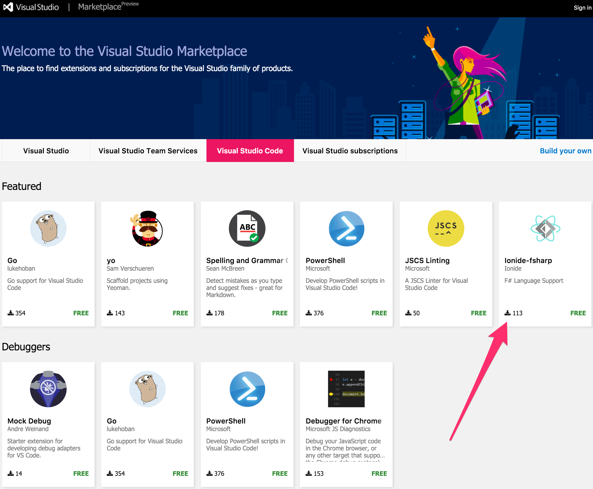

**A Few Streams to Learn From: Apacha Kafka!**

Here I am in the middle of <a href="https://qconsf.com/" target="_blank" rel="noopener noreferrer">Qcon SF</a>, about to enjoy the "<a href="https://qconsf.com/sf2015/presentation/demystifying-large-scale-stream-processing" target="_blank" rel="noopener noreferrer">Demystifying Stream Processing with Apache Kafka</a>" talk with Neha Narkhede <a href="https://twitter.com/nehanarkhede" target="_blank" rel="noopener noreferrer">@nehanarkhede</a>. The background on this talk is rooted in Neha being a co-founder of <a href="http://www.confluent.io/" target="_blank" rel="noopener noreferrer">Confluent.io</a>, with co-founder Jay Kreps of Karka co-creation fame. Neha is providing a fundamental talk on the insight and usage of streams across distributed systems.

<blockquote class="twitter-tweet" data-lang="en">
<a href="https://twitter.com/hashtag/Qcon?src=hash">#Qcon</a> &quot;Demystifying Stream Processing w/ Apache Kafka&quot; w/ <a href="https://twitter.com/nehanarkhede">@nehanarkhede</a> <a href="https://t.co/zgR2H87xVn">pic.twitter.com/zgR2H87xVn</a>
&mdash; Λdrøn (@Adron) <a href="https://twitter.com/Adron/status/667053052029829121">November 18, 2015</a></blockquote>

<blockquote class="twitter-tweet" data-lang="en">
Holy smokes the distributed systems track is CRAZY packed!! <a href="https://twitter.com/hashtag/qconsf?src=hash">#qconsf</a> <a href="https://t.co/tVmUxExk0j">pic.twitter.com/tVmUxExk0j</a>
&mdash; Λdrøn (@Adron) <a href="https://twitter.com/Adron/status/667045151659790336">November 18, 2015</a></blockquote>

<em>That second tweet was of the room before we had to move to the keynote space to make room for everybody that was interested in the topic! Holy snikies!</em>

If you'd like to read some more information on Kafka and streaming, check out some of these posts.
<ul>
	<li><a href="http://www.confluent.io/blog/distributed-consensus-reloaded-apache-zookeeper-and-replication-in-kafka" target="_blank" rel="noopener noreferrer">Distributed Consensus Reloaded: Apache Zookeeper and Replication in Kafka</a> by <a href="https://twitter.com/nehanarkhede" target="_blank" rel="noopener noreferrer">Neha Narkhede</a> & <a href="https://twitter.com/fpjunqueira" target="_blank" rel="noopener noreferrer">Flavio Jungueira</a></li>
	<li><a href="http://spark.apache.org/docs/latest/streaming-kafka-integration.html" target="_blank" rel="noopener noreferrer">Spark + Kafka Streaming Integration (from Docs)</a></li>
	<li><a href="http://kafka.apache.org/" target="_blank" rel="noopener noreferrer">The Kafka Project</a></li>
	<li><a href="http://kafka.apache.org/code.html" target="_blank" rel="noopener noreferrer">Getting the Code</a></li>
	<li><a href="https://cwiki.apache.org/confluence/display/KAFKA/Kafka+papers+and+presentations" target="_blank" rel="noopener noreferrer">A crazy awesome list of papers & related material for those that love papers and want to read papers on Kafka.  ;)</a></li>
	<li>Follow the <a href="https://twitter.com/apachekafka" target="_blank" rel="noopener noreferrer">Kafka project on Twitter</a>, you should be on twitter, for professional and time killing reasons, because... just follow the account if you really want to keep up with the latest.</li>
	<li><a href="http://www.confluent.io/blog/stream-data-platform-1/" target="_blank" rel="noopener noreferrer">Putting Apache Kafka to Use: A Practical Guide to Building a Streaming Data Platform Part 1</a> and <a href="http://www.confluent.io/blog/stream-data-platform-2/" target="_blank" rel="noopener noreferrer">Part 2</a>.</li>
	<li>More on <a href="http://www.michael-noll.com/blog/2014/10/01/kafka-spark-streaming-integration-example-tutorial/" target="_blank" rel="noopener noreferrer">Spark and Kafka integration</a>.</li>
</ul>
I'm looking forward to digging into Kafka and various uses in the coming weeks. My current job (more on that <em>REAL</em> soon, and yes I said <em>job</em>). I've got some heavy data (big data just isn't even discriptive, and I'm going with the Marty McFly terminology of "Heavy" and adding "Data" to form a more descriptive and unique term).  ;)
<h2>Visual Studio Code goes OSS & more Wicked F#!</h2>
As I'm sitting listening to Neha's talk I see a stream (because I multi-task like a crazy person) of things getting mentioned about something something OSS and something something F# and something something Visual Studio Code. So even though we're heavy into the middle of compaction, stream processings, discussions of queue points and how to manage so many things Kafka using a library with kstream DSL, processor API, and interfaces in a library Neha is discussing. It's very interesting so

I'm going back and forth between what Neha is talking about, taking notes on the specific topic points I'll need to research after her talk, and reading up on these something something OSS something something F# somethign something Visual Studio Code tweets. Then I stumbled into the rabbit hole of goodies that I was seeing...
<blockquote>Visual Studio Code is OSS now w/ F# Goodies!

HELL YEAH!</blockquote>
At least, that's my first response because this fixes my #1 complaint about Visual Studio Code. I hated that it wasn't open source, when there was very little reason for it to be closed source. So much of it was open already, it just seemed confusingly absurd that it wasn't open source. But here it is, wide open and ready for PRs yo!
<ul>
	<li><a href="https://github.com/Microsoft/vscode" target="_blank" rel="noopener noreferrer">https://github.com/Microsoft/vscode</a></li>
</ul>
The <a href="https://marketplace.visualstudio.com/#VSCode" target="_blank" rel="noopener noreferrer">Marketplace for Visual Studio</a> now has a few new goodies for F# too which is excellent!

Most of this is mentioned on the <a href="https://wakatime.com/blog/27-visual-studio-code-extensions" target="_blank" rel="noopener noreferrer">Visual Studio Code blog</a> of course, but I'm outlining a few of the bits here, since I know not too many follow the VSC blog that read my blog - for various good reasons!  ;)

With that, I leave you with the two key tidbits that worked their way into my brain while I enjoyed learning about Kafka in Neha's talk. Cheers!
