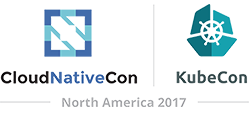

<blockquote class="twitter-tweet" data-lang="en">
It appears <a href="https://twitter.com/AlaskaAir?ref_src=twsrc%5Etfw">@AlaskaAir</a> could have just dubbed the nonstop to Austin the <a href="https://twitter.com/hashtag/KubeCon?src=hash&amp;ref_src=twsrc%5Etfw">#KubeCon</a> Express flight! <a href="https://t.co/xui3t4VB1i">pic.twitter.com/xui3t4VB1i</a>
&mdash; Λdrøn @ ¯\_(ツ)_/¯ (@Adron) <a href="https://twitter.com/Adron/status/938138750332235781?ref_src=twsrc%5Etfw">December 5, 2017</a></blockquote>

I'm on another plane departing Seattle via SEATAC (SEA). An Alaska Air Boeing 737-900 to be specific. The flight is currently en route to Austin, Texas and the vast majority of people aboard are going to KubeCon. The seats, as they always are, aren't built for any mortal, normal, reasonably sized human being. So we're all cuddled up annoyingly but making the best of it we can. Seriously though, I'd rather be on an overnight train. I'd rather spend another 24+ or more hours comfortably studying some Netflix infrastructer and chilling out instead of flying, but that isn't really an option in this giant country, so onward I go as the dream of comfort in transportation eludes me.

I'm setup and am aiming to provide coverage of numerous events, topics, and the like while at the conference. To boot, after conference I'll be writing up some coverage of open source projects and companies that are at KubeCon.

    

There are a few new practices, techniques, and related things I'm trying out so I can cover even more of the event with useful things. We'll see how that works. As always, much of my coverage will be on the [various mediums I post to](http://blog.adron.me/docs/medium-medium-lists-of-mediums/). The rest may appear in other various sources, which I'll tweet and provide a summary email via my [Thrashing Code News](http://blog.adron.me/docs/thrashing-code-news/) at the end of the conference.

## My Schedule -> https://kccncna17.sched.com/adronhall

Here are a few of the specific things I've got on the roster.

### Wednesday

* Pancake Breakfast with The New Stack cuz' they're freakin' awesome!
* Dan, Michelle, Imad, Dianne, and Adrian's keynote!
* Panel: Kubernetes, Cloud Native and the Public Cloud [B] - Moderated by Dan Kohn, Cloud Native Computing Foundation
* Full Stack Visibility with Elastic: Logs, Metrics, and Traces
* The Art of Documentation and Readme.md for Open Source Projects

...and a bunch more to come! Subscribe to [Thrashing Code News](), follow me on the twitters [@Adron](https://twitter.com/Adron), and I'll have more coverage coming soon!
