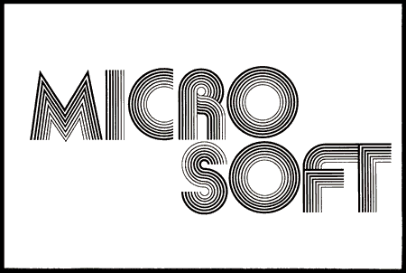
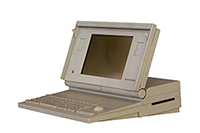

Microsoft is at a crossroads. If you're not familiar with Microsoft at all, then just go ahead and skip this blog entry. It won't matter to you anyway, at least not in the grand scheme of things. Only read forward if you're curious about the conflict, the inner battles, and perverse juxtaposition that Microsoft exists within.

In this article I'll break out various key points and call them out in quotes as an *"assertion"*. Such as this

> Assertion: this is the assertion I'm making.

The article is also broken out with the historical context, then I'll dig into the actual dichotomy of the juxtapositions that are in evidence.

    
    This is the first logo for Microsoft dating from 1975.

## The History and Context

Many people, maybe not all today, are aware that at one time Microsoft was brought to court on charges of by the United States of America. That court battle is simply known as the [United State vs. Microsoft Corporation](https://en.wikipedia.org/wiki/United_States_v._Microsoft_Corp.). It effectively became moot with the meteoric rise and subsequent irrelevancy of their operating system through the course of many events. However Microsoft still paid out about $750 million to Netscape for damages. It's hard today to find specific information on the payout, but some google-fu tends to still pull up the information on the settlement.

    
    This is the logo used for much of the 1980's.

Some people might not know where most of Microsoft's *innovations* have come from. The history is pretty clear however, that Microsoft has resoundingly been fairly poor at innovations that come forward and stick. Not to detract from the positives they did bring; a computer in every home, every school, etc was their mission for years, and largely successful. For a clear grasp of Microsoft's *innovations* however, let's take a look at some of the big ones.

* [MS-DOS](https://en.wikipedia.org/wiki/MS-DOS) - This was the operating system of default for the vast majority of business in the 80s. This was when computers or *desktops* were kind of a new thing and [the laptop was still a *laptop*](https://en.wikipedia.org/wiki/History_of_laptops) in the literal sense.

MS-DOS was created by Tim Paterson and in May of 81' he wrote 86-DOS for Microsoft for $75,000. This was what was renamed to MS-DOS and licensed by Microsoft to computer manufacturers like IBM. Externally created, customized and purchased by Microsoft.

> **Assertion:** "Microsoft bought a product, often gets credited with it's invention, which was Tim Paterson and his small company, furthering the notion laid out in [Innovator's Dilemma](http://www.claytonchristensen.com/books/the-innovators-dilemma/)."

* [Windows 1 to 3.11 to 95 to 2000 to 10 etc.](https://en.wikipedia.org/wiki/Microsoft_Windows) - Windows was largely inspired by, with some slight customizations, from the work done at [Xerox PARC](https://en.wikipedia.org/wiki/PARC_(company)), a research a development company. Things Xerox PARC actually invented include; Laser Printers, Graphical User Interfaces (GUI) with Windows & Icons, the Mouse pointing device, WYSIWIG Text Editor, Ethernet, Smalltalk (Object Oriented Programming Language), and Model View Controller software architecture (MVC). As an aside, massive kudos and thanks to PARC for being an amazing innovator and developer what led to the core of over 30 years of software and computer technology!

> **Assertion:** Microsoft, Apple, or whoever at the time (Remember Deskmate? Yeah there were many others) simply were not the *innovators* or *creators* of the GUI or related windows technology, they were merely following the consumer product industry.

* [Azure](https://azure.microsoft.com) - Nothing really original in this space at all, it's almost entirely derived from [Amazon Web Services (AWS)](http://aws.amazon.com/) and related cloud computing technologies. The first release of Azure was a complete and utter failure and barely remembered by anybody involved in cloud computing. The original Microsoft attempt was a Platform as a Service (PaaS) similar to Google's AppEngine, but it failed to gain much traction at all. Eventually they worked and worked on reliability (because it was catastrophically not reliable in the early days). At some point in time Scott Guthrie was put in charge of it and other Microsoft projects and it finally became something. Largely the effort changed to follow a more modern cloud computing focused path, it came to mimic AWS's efforts around compute, storage, networking, and related items being independent, individual, but centrally managed via API services.

> **Assertion:** Does this one really need tackled? Microsoft was years late to this game (don't even get me started on the laggard luddite beast that Oracle is!). It's really cool that Microsoft is there now, but by no means did they lead and it is arguable whether they have any technological lead today.

Now, not to distract from the accomplishments of the company by pulling these technologies together. It was and continues to be the way large corporations *innovate* or *invent* new things. I put italics around innovate in this and most writing about large corporations and innovation because of a simple premise. This is laid out very well in [Innovator's Dilemma](http://www.claytonchristensen.com/books/the-innovators-dilemma/). If you haven't read Innovator's Dilemma, I highly recommend it in the sense that it is a fundamental reference point that anybody even slightly involved in this industry should have the knowledge of. The basic premise is, big companies simply do not innovate or invent without either creating small breakaway companies (i.e. like startups), research entities, or some other organization that can operate almost entirely outside of the large parent corporation. Microsoft is no exception to this premise, being almost all of the innovation or inventions that Microsoft has attained or can even take credit for primarily come from external or externally organized sources. More on this later in this article, but suffice to say, the *core* corporate entity Microsoft is itself no innovator or inventive company.

> **Assertion:** "...almost all of the innovation or inventions that Microsoft has attained or can even take credit for primarily come from external or externally organized sources."

I'll write more about Microsoft's *innovation* and *inventions* later. However, the caveat to what I've written above is that Microsoft has *traditionally* not innovated, but simply purchased their new technology and otherwise maintained or slowly iterated it forward over time with their own internal resources. The company has spent most of its history creating this *maintain the status quo* type of ecosystem and employee base, in spite of the employee's efforts sometimes to push forward the company into a leader instead of a massive monolithic follower. But again, this is simply an observation of Microsoft's history, not their current actions.

With this being the case, Microsoft has also provided a vast benefit to humanity by providing a central operating system platform. One can argue the merits of the ethical issues of the monopolization (or arguable the lack there of) but having an operating system that was pushed and provided a cohesive means for the market (and respectively the *people*) to come together behind an ideal. One could even argue that an open source movement coming about sooner, or that Microsoft stymied the open source movement originally, but I assert this just from the perspective that Microsoft was what we had and otherwise nothing might have happened in this space. That leads to another assertion, that Microsoft has arguably created a societal benefit of various sorts over the years and has made a ton of cash in the process.

> **Assertion:** "Microsoft has arguably created a societal benefit of various sorts over the years and has made a ton of cash in the process."

Now we get to the real meat of the subject, here stand the crossroads. It's a dustbowl field to the left, and a razed field the right. Just beyond a wisp of trees swaying in the breeze. It's hot, humid, and a hellish sting in the air. The crossroads has but one entity standing alone watching our path, sitting there to collect the soul. Shall Microsoft go left, shall we go right, shall we go together or is it best to shun the effort? Whatever the case, there is no path back, it's only forward onward, to the left or to the right. The devil is in the details, and let's talk about those details shall we.

# The Crossroads

    
    Microsoft Logo of 1987

Alright, we're finally at the crossroads now, hot as hell as it is. Microsoft has shown us several key market spaces they're going after that really draw us to these crossroads. These are the battles that exist in Microsoft itself and not just among its competition. In the following I'll hit on these key market spaces and break them down into bullet points.

## Key Market Space: Cloud computing

**Azure vs. AWS/GCP** - Microsoft's Azure still has some significant features to overcome to be best of breed. However it isn't always Microsoft's forte to be best of breed, just to impose enough marketing pressure to disparagingly edge corporate entities into usage. They did it with Office through loss leader tactics, and pushing their way in through control with active directory and other resources. Even amid Word, Excel, and the other tools being lackluster products compared to WordPerfect or Quattro Pro (even until in just the recent few years, when these tools finally gained parity with the features and capabilities of WordPerfect and Quattro Pro in 1998). It could be a strategy that I hope Microsoft doesn't pursue to gain dominance in cloud computing.

**Accounting & Market Trickery** - What counts as "cloud" to Azure is a bit confusing. I generally don't care how Microsoft manages its accounting books, it shouldn't alter the technology right? Well, considering that Microsoft counts its "cloud customers" or "cloud market" in a very different way than AWS or GCP it can be used to mislead CIOs or other IT leaders into thinking Azure is dramatically larger and more used than it is. This might not, at face value, seem like a big deal but you can rest assured that the board rooms are made to make decisions of folly on a regular basis with this type of misleading data.

**Microsoft vs. Microsoft's "Developers, Developers, Developers!"** - In the cloud space, Microsoft has a loyal following of developers. They're definitely using that to their advantage as much as possible. However the patterns, practices, and acumen doesn't always follow the capabilities, intent, or design elements fundamental to cloud computing. Rarely do we see a well design distributed anything coming out of the Microsoft oriented landscape - among the company or the company's constituents. I hope this improves in the near future with more focus on well designed applications that are focused around *microservices*, *containerized applications*, *modular, dare I say "unix way" style CLIs*, and the like. Overall the developer's world within Azure is one of a continuously improving state.

**Ops in Azure** - Azure is not known as a great space for operations. Whatever one calls it; DevOps, Operations, Ops, IT, or whatnot, the team is often better off with AWS or GCP unless there is some very specific reasons to be using Azure. This could be changing in the coming months as they're closing the gap on many of Azure's usability issues.

The SRE specifically and the tooling is focused more and more on how to do things right vs. the traditional old style Microsoft way - which inherently is severely broken in the world of cloud computing. One notable thing however, that is holding back the platform, is the strange notion of the Azure interface being a side scrolling mobile application oriented sewer of user interface elements shafted via a skewer of a pseudo tab interface shoved on the top and sides. The user experience is horrible in that regard, and it's a damned good thing that they're pushing more and more with the APIs. Please more APIs Microsoft and less of this scandalous thing called a user interface.

Azure recently, closing that gap has had tooling introduced around [Hashicorp](https://www.hashicorp.com/)'s Tools, more tooling in Go (more on this later), and a host of other advancements. These things have really been giving me some hope that they'll clean this space up.

## Key Market Space: Gaming

**Playstation & Nintendo** - Microsoft really doesn't have all that much competition in this space. Sure the Playstation product and Nintendo product exists, but the Xbox and PC Gaming is still almost entirely the domain of Microsoft. I'm cool with that, and it seems the market is happy with this.

**Frameworks & Game Coding** Not only is Microsoft still dominating much (most?) of the gaming industries hardware and end product, they've also been doing a fairly solid job building and maintaining gaming frameworks. Albeit again, as mentioned with their Office product, the frameworks aren't always the best of breed. In spite of this they often introduce easier and more focused ways to build games for whatever system.

## Key Market Space: Computers (i.e. Be Like Apple)

**SURFACE ALL THE THINGS** - Surface This, Surface That - Ok, years ago when Microsoft came out with the small car size table top computer, it inspired chuckles and laughter that it cost as much as a small new car and was the size of one too. However the technology and notions derived from it are coming to play in positive ways. The Surface Book, Surface Desktop, Surface Pro, and Surface (*are these all the names, I always feel like I might be missing one of the surfaces*). These are truly beautiful machines that show some actual creativity, (*are you ready for this*) innovation, and inventive leadership in the market. As of late, they're even appearing to one up Apple at the hardware game. I'm much impressed.

**Microsoft vs. Google** - The Google Computers honestly aren't even showing on the radar. The Google computers are basically in the same space as Microsoft's phones are. Albeit neither of these things are bad, the Google Computers do what they do and the Microsoft phones are actually good phones with a cool mobile operating system. But alas, nobody is buying the things. This in turn is an unfortunate failure for Google, Microsoft, and the lot of us consumers.

## Key Market Space: Software? Open Source?

**Azure vs. AWS/GCP (OpenStack?)** - This is a strange space compared to the clean cut Linux vs. Windows fight. One was entirely closed source and the other open to the world. In the cloud space some of this and some of that is open, some is partially open, and yet other stuff is entirely closed. Some hardware stuff is open and some is closed, it's entirely different for every single little piece of the cloud space.

Amidst all the confusion Microsoft has it's positives and negatives just as GCP and AWS do. AWS is probably one of the least involved in actually contributing back to the open source software community, where as GCP contributes back at a regular pace. Microsoft probably leans towards the not open approach but it's confusing, it appears and seem almost like they're not open because of mere obfuscation of their efforts.

**Microsoft vs. Microsoft's "Developers, Developers, Developers!"** - Two events occurred recently that kind of insured that hell was indeed frozen over. One was that Microsoft contributed to and got one of their pull requests accepted to the Linux Kernel. The other was that they surpassed any other entity on github for commits/pull requests. The later is a bit hard to measure as succinctly as the simple fact they contributed to the Linux Kernel, but they're both huge accomplishments for the company.

This is all great, these events and Microsoft's newfound efforts and new attempts to improve their culture. Their previously built developer community culture of insular and myopic viewpoints has been and still continues to take a toll upon the technology community however and that is another issue that Microsoft has to deal with. The community could just ignore the "softies" and fanbois of yesteryear but Microsoft actually needs to get these individuals to update their viewpoints, get with the program, and step out of the ways they were previously taught in order for Microsoft to actually get ahead of itself. It's a kind of perverse irony, which I'll elaborate on more in just a moment.

# Microsoft's Lingering Issues

## The Insular Cultural Mort

(For more on what a "[Mort](http://www.urbandictionary.com/define.php?term=Mort)" is check out the [Urban Dictionary](http://www.urbandictionary.com/define.php?term=Mort) or these other great blog entries "[Mort, Elivs, Einstein, and You](https://blog.codinghorror.com/mort-elvis-einstein-and-you/)", "[Who are Mort, Evlis, and Einstein](https://blogs.msdn.microsoft.com/ericwhite/2006/05/11/who-are-mort-elvis-and-einstein/)", "[Microsoft's Mort: we hardly knew you](https://www.cnet.com/news/microsofts-mort-we-hardly-knew-you/)", and [Scott Hanselman](http://www.hanselman.com/)'s awesome "[Beyond Elivs, Einstein and Mort: New Programming Stereotypes for Web 2.0](http://www.hanselman.com/blog/BeyondElvisEinsteinAndMortNewProgrammingStereotypesForWeb20.aspx)").

During the 80s and 90s Microsoft built itself into a huge powerhouse and built a massive cultural programmer community around this. It was however a community of closed doors, insular viewpoints, notions of *"open source is communism"*, and other such nonsense notions. Microsoft taught one brand of things, their brand, dictated often by copying the competition or rewriting ideas from the community for their own and pawning them off on their fanbois as an alternate to the rest of ... well the rest of anything or whatever existed in opposition of Microsoft and The Microsoft Way™. (is it trademarked? Seemed fitting. meh?) This Microsoft Way™ way introduced much of the computer scientist community to a new form of software developers that was dubbed the *mort*.

Microsoft loved to act like it had the best programmers programming applications for their platform, while in reality Microsoft had made huge strides in dumbing down programming into Visual Basic [&&.NET] (and hey, I wrote some amazeballs stuff with Visual Basic too, shoutout to SCP Pool Corp!) and other tools. For many, this was great and I'll be the first to say, entry of any sort brought more to the industry as a whole than less. I'll also must say that Microsoft - purposely or inadvertently - creating the notion of a lesser programmer through the *mort* casting was not helpful overall.

There's a lot of argument that has occurred around this dubbing and segmentation of developer types, and I'm *not* arguing there are not types of developers, but mort is a rather denigrative adjective to use to describe the sort. But it is extremely telling about some of the very serious issues still facing Microsoft. I bring up the *mort* designator for a simple example, and only one of many examples, of how Microsoft has burned itself in the tech industry over the years.

## Microsoft Building the 90s Corporation

Microsoft unfortunately has a lot of developers that fall under its communities' designators of Elvis, Einstein, and Mort. The problem with this is Microsoft has also built up a huge number of developers outside of Microsoft inside corporations that latch onto the Microsoft Way™. They use Windows Server, SQL Server, .NET 2.x, and maybe even Microsoft Bob. They are the hard core fanbois and they've sold their respective companies short by pushing a simpleton, singular, myopic view of the world on the companies they work for. They've shoved every possible Microsoft solution down their respective company's throats and now they're where they are. This poses a very serious threat to Microsoft itself, since Microsoft has taken a very direct about face to its whole preached Microsoft Way™.

> **Assertion:** "re: Mort - This poses a very serious threat to Microsoft itself, since Microsoft has taken a very direct about face to its whole preached Microsoft Way™."

In the 00s and 10s of the 21st Century Microsoft has put huge efforts, which are starting to work finally, into changing vast amounts of their insular culture, legal attack activities, patent trolling, and other ethical issues. This is wonderful news for anybody and everybody using their tooling directly or even standard consumers out there. Is it good for Microsoft's bottom line? So far, it doesn't seem bad, as they're still raking in billions.

This conflict however, between Microsoft's aged mort, Einstein, Elvis, and fanbois programmers and their new desired demographic of everybody. This conflict is vast and difficult, and Microsoft has made some intelligent moves, but faces many extremely difficult hurdles. Their relevancy, what Microsoft had, has mostly been lost in software development circles and entirely lost in the world of startups. They've taken a huge hits from any number of technologies: Ruby on Rails, Java, Node.js, JavaScript, Cloud, etc. Almost all point at the root of one uprising against Microsoft that won out, and that's open source software. It is the new relevant item among the *cloud* and *big data* landscapes (or whatever marketing word trash one wants to use).

In this Microsoft has tried to regain relevancy, and has done a wonderful job of involving itself in open source. It has even, mostly, kind of, sort of, almost figured out how to use and work with open source. This is a huge plus.

However, at this point in time they still have a huge problem with their internal and external demographics. It's almost entirely older males, and often from only one subset of society. Contrary to this the industry is slowly but surely becoming extremely diverse: from men and women to cultural differences to age ranges. But Microsoft's minions and fans have stayed one small demographic of the overall - and that subset has shrunken and lost many of its ardent advocates even.

## The Root Culture Issue

The cultural issue goes deep and I honestly have a hard time writing or even speaking about the issue. Microsoft has shorted its adopted community (Seattle) which hasn't exactly adopted it (Softies often just piss off the locals, including the transplant locals) and they're largely uninvolved in the actual tech scene in Seattle. Until of course they leave Microsoft.

Recently I got an email from a recruiter who thought I worked or had started working at Microsoft. It went like this, *"Has it sucked your soul dry yet?"* which I thought was a bit hyperbolic. But I understand the sentiment and their attempt at catching one's eye. They probably start letters to Amazonians this way too, but it hit me that this isn't all that hyperbolic. This is kind of a summary for many.

This is the reason why startups have their pick of top tier talent before Microsoft (and often before Amazon or Google) even though they offer slim chances at riches and very little stability. But people, top tier people, tend to be attracted to challenge, opportunity, and even just the chance at being with the next big startup. They want to change the world in some way for the better, and Microsoft just isn't seen as that entity. Albeit the perception is wrong (they can change the world for the better) but perception is more important in attracting talent then reality.

> **Assertion:** "They want to change the world in some way for the better, and Microsoft just isn't seen as that entity. Albeit the perception is wrong (they can change the world for the better) but perception is more important in attracting talent then reality."

## Thoughts and Solutions

Here's some of my key ideas, the top 4 for now, for Microsoft's leadership. Maybe they're already working on some of these, maybe not. Either way, here they are for free!

1. Microsoft should get serious about downtown Seattle office real estate and having a real prominence and location there. Ideally they ought to build a tower, instead of their sleepy, faux suburbian, divided, lonely campus away from everything they could instead have a presence among the city life and music, art, and the relevancy of urban life. Not that they should give up their surburban myopia, but just give the options a fair shake. The singular small offices that are mostly empty really don't help much.

2. Keep pushing the open source angle. Do NOT dictate, which Microsoft hasn't been doing much of this for years now, but don't start and get rid of any notions that the company should dictate how a thing should be. In the past Microsoft tried this with development methods like Agile, and other things that they weren't responsible for creating nor should they have pushed until they understood it better. The same goes for renaming and dictating design patterns. This has happened with MVVM and some others, and it would behoove Microsoft not to regurgitate existing things without it being community rooted, not "company proprietary" (or heaven forbid pre-existing and effectively plagiarized!).

3. Build software and tooling as stand alone entities. Stop trying to build software to lock one into other software. I know a lot of the time this isn't even intentional, but it would help Microsoft in a big way if the quelled that reaction of internal employees to hook up to "All the Microsoft Things" when it should be "Connect it to all the Used Web Tools & Internets". A case in point, Dev Tool A is integrated into TFS, Visual Studio, and some other nonsense. It's only used by Softies, when it could have been incorporated in a cleaner way into *source control* and *plugins for editors* (like Atom, Code, or what not). This doesn't happen as much as it used to at Microsoft but still enough that it needs to stop.

4. This is super abstract and kind of out there, but seriously Microsoft needs to figure out marketing. A large part of this will be to relocate and kill off the *suburban 80s* design motif and *50s lifestyle* mindset that Microsoft often perpetuates. Dive into lifestyles outside of that singular demographic and the marketing will come to the company better. Individuals will stand up and come to work for Microsoft when these issues, as massive as they are, are resolved. Until then I expect to see the same marketing trash come from Microsoft and that's unfortunate.

> **Summary** "If Microsoft can pull off these few changes, albeit huge, there are even larger upsides to accomplishing these. The downside is they continue to trudge along with small wins and minor, but unfortunately forgettable things like Surface Desktop, Windows Phone, and similar technologies. In the end, I wish the company well and best wishes to Satya and crew on continuing to change the direction and sailing of the Microsoft ship. Cheers!"
