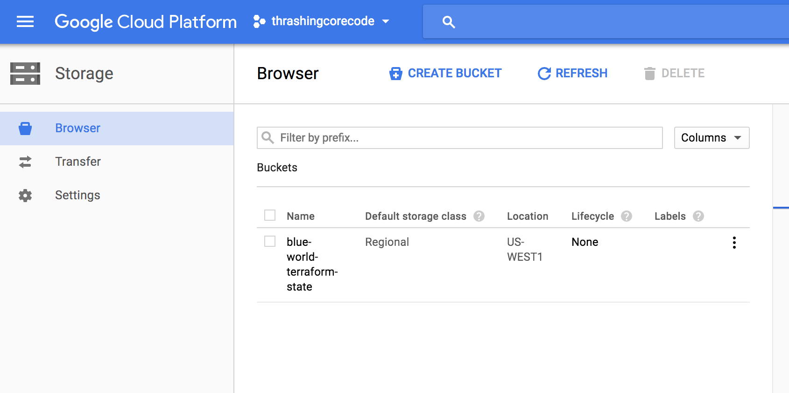
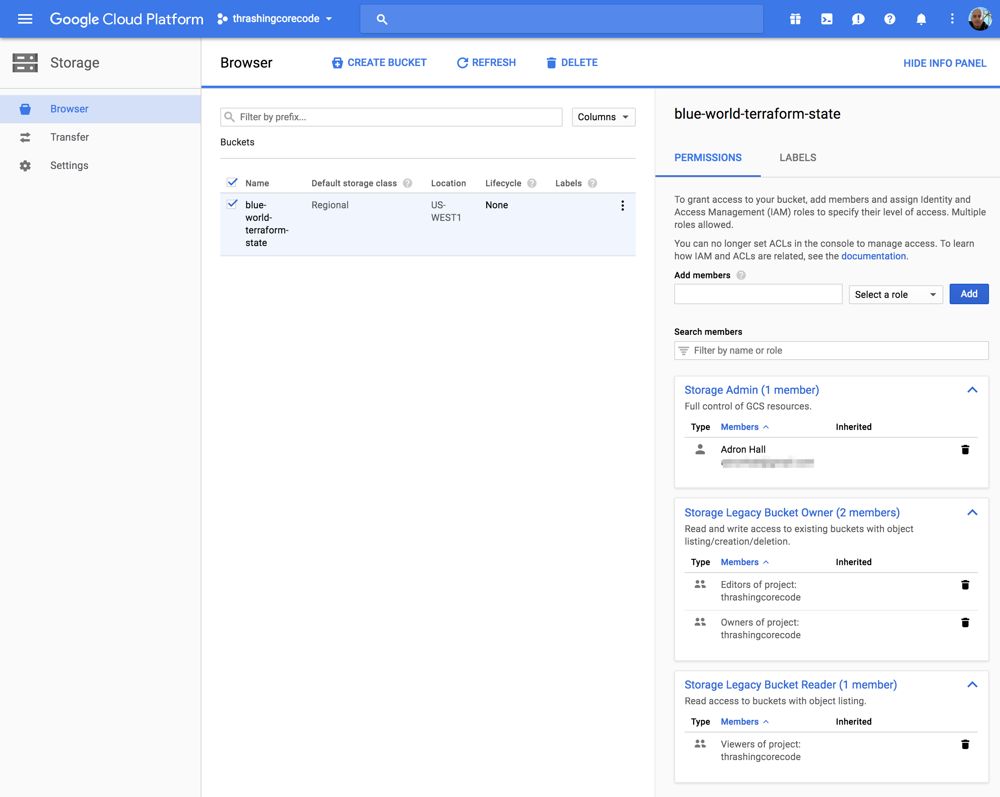
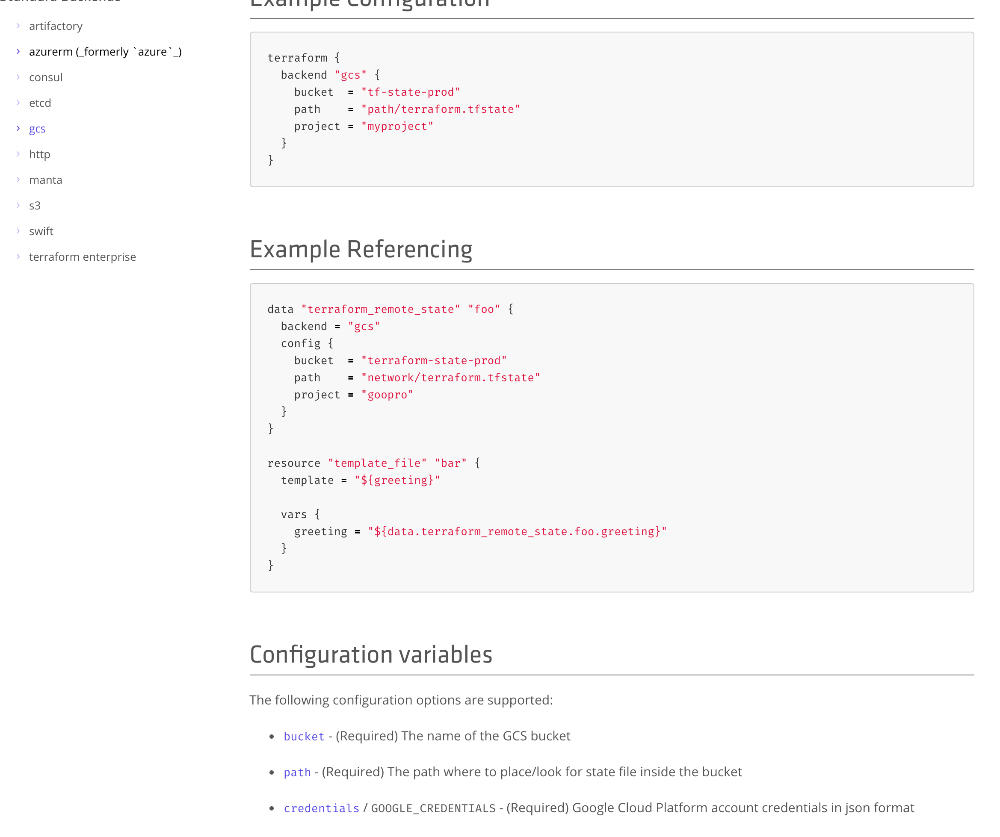

**UPDATE INLINE BELOW -** ***SEPTEMBER 29, 2017***

[Article Code/Config Repository](https://github.com/Adron/terraform-gcs-state)

I've started this process by setting up two stages for execution. The initial Terraform execution which will create the Google Cloud Storage (GCS) bucket and then the Terraform stage that will then init that bucket for Terraform State and then create a simple resource.

For phase 1 I have created a simple *connetion.tf* file that has the provider information in it.

<span class="more"></span>

```
provider "google" {
  credentials = "${file("../../secrets/account-thrashingcode.json")}"
  project     = "thrashingcorecode"
  region      = "us-west1"
}
```

The next element of phase 1 is a simple resource with the storage to be created for use as the remote state management for Terraform. That file I've named *google-cloud-storage.tf* with the following contents for creating the Google Cloud Storage resource.

```
resource "google_storage_bucket" "blue-world-tf-state" {
  name     = "blue-world-terraform-state-test"
  location = "us-west1"
}
```

This part of the process works quickly, just a few seconds. A simple `terraform apply` and the resource is created.

```
$ terraform apply
google_storage_bucket.blue-world-tf-state: Creating...
  force_destroy: "" => "false"
  location:      "" => "US-WEST1"
  name:          "" => "blue-world-terraform-state"
  self_link:     "" => "<computed>"
  storage_class: "" => "STANDARD"
  url:           "" => "<computed>"
google_storage_bucket.blue-world-tf-state: Creation complete (ID: blue-world-terraform-state)

Apply complete! Resources: 1 added, 0 changed, 0 destroyed.
✔ ~/Codez/terraform-gcs-state/phase1
```

***Success!***

In the phase 2 Terraform execution I've setup a *connection.tf* file for connection and declaration of GCS for the Terraform state files. The file contents looks like this.

```
provider "google" {
  credentials = "${file("../../secrets/account-thrashingcode.json")}"
  project     = "thrashingcorecode"
  region      = "us-west1"
}

terraform {
  backend "gcs" {
    bucket  = "terraform-remote-states"
    path    = "dev/terraform.tfstate"
    project = "thrashingcorecode"
  }
}
```

The resource I've setup, at least for this example, is a super simple configuration to create a default network in GCP. That configuration looks like this.

```
data "google_compute_network" "my-network" {
  name = "default-us-west1"
}
```

Now when I run `terraform init` I get this error.

```
$ terraform init

Initializing the backend...

Successfully configured the backend "gcs"! Terraform will automatically
use this backend unless the backend configuration changes.
Error refreshing state: [WARN] Error retrieving object blue-world-terraform-state/dev/terraform.tfstate: googleapi: got HTTP response code 403 with body: adronsotheremail@gmail.com does not have storage.objects.get access to blue-world-terraform-state/dev/terraform.tfstate.
```

This leaves me with a few questions.

* Where does Terraform derive the "adronsotheremail@gmail.com" email identity as the account to try to access the storage location with? It doesn't appear to actually be the same email associated to the account I created the resource with.
* If I can create the resource originally with a service account that has ownership rights in phase 1, what is it using for permissions in this particular situation? It does clearly exist as shown 

My first attempt to fix this was to go to the storage resource and add this account to insure it has permission to this resource.



Ok, so that fixed the issue, but I'm still not entirely sure why I had to add the member, when theoretically I thought I was using the connection information detailed in the *connection.tf* files in both phases right? RIGHT?

I went to RTFM at this point, to see what I might be missing. I found on the [Hashicorp Docs](https://www.terraform.io/docs/backends/types/gcs.html) some information. As I scrolled down it appeared that maybe I could use the *credentials* property for the configuration resource.



I added it as such to my configuration in the *connection.tf* file.

```
terraform {
  backend "gcs" {
    bucket  = "blue-world-terraform-state"
    path    = "dev/terraform.tfstate"
    project = "thrashingcorecode"
    credentials = "${file("../../secrets/account-thrashingcode.json")}"
  }
}
```

Now, this seems all groovy. But now I'm looking at my *connection.tf* file and the complete file looks like this.

```
provider "google" {
  credentials = "${file("../../secrets/account-thrashingcode.json")}"
  project     = "thrashingcorecode"
  region      = "us-west1"
}

terraform {
  backend "gcs" {
    bucket  = "blue-world-terraform-state"
    path    = "dev/terraform.tfstate"
    project = "thrashingcorecode"
    credentials = "${file("../../secrets/account-thrashingcode.json")}"
  }
}
```

My first issue with this is I have two credentials properties and really there should just be the one, in the provider. But I digress, I'm experimenting so upwards and onward.

```
$ terraform apply
Failed to load backend: Error loading backend config: 1 error(s) occurred:

* terraform.backend: configuration cannot contain interpolations

The backend configuration is loaded by Terraform extremely early, before
the core of Terraform can be initialized. This is necessary because the backend
dictates the behavior of that core. The core is what handles interpolation
processing. Because of this, interpolations cannot be used in backend
configuration.

If you'd like to parameterize backend configuration, we recommend using
partial configuration with the "-backend-config" flag to "terraform init".
```

So yup, that's an utter failure. Let's read this. The meat of this message boils down to *"terraform.backend: configuration cannot contain interpolations"*. Ok, that I understand, the `credentials = "${file("../../secrets/account-thrashingcode.json")}"` can't be used in this particular configuration. That doesn't fix the underlying issue.

I'm not exactly sure, at this point, what is using what permission and why the permission isn't available by creating the resource and using the same service account to write into that bucket, the resource, with the contents of the Terraform state unless I go set the bucket's permissions manually. Simply, this is odd and I'm convinced I'm missing something or maybe something really is just that crazy.

If you've got any idea what's going on, ping me [@Adron](https://twitter.com/adron) if you would. I'd love to complete this automation without such a hacky fix. When I get all the pieces understood, figure out this issue, and fix it, I'll update this post ASAP with the end of this whole story!

I've also posted a question on Stackoverflow to make providing an answer easier [here](https://stackoverflow.com/questions/46495146/my-terraform-backend-state-with-google-cloud-storage-buckets-is-created-oddly-t).

**UPDATED:** ***SEPTEMBER 29, 2017***

The Stackoverflow has the update with the answer I stumbled into. I feel I was being a bit of a dummy. The Google Cloud Storage Bucket is setup with the account that I used in the `connection.tf` file. But, the storage bucket needs an ACL, or Access Control List resource, created and assigned appropriately. I needed to add that to my configuration, which I did as shown below.

```
resource "google_storage_bucket" "blue-world-tf-state" {
  name     = "blue-world-terraform-state"
  location = "us-west1"
}

resource "google_storage_bucket_acl" "image-store-acl" {
  bucket = "${google_storage_bucket.blue-world-tf-state.name}"
  predefined_acl = "publicreadwrite"
}
```

The first resource I'd setup before, the second is the specific ACL that I now have setup to allow my Terraform state files to be stored there as a central repository. So the mystery is resolved, albeit I still think there ought to be some "*give the storage bucket rights per the service account*" type of creation process. But there isn't, so at least once the practice is known, one can easily move forward with that practice in play. Cheers!

**UPDATE FINI**
