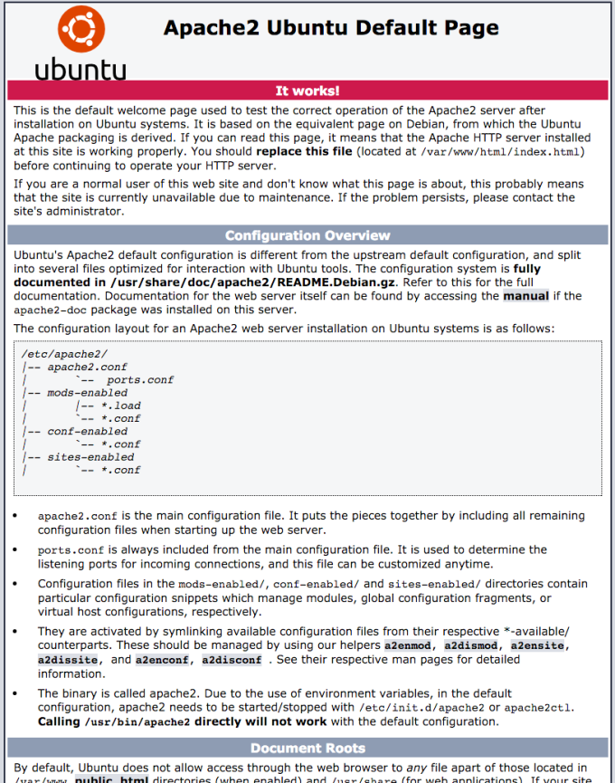
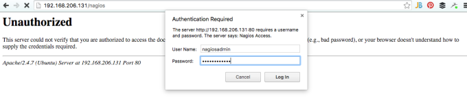

<h2>1st - The Virtual Machine</h2>
First I created a virtual machine for use with VMware Fusion on OS-X. Once I got a nice clean Ubuntu 14.04 image setup I installed SSH on it so I could manage it as if it were a headless (i.e. no monitor attached) machine (<a href="http://compositecode.com/setting-up-ubuntu-with-ssh-wmware-tools-on-vmware-fusion/">instructions</a>).

In addition to installing openssh, these steps also include build-essential, make, and gcc along with instructions for, but don't worry about installing VMware Tools. The instructions are cumbersome and in parts just wrong, so skip that. The virtual machine is up and running with ssh and a good C compiler at this point, so we're all set.

<span class="more"></span>

<h2>2nd - The LAMP Stack</h2>
```shell-script
sudo apt-get install apache2
```

Once installed the default page will be available on the server, so navigate over to 192.168.x.x and view the page to insure it is up and running.



Next install mysql and php5 mysql.

```shell-script
sudo apt-get install mysql-server php5-mysql
```

During this installation you will be prompted for the mysql root account password. It is advisable to set one.

Then you will be asked to enter the password (the one you just set about 2 seconds ago) for the MySQL root account. Next, it will ask you if you want to change that password. Select 'n' so as not to create another password for the root acount since you've already created the password just a few seconds before.

For the rest of the questions, you should simply hit the enter key for each prompt. This will accept the default values. This will remove some sample users and databases, disable remote root logins, and load these new rules so that MySQL immediately respects the changes we have made.

Next up is to install PHP. No grumbling, just install PHP.

```shell-script
sudo apt-get install php5 libapache2-mod-php5 php5-mcrypt
```

Next let’s open up dir.conf and change a small section to change what files apache will provide upon request. Here’s what the edit should look like.

Open up the file to edit. (in vi, to insert or edit, hit the 'i' button. To save hit escape and ':w' and to exit vi after saving it escape and then ':q'. To force exit without saving hit escape and ':q!')

```shell-script
sudo vi /etc/apache2/mods-enabled/dir.conf
```

This is what the file will likely look like once opened.

```shell-script
<IfModule mod_dir.c>
DirectoryIndex index.html index.cgi index.pl index.php index.xhtml index.htm
</IfModule>
```

Move the index.php file to the beginning of the DirectoryIndex list.

```shell-script
<IfModule mod_dir.c>
DirectoryIndex index.php index.html index.cgi index.pl index.xhtml index.htm
</IfModule>
```

Now restart apache so the changes will take effect.

```shell-script
sudo service apache2 restart
```

Next let’s setup some public key for authentication. On your local box complete the following.

```shell-script
ssh-keygen
```

If you don't enter a passphrase, you will be able to use the private key for auth without entering a passphrase. If you've entered one, you'll need it and the private key to log in. Securing your keys with passphrases is more secure, but either way the system is more secure this way then with basic password authentication. For this particular situation, I'm skipping the passphrase.

What is generated is id_rsa, the private key and the id_rsa.pub the public key. They're put in a directory called .ssh of the local user.

At this point copy the public key to the remote server. On OS-X grab the easy to use ssh-copy-id script with this command.

```shell-script
brew install ssh-copy-id
```

or

```shell-script
curl -L https://raw.githubusercontent.com/beautifulcode/ssh-copy-id-for-OSX/master/install.sh | sh
```

Then use the script to copy the ssh key to the server.

```shell-script
ssh-copy-id adron@192.168.x.x
```

Next let’s setup some public key for authentication. On your local box complete the following.

```shell-script
ssh-keygen
```

That should give you the ability to log into the machine without a password everytime. Give it a try.

Ok, so now on to the meat of this entry, Nagios itself.
<h2>Nagios Installation</h2>
Create a user and group that will be used to run the Nagios process.

```shell-script
sudo useradd nagios
sudo groupadd nagcmd
sudo usermod -a -G nagcmd nagios
```

Install these other essentials.

```shell-script
sudo apt-get install libgd2-xpm-dev openssl libssl-dev xinetd apache2-utils unzip
```

Download the source and extract it, then change into the directory.

```shell-script
curl -L -O https://assets.nagios.com/downloads/nagioscore/releases/nagios-4.1.1.tar.gz
tar xvf nagios-*.tar.gz
cd nagios-*
```

Next run the command to configure Nagios with the appropriate user and group.

```shell-script
./configure --with-nagios-group=nagios --with-command-group=nagcmd
```

When the configuration is done you'll see a display like this.

```shell-script
Creating sample config files in sample-config/ ...

*** Configuration summary for nagios 4.1.1 08-19-2015 ***:

General Options:
-------------------------
Nagios executable: nagios
Nagios user/group: nagios,nagios
Command user/group: nagios,nagcmd
Event Broker: yes
Install ${prefix}: /usr/local/nagios
Install ${includedir}: /usr/local/nagios/include/nagios
Lock file: ${prefix}/var/nagios.lock
Check result directory: ${prefix}/var/spool/checkresults
Init directory: /etc/init.d
Apache conf.d directory: /etc/httpd/conf.d
Mail program: /bin/mail
Host OS: linux-gnu
IOBroker Method: epoll

Web Interface Options:
------------------------
HTML URL: http://localhost/nagios/
CGI URL: http://localhost/nagios/cgi-bin/
Traceroute (used by WAP):

Review the options above for accuracy. If they look okay,
type 'make all' to compile the main program and CGIs.
```

Now run the following make commands. First run make all as shown.

```shell-script
make all
```

Once that runs the following will be displayed upon success. I've included it here as there are a few useful commands in it.

```shell-script
*** Compile finished ***

If the main program and CGIs compiled without any errors, you
can continue with installing Nagios as follows (type 'make'
without any arguments for a list of all possible options):

make install
- This installs the main program, CGIs, and HTML files

make install-init
- This installs the init script in /etc/init.d

make install-commandmode
- This installs and configures permissions on the
directory for holding the external command file

make install-config
- This installs *SAMPLE* config files in /usr/local/nagios/etc
You'll have to modify these sample files before you can
use Nagios. Read the HTML documentation for more info
on doing this. Pay particular attention to the docs on
object configuration files, as they determine what/how
things get monitored!

make install-webconf
- This installs the Apache config file for the Nagios
web interface

make install-exfoliation
- This installs the Exfoliation theme for the Nagios
web interface

make install-classicui
- This installs the classic theme for the Nagios
web interface

*** Support Notes *******************************************

If you have questions about configuring or running Nagios,
please make sure that you:

- Look at the sample config files
- Read the documentation on the Nagios Library at:
https://library.nagios.com

before you post a question to one of the mailing lists.
Also make sure to include pertinent information that could
help others help you. This might include:

- What version of Nagios you are using
- What version of the plugins you are using
- Relevant snippets from your config files
- Relevant error messages from the Nagios log file

For more information on obtaining support for Nagios, visit:

https://support.nagios.com

*************************************************************

Enjoy.
```

After that successfully finishes, then execute the following.

```shell-script
sudo make install
sudo make install-commandmode
sudo make install-init
sudo make install-config
sudo /usr/bin/install -c -m 644 sample-config/httpd.conf /etc/apache2/sites-available/nagios.conf
```

Now some tinkering to setup the web server user in www-data and nagcmd group.

```shell-script
sudo usermod -G nagcmd www-data
```

Now some Nagios plugins. You can find the plugins listed for download here: http://nagios-plugins.org/download/ The following are based on the 2.1.1 release of plugins.

Change back out to the user directory on the server and download, tar, and change into the newly unzipped files.

```shell-script
cd ~
curl -L -O http://nagios-plugins.org/download/nagios-plugins-2.1.1.tar.gz
tar xvf nagios-plugins-*.tar.gz
cd nagios-plugins-*
./configure --with-nagios-user=nagios --with-nagios-group=nagios --with-openssl
```

Now for some ole compilation magic.

```shell-script
make
sudo make install
```

Now pretty much the same things for NRPE. Look <a href="http://sourceforge.net/projects/nagios/files/nrpe-2.x/">here</a> to insure that 2.15 is the latest version.

```shell-script
cd ~
curl -L -O http://downloads.sourceforge.net/project/nagios/nrpe-2.x/nrpe-2.15/nrpe-2.15.tar.gz
tar xvf nrpe-*.tar.gz
cd nrpe-*
```

Then configure the NRPE bits.

```shell-script
./configure --enable-command-args --with-nagios-user=nagios --with-nagios-group=nagios --with-ssl=/usr/bin/openssl --with-ssl-lib=/usr/lib/x86_64-linux-gnu
```

Then get to making it all.

```shell-script
make all
sudo make install
sudo make install-xinetd
sudo make install-daemon-config
```

Then a little file editing.

```shell-script
sudo vi /etc/xinetd.d/nrpe
```

Edit the file for the line only_from to include the following where 192.x.x.x is the IP of the Nagios Server.

```shell-script
only_from = 127.0.0.1 192.x.x.x
```

Save the file, and restart the Nagios server service.

```shell-script
sudo service xinetd restart
```

Now begins the Nagios Server configuration. Edit the Nagios configuration file.

```shell-script
sudo vi /usr/local/nagios/etc/nagios.cfg
```

Find this line and uncomment the line.

```shell-script
#cfg_dir=/usr/local/nagios/etc/servers
```

Save it and exit.

Next creat the configuration file for the servers to monitor.

```shell-script
sudo mkdir /usr/local/nagios/etc/servers
```

Next configure the contacts config file.

```shell-script
sudo vi /usr/local/nagios/etc/objects/contacts.cfg
```

Fine this line and set the email address to one you'll be using.

```shell-script
email adronsemail@compositecode.com
```

Now add a Nagios service definition for the check_nrpe command.

```shell-script
sudo vi /usr/local/nagios/etc/objects/commands.cfg
```

Add this to the end of the file.

```shell-script
define command{
command_name check_nrpe
command_line $USER1$/check_nrpe -H $HOSTADDRESS$ -c $ARG1$
}
```

Save and exit the file.

Now a few last touches for configuration in Apache. We'll want the Apache rewrite and cgi modules enabled.

```shell-script
sudo a2enmod rewrite
sudo a2enmod cgi
```

Now create an admin user, we'll call them 'nagiosadmin'.

```shell-script
sudo htpasswd -c /usr/local/nagios/etc/htpasswd.users nagiosadmin
```

Create a symbolic link of nagios.conf to the sites-enabled directory and then start the Nagios server and restart apache2.

```shell-script
sudo ln -s /etc/apache2/sites-available/nagios.conf /etc/apache2/sites-enabled/
sudo service nagios start
sudo service apache2 restart
```

Enable Nagios to start on server boot (because, ya know, that's what this server is going to be used for).

```shell-script
sudo ln -s /etc/init.d/nagios /etc/rcS.d/S99nagios
```

Now navigate to the server and you'll be prompted to login to the web user interface.



Now begins the process of setting up servers you want to monitor... stay tuned, more to come.