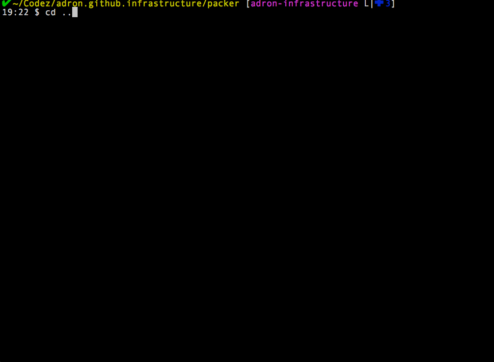

    

In the [first blog entry, "NGinx Notes from URL Redirect Project on Google Cloud with Terraform & Packer - Part 1"](http://blog.adron.me/articles/nginx-notes-from-the-url-redirect/) I covered getting a basic Nginx URL Redirector setup and running. Now it's time to dig into some of the next steps.

Since we have an operative server running that we want to automate, I'll actually just wipe out the server we built in the first part of this series. Albeit I will refer back to it when I get to the process of recreating this server with Packer and Terraform. So first things first, let's actually setup the networking elements needed to put the server into action.

## Infrastructure : The first Terraform Resources

The first thing I need is an IP and an A Record in DNS to map to the server that'll be in charge of the redirection. With Terraform, I can automate this, and for a quick review of how to get started with Google Cloud and Terraform, check out my post "[Working With Google Compute Engine (GCE) using Terraform (With a load of Bash Scripts too)](http://blog.adron.me/articles/working-with-google-compute-engine/)". With that, I'll add the following files to this project including the following Terraform resources. The way I do this is simply create a directory and run `git init` to make that a repo, then just push it up to Github or wherever the remote needs to be stored. I'll work based on that from here on out with this series. 

* Filename: `connections.tf`

This file will simply host the connection for the provider I'll be building the infrastructure resources against. In this case, I'll be working against Google Cloud. The `credentials` section in the file has the interpolated local file `account.json` that I have my secret key in. It's one of the multiple ways you can setup your Google Cloud key to use with Packer, Terraform, or other tools. For more information or for specific directions on getting an account.json file just read my previous post on using [Google Cloud & Terraform](http://blog.adron.me/articles/working-with-google-compute-engine/).

    provider "google" {
      credentials = "${file("../secrets/account.json")}"
      project     = "that-big-universe"
      region      = "us-central1"
    }

* Filename: `addresses.tf`

This file will include the resources for the static IPs for use with the server and assigning a subdomain within the DNS Zone to redirect.
 
    resource "google_compute_address" "nginx-server" {
      name = "nginx-server"
    }

* Filename: `zone-adronme.tf`

This file has more than the entries below, such as for this very blog. But I've just included the specifics of what are needed to provide the subdomain that will direct to the server, which will then provide the redirect.

    resource "google_dns_managed_zone" "adronme" {
        name = "adronme"
        dns_name = "adron.me."
        description = "Production http://adron.me Domain."
    }
    
    resource "google_dns_record_set" "data" {
        managed_zone = "${google_dns_managed_zone.adronme.name}"
        name = "data.${google_dns_managed_zone.adronme.dns_name}"
        type = "CNAME"
        ttl = 5
        rrdatas = ["${google_compute_address.nginx-server.address}"]
    }

Note that the rrdatas value of `google_compute_address.nginx-server.address` references whatever static IP is created in the `addresses.tf` file resource.

That will give me the DNS entries needed to get any requests sent to the actual server from within Google Cloud using their respective DNS Server & static IP assigned for their network.

The next thing I want now is the actual server that Nginx will be installed on. I don't want Terraform just to whimsically make this Nginx Server from scratch though (which it could through scripts, etc). I know what needs to be on the server, namely Nginx, but also how it should be configured by default. I already have my actual redirect, so I want to just have the data baked into the image. The easiest way to insure Terraform builds a Virtual Machine in a repeatable way is to simply create an image in Google Cloud first. That way I can use that as the base of the virtual machine whenever it needs created. The way I generally manage this, is I simply create a folder within the repository called *packer*.

In the packer directory I'll now have three specific files: install-nginx.sh, nginx.conf, and redirector.json. The install-nginx.sh will be for installing nginx, but will also include installing and opeing up the appropriate connections to the local firewall. The nginx.conf file will be the custom nginx file used for our nginx server that includes the URL redirection. This file will also be copied into the appropriate directory during creation of the image by the install-nginx.sh file. Last, the redirector.json file is the actual packer template that will be used to create the image. Below are the three files.

* Filename: `install-nginx.sh`

This starts out by running the apt-get update, then installing UFW. UFW stands for **U**ncomplicated **F**ire**W**all. After that is done, two allowances are added to the firewall for 22 (ssh) and 80 (http) traffic. Then it is enabled by passing in "y" to the command execution of `sudo ufw enable`. After that is setup, nginx is installed and the service stopped. The service doesn't really need stopped, but I'll have to start it or restart it again in a moment so I stop it anyway. Then I've got the `sudo update-rc.d nginx defaults` to set nginx to start upon reboots of the instance, finally the nginx.conf file from the repo is moved to replace the default nginx.conf file included with the original installation. Then finally a command to start nginx back up.

    #!/usr/bin/env bash
    
    # Install the UFW (Uncomplicated Firewall), setup tcp 22 and 80 for ssh and http. Then enable the firewall.
    sudo apt-get update
    sudo apt-get install ufw
    sudo ufw allow 22/tcp
    sudo ufw allow 80/tcp
    echo "y" | sudo ufw enable
    
    # Install nginx, stop, start, and restart the server for verification. Then set startup defaults.
    sudo apt-get -y install nginx
    sudo service nginx stop
    sudo update-rc.d nginx defaults
    
    sudo mv nginx.conf /etc/nginx/nginx.conf
    
    sudo service nginx start

* Filename: `nginx.conf`

This is the simple nginx.conf file, trimmed down to the bare necessities to accomplish the goal of redirecting this singular subdomain of http://data.adron.me to the URL in the file. Everything else in the file is default from the original installation. The key part with the URL redirection is toward the bottom of the file in the `server` block. For now, until I make the redirect permanent, I've set it up simply as a 302 redirect.
    
    user www-data;
    worker_processes 4;
    pid /run/nginx.pid;
    
    events {
        worker_connections 768;
    }
    
    http {
    
        ##
        # Basic Settings
        ##
    
        sendfile on;
        tcp_nopush on;
        tcp_nodelay on;
        keepalive_timeout 65;
        types_hash_max_size 2048;
    
        # server_names_hash_bucket_size 64;
        # server_name_in_redirect off;
    
        include /etc/nginx/mime.types;
        default_type application/octet-stream;
    
        ##
        # SSL Settings
        ##
    
        ssl_protocols TLSv1 TLSv1.1 TLSv1.2; # Dropping SSLv3, ref: POODLE
        ssl_prefer_server_ciphers on;
    
        ##
        # Logging Settings
        ##
    
        access_log /var/log/nginx/access.log;
        error_log /var/log/nginx/error.log;
    
        ##
        # Gzip Settings
        ##
    
        gzip on;
        gzip_disable "msie6";
    
        ##
        # Virtual Host Configs
        ##
    
        include /etc/nginx/conf.d/*.conf;
        include /etc/nginx/sites-enabled/*;
    
        server {
            server_name data.adron.me;
            return 302 http://api.compositecode.com/dataservices/information.html;
        }
    }

* Filename: `redirector.json`

This final file, the redirector.json file, is the packer template itself. The first section holds two variables, which I didn't technically need, but when I expand on usage it comes in handy. Also, this way any names or such that I might want to change are at the top of the file. It makes it a little simpler to find the parts I change regularly during troubleshooting and getting everything to work.

After the two variables is the `builders` section of the template. It includes what type of of builder it is (googlecompute), where that security file is (which I mentioned in the connection above for the terraform files, but this is connecting the packer template to the appropriate security key file), project id, zone, instance name, image name, and a few other values. A few of these values are very important to understand what they're for and why I've put them here. The three I need to point out are `instance_name`, `image_name`, and `ssh_username`.

The instance name is exactly what you might think, it's the name of the instance that runs in Google Cloud Engine. However, this is the instance name of the instance that will be used temporarily to build the image from. That's where the next value comes into place, the `image_name`. The instance is deleted once it's done being created, disconnected form the image that was created to build the instance, and that image is named whatever value is in the `image_name`. So you'll never really see the `instance_name` except for a few moments during creation.

The third value, the `ssh_username` is actually the username of the account created to run the shell scripts and do the installations and such. For some of the operating system types, this is necessary and others it is not. For the debian-8-jessie-v20160803 image I've set as the `source_image`, it seems to be necessary based on my testing.
    
    {
      "variables": {
        "instance_name": "redirector-{{timestamp}}",
        "image_name": "redirector-{{timestamp}}"
      },
      "builders": [
        {
          "type": "googlecompute",
          "account_file": "../../secrets/account.json",
          "project_id": "that-big-universe",
          "source_image": "debian-8-jessie-v20160803",
          "zone": "us-central1-a",
          "instance_name": "{{user `instance_name`}}",
          "image_name": "{{user `image_name`}}",
          "image_description": "Nginx Server.",
          "communicator": "ssh",
          "ssh_username": "nginxadmin"
        }
      ],
      "provisioners": [
        {
          "type": "shell",
          "inline": [
            "sleep 3",
            "echo \"slept for 3 seconds.\""
          ]
        },
        {
          "type": "file",
          "source": "nginx.conf",
          "destination": "nginx.conf"
        },
        {
          "type": "file",
          "source": "install-nginx.sh",
          "destination": "install-nginx.sh"
        },
        {
          "type": "shell",
          "script": "install-nginx.sh",
          "pause_before": "10s"
        }
      ]
    }

## Where we're at...

At this point I've got the key elements ready for deploy to Terraform and I've got the core pieces to build the image with my template for Packer. But I've got neither of these tools actually installed just yet. Well, I'm in luck, I've created two scripts just for this purpose for [OS-X](https://github.com/Adron/adron.github.io/blob/adron-infrastructure/terraform-packer-install-scripts/install-terraform-packer-os-x.sh) and [Linux](https://github.com/Adron/adron.github.io/blob/adron-infrastructure/terraform-packer-install-scripts/install-terraform-packer-ubuntu.sh). Oh wait, I might have lied, I only have install files for OS-X and Linux. If you're running Windows just navigate out and follow these instructions for [Terraform on Windows](https://www.terraform.io/intro/getting-started/install.html) and [Packer on Windows](https://www.packer.io/intro/getting-started/setup.html).

Alright, with Packer and Terraform installed, I'm ready to build some networking infrastructure and a base image. The first thing I do is run the Packer command, from the directory in which I created the three files related to my Nginx Server. The following is an animated .gif recording (made with [licecap](http://www.cockos.com/licecap/)) of running `packer build redirector.json`. Note, I paused over some of the parts that take a few seconds, so just the actual changes are shown without the long delays over things like deleting instance or creating image steps. So don't freak out when you run a packer build and some things take a few seconds or minutes.

Now that we have the packer built image in Google Cloud I can build the Nginx server using this image. Here's what I put together for the Terraform file to create the Nginx server. Note, I've placed this file in the root of the project repository (where I've placed all of my Terraform files that I mentioned previously in this article).

* Filename: `redirector.tf`
        
In this file I've declared a Terraform Compute Instance type, and named it redirector. For the disk, I've set it to the image name that Packer created for me, then the network_interface has an access_config that has the nat_ip set to the .address of the redirector static IP. Previously in the article I setup the DNS to point http://data.adron.me to that IP address, so this is the final step here. The other information in the Terraform Template, suffice it to say, is a topic for another day. I will mention however, that the tags "http-server" and "https-server" are there to ensure that the Google Firewalls are appropriately opened up to these ports (80 and 443 respectively). Albeit I'm not using 443 at the moment, it's open for subsequent material I may write on this topic.
        
        resource "google_compute_instance" "redirector" {
          name = "redirector"
          machine_type = "f1-micro"
          tags = [
            "http-server",
            "https-server"]
          zone = "us-central1-b"
        
          disk {
            image = "redirector-1471307522"
          }
        
          network_interface {
            network = "default"
            access_config {
              nat_ip = "${google_compute_address.redirector.address}"
            }
          }
        
          service_account {
            scopes = [
              "userinfo-email",
              "compute-ro",
              "storage-ro"]
          }
        }

Now, I can use the Terraform CLI and it'll pull in the all the .tf files for processing and build out the static IP, DNS entry, and respective instance with the nginx.conf file already baked in. With a single command of `terraform apply` and it will all be done!
  

Now, of course the first time this is applied, be sure to give the DNS Servers some time to propagate.