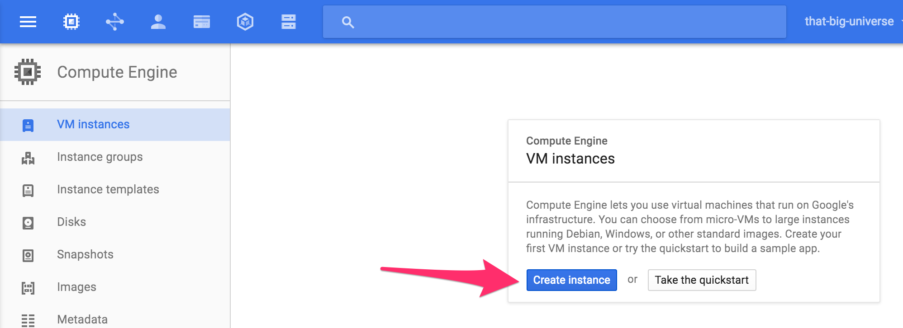
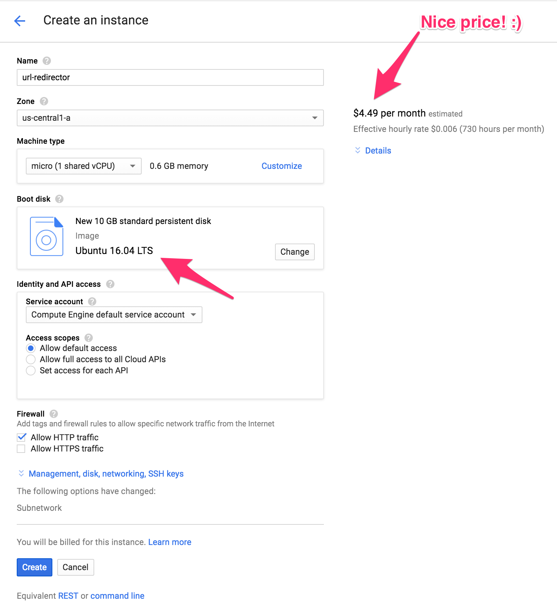
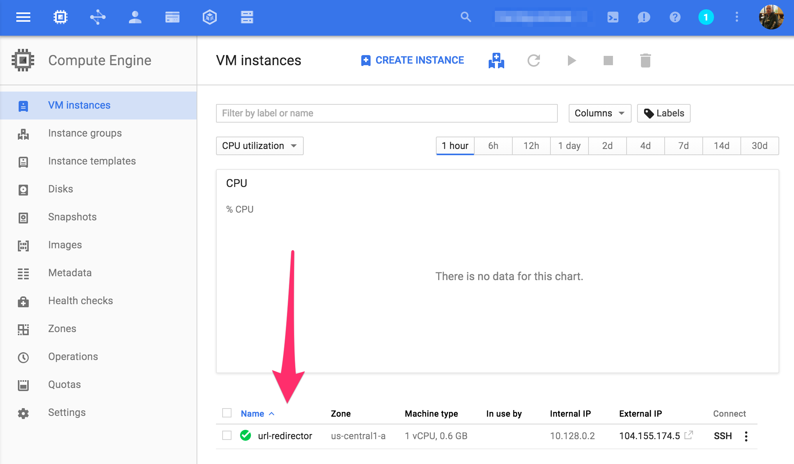
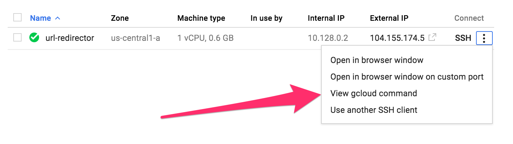

I set out on a mission yesterday to put together a URL Redirect Server. Before I even get into the nitty gritty of how I got this to work via Nginx, I'll add two caveats:

* I don't really know much about Nginx at all. I've written up and configured one reverse proxy and handed that off to some ops team. Theoretically it worked (in their testing). But other than that, I've barely done anything myself with Nginx.
* I've no idea really if this is even a good practice. URL Redirects of this sort actually seem like a hack. They work, but it seems like there really ought to be a better less onion layer like way to do this type of redirection.

With those two caveats I'll add a few questions for you, dear reader.

1. If you have any suggestions for an easier way than spinning up a whole Nginx Server to do URL Redirects I'd love to hear them!
2. Is this a best practice way to do subdomain to URL Redirects? If not, I'd probably like to be doing whatever is best practice.

Anyway, now that we're past my caveats, questions, and requests for help, let's roll on the how-to of all this.

This whole setup started when I realized while doing a migration from one DNS Provider to Google DNS. Google DNS doesn't convolute their DNS Services with URL Redirect features or other non-DNS features. When I stumbled into the fact that there were some URL Redirects that had muddled themselves into Google DNS as actual CNAME DNS entries, I knew I'd need to get those migrated to something that could actually do URL redirects.

The need was super simple in scope. Have a subdomain, like [http://data.adron.me](http://data.adron.me) redirect (302 and eventually 301, more on that in a minute) to something like [http://api.compositecode.com/dataservices/information.html](http://api.compositecode.com/dataservices/information.html). I did some reading about [Apache vs. Nginx](https://www.digitalocean.com/community/tutorials/apache-vs-nginx-practical-considerations). I determined I'd go with Nginx as I knew it to be a solid server with minimal fuss.

## Setting up Nginx

Before getting into a smart way to setup Nginx, I just dove in to figure out how to setup a redirect.

First I spun up an Ubuntu 16.04 Server on Google Cloud. Here's the interface for creating a new instance on Google Compute Engine (GCE).

Next setup the criteria for the instance. In my particular situation I'm assuming an almost non-existent need for resources so I've select the uber cheapo $4.49 instance. For that instance I named it url-redirector, stuck it in the us-central1-a zone, selected the micro (1 shared vCPU) with 0.6 GB Memory, using the Ubuntu 16.04 LTS image, gave it default access, selected HTTP traffic, and clicked create.

Once created it displayed on the Compute Engine dashboard screen. There I have my IP and SSH options.

Clicking on the SSH vertical elipsis I then selected the `View gcloud command` option. A dialog appears with the gcloud command to connect to this new instance.

I copied the command to ssh into my Google Cloud server instance.

    gcloud compute --project "that-big-universe" ssh --zone "us-central1-a" "url-redirector"

At this point I went ahead and logged into this new instance and installed Nginx.

    sudo apt-get update
    sudo apt-get install -y nginx

On Ubuntu 16.04 a new firewall technology is used called Uncomplicated Firewall (UFW). To setup that firewall, open up the HTTP and SSH ports. Some instructions point to an Nginx HTTP so I added that too. Then I enabled the firewall.

	sudo ufw allow http  #adds port 80
	sudo ufw allow ssh  #adds port 22
	sudo ufw allow 'Nginx HTTP'
	sudo ufw enable

I noticed this prompted for a "`y|n`" as I enabled the firewall. So I'll have to figure that out later as I work through automating and building out this server for deployment and prep with Packer and Terraform later. At this point however I have the server running, with Nginx, and am ready to test out a redirect.

**Configuration File Structure**

A lot of the samples I find all over the web are in little snippets like the following.

	location / {
	    root /data/www;
	}

or

	server {
	    location / {
	        root /data/www;
	    }

	    location /images/ {
	        root /data;
	    }
	}

or

	location / {
	        fastcgi_pass  localhost:9000;
	        fastcgi_param SCRIPT_FILENAME $document_root$fastcgi_script_name;
	        fastcgi_param QUERY_STRING    $query_string;
	    }

In these three examples I have location with a value for the root property in the top one, then in the next the server with two location sections and then finally a location. So many of these snippets are used and can be confusing without context for how and where things are structured within the configuration file itself.

Let's break this out real quick to the requisite parts of the file. Nginx has modules controlled by directives in the configuration file. A directive consistes of name and parameters separated by spaces and ending with a semicolon. A block directive or simple directive has the same overall structure. The difference being a block directive has a set of instructions surrounded by braces. A context is a block directive that has additional directives inside the braces. Directives placed in the configuration file outside of contexts is in the main context.

Some of the key contexts to be familiar with in configuration of Nginx are the *events*, *http*, *main*, *server*, *http*, and *location* directives. Also, it's good to know that the *events* and *http* directives reside int he *main* context, *server* in *http*, and *location* in *server*. The most common one often edited, at least in my minor experience so far is the *server* context. This *server* context of course resides in the *http* context which resides in the *main* context. This looks something like what is shown below.

	http {
	    server {
	    }
	}

Check out a [sample nginx.conf files](../../docs/nginx-default-config-file) to get an idea of what the default config file looks like after installation. For more information also check out this other [Digital Ocean blog entry "Understanding the Nginx Configuration File Structure and Configuration Contexts"](https://www.digitalocean.com/community/tutorials/understanding-the-nginx-configuration-file-structure-and-configuration-contexts).

Another important thing to know, besides how the nginx.conf file is structured and formatted, is where the thing is actually located. Here are some of the file locations for it and related important files.

* `/var/www/html` is where the actual content that Nginx serves is located.
* `/etc/nginx` is where the configuration files are. Including the nginx.conf file I'll need to edit for the redirect.
* `/etc/nginx/sites-available` is the directory where per-site "server blocks" are stored. Typically server block config is done here and then enabled by linking to the other directory.
* `/etc/nginx/sites-enabled` is the directory where enabled per-site "server blocks" are stored linked by config files in the sites-available directory.
* `/etc/nginx/snippets` is where config fragments are included that are used elsewhere in Nginx configuration.
* `/var/log/nginx/access.log` is where the web server records log files unless configured to do so elsewhere.
* `/var/log/nginx/error.log` is where Nginx errors are recorded.

What I needed to do at this point was edit the nginx.conf, or some file, and ensure that it had the appropriate redirection in the file. My first take at this looked like the following edit. I opened up the nginx.conf file and added this to the `http {}` context.

	http {
		server {
        	server_name data.adron.me;
        	return 302 http://api.compositecode.com/dataservices/information.html;
        }
	}

At this juncture however, with this hack of the config file I had a working URL Redirection. Upon further reading I realized that maybe this wasn't the most ideal place to put the redirection.

## Summary

I've got a solid redirect in place for [http://data.adron.me](http://data.adron.me) that is sending traffic to [http://api.compositecode.com/dataservices/information.html](http://api.compositecode.com/dataservices/information.html). However I'm not sure I've set this up using an ideal practice. So I went back to reading more of the documentation. RTFMing, it's important.

Part 2, coming up soon, with more docs read for better insight! <- this line will eventually link, like a linked list, to the next part of this series.

**References:**

* [Nginx](https://www.nginx.com/)
* [Nginx Documentation](https://www.nginx.com/resources/wiki/)
* [Installing Nginx on Ubuntu Server 14.04 LTS](https://www.digitalocean.com/community/tutorials/how-to-install-nginx-on-ubuntu-14-04-lts)
* [Installing Nginx on Ubuntu Server 16.04](https://www.digitalocean.com/community/tutorials/how-to-install-nginx-on-ubuntu-16-04)
* [Aapche vs. Nginx: Practice Considerations](https://www.digitalocean.com/community/tutorials/apache-vs-nginx-practical-considerations)
* [Understanding the Nginx Configuration File Structure and Configuration Contexts](https://www.digitalocean.com/community/tutorials/understanding-the-nginx-configuration-file-structure-and-configuration-contexts)