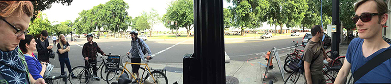

Node PDX, at least for me, kicked off Saturday morning before the conference. This involved the Geek Train, which as always was a great ride. After returning everyone went off for the evening and I prepared more for the conference.
 
The following day involved Sunday conference setup, workshops, and the Node PDX bike ride. Here's a few photos of the ride and our break at Cup & Bar. In the next blog entry I'll have more pictures & videos of the talks coming up.

