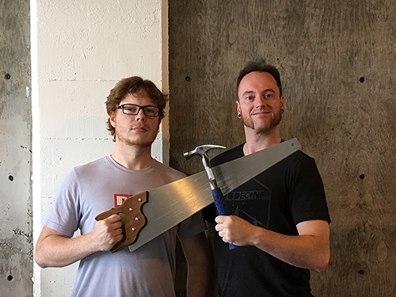

    

This is a very Portland, very unique to Node PDX talk, by Adam and David who work at ZHealth Documentation and have opinions about things.

Nuff' said eh!

Despite having no formal construction experience, Adam and David have been tasked
with designing a new bike shed outside of the Olympic Mills Commerce Center. They have spent long hours in extensive research, and are excited to share their results with the community.

Attendees will receive plans and a Starter Kit of building materials.

For more important information about what a bike is, what a shed is, and how these two things combined make bike sheds, check out this useful links.

* Bikes: [https://en.wikipedia.org/wiki/Bicycle](https://en.wikipedia.org/wiki/Bicycle)
* Sheds: [https://en.wikipedia.org/wiki/Shed](https://en.wikipedia.org/wiki/Shed)
* Bike Sheds: [https://en.wikipedia.org/wiki/Shed#Specific-use_sheds](https://en.wikipedia.org/wiki/Law_of_triviality)
