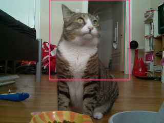

I'm stoked to introduce Tomomi (<a href="http://twitter.com/girlie_mac">@girlie_mac</a>). Tomomi is an avid open web &amp; open technology advocate and creative technologist, who had been active in the mobile space for past 8+ years. Now she is working at PubNub in San Francisco. When she is not at work, she still geeks around and hacks some stuff like Amazon Dash to Rickroll people.

Tomomi will be presenting "<strong>From Software to Hardware: How Do I Track My Cat with JavaScript</strong>".

In the era of Internet of Things, connecting things to the mobile devices and web is becoming ubiquitous. You can control room light using your mobile phone. You can monitor your heart rate and weight on browser. JavaScript engineers like you already have skills to prototype ideas to build software, so why not hardware too?

Tomomi, a front-end engineer with no background in electrical engineering, tells how she got started with hardware hacking with JavaScript, also talks about her recent fun project, <a href="https://github.com/girliemac/RPi-KittyCam">KittyCam</a>, a Raspberry Pi camera with cat facial detection to see when her cat Jamie is eating while being away from home.

If you're interested in seeing Tomomi speak, get registered for <a href="http://nodepdx.org/" target="_blank">Node PDX before the tickets are gone</a>.
