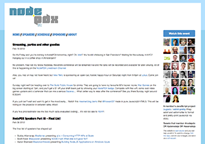
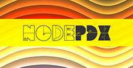

Some of you may know the story, but I'll tell it again for those that don't. In 2012 Troy Howard ([@thoward37](https://twitter.com/thoward37)) and I were sitting at the Side Door hacking on some project code. We started talking about where and what was up with the Node.js project, community, and asking ourselves what the future of that was. You see, we'd toyed about with the technology here and there but we hadn't really done anything with it.
   
We continued our coding, enjoying a tasty locally brewed beer, frothy and good. After a reasonable amount of said tasty beer, we started discussing a way to get up to speed faster on Node.js. In our infinitely wise and slightly intoxicated minds we both thought, "Hey, let's throw a conference!". We immediately started discussing this idea and a number of decisions were made...

## Inception by Conversation

> ***Adron*** "Oh man, we should do exactly that, let's have a conference! It'll be super easy to ramp up if we just get a bunch of smart Node.js people together."

> ***Troy*** "Yeah, and it'd be a total blast. There are a number of smart people working in this space."

> ***Adron*** "Let's!"

> ***Troy*** "Yes."

> ***Adron*** "Cheers!"

> ***Troy*** "Cheers!"

> Beer drinking. So there we sat, and we began, the dilligent decision making at what was obviously the perfect time to make decisions about a conference!

> ***Adron*** "Have you ever organized anything like this before?"

> ***Troy*** "Naw. You?"

> ***Adron*** "Ummm, nope."

> ***Troy*** "What seems like a reasonable timespan to get this put together?"

> ***Adron*** ... sip, sip, sip, big drink. "Hmmm, I don't know, 4 or 5 weeks, maybe 4?"

> ***Troy*** "Meh, sounds good."

> ***Adron*** "Cool, so we'll have it in about 5 weeks."

> ***Troy*** "Yup."

> ***Adron*** "How many days, speakers and such?"

> ****Troy**** "Let's go for two days and we'll just do one track."

> ***Adron*** "Done and done."

*(Ok, it might have been slightly different, but this is the gist of it.)*

In that moment of infinite wisdom we began the journey to create and organize our first conference. It thoroughly kicked our ass but was super fun.

    

We also learned some very key things.

* Organizing an inclusive conference is both easy and ridiculously stressful and difficult.
* Organizing a conference with 4-5 weeks before the date is batshit insane.
* Making decisions about organizing something one has never organized is probably not the best thing to do after coding for hours on end and maybe one to many beers.
* Community focused and grassroots organized conferences are really fun and arguably more educational than that corporate shit shill.
* Organizing volunteers and speakers is not actually easy at all.
* Non-profit incoroporation, actually any type of corporation is very poorly organized for this type of event. Either way, it adds a financial burden just for undertaking such an enterprise.
* One can actually learn a lot at a conference, but the people contacts are vastly more important.
* One can actually not learn a whole lot if actually organizing the conference, yet this first year we managed to do both learning and connecting with many of the great attendees of the conference.

    

So this basically summarizes year one of Node PDX. That was [Node PDX 2012](http://2012.nodepdx.org/).

Node PDX 2013 started off a bit differently. We gave ourselves more runway to work with. I believe initially it was at least several months. We also gave ourselves plenty of resources to work with and incorporated anyway, which still is a complete discouragement from actually doing these things.

Troy also did effectively all of the graphic design, which I might add, turned out pretty rad! Check it out for a trip down memory lane at the [archive site](http://2013.nodepdx.org/).

    

## Node PDX 2013

We got the ball rolling and Node PDX 2013 was a huge hit. We had involvement from all sorts of sponsors from great companies like [New Relic](https://newrelic.com/), [Urban Airship](https://www.urbanairship.com/), [^lift](https://liftsecurity.io/), [Mozilla](https://www.mozilla.org/en-US/), [Jive](https://www.jivesoftware.com/), [Janrain](http://www.janrain.com/), [Walmart Labs](http://www.walmartlabs.com/), [PIE PDX](http://www.piepdx.com/), [Basho](http://basho.com/), [Sticker Mule](https://www.stickermule.com/), [Silicon Florist](http://siliconflorist.com/), and [Devion](http://devion.com/). We also had a great speaker line up, had excellent local food, great freshly brewed & roasted coffee, and lots more. I even got hit in the head with a quad-copter! It was absolutely a superb time. 

    

## Conference Burnout

After 2013 Troy and I had a case of the burnouts kick us. He went the route of just organizing more conferences, I however went the route of not organizing any conferences, or much of anything for a while.

This however lasted over a year for me, I started working on some projects, co-founded a startup, worked to raise capital with the team, built a product, ran out of money, spent most of 2015 not working, produced some training material and a lot more. Basically I was working on anything that involved not working on conference (or meetup) organizing.

## 2016 Hits and Energy Returns

At this point I'd had a significant amount of time off. I'd also managed to spend time in Europe, recover from my doldrums, get married to a most amazing an awesome person, and felt maybe I'd dive into some conference organizing again. I'd missed Node PDX & the comraderie and learning it brought. With that deduction I struck up another conversation to see if Troy was interested in organizing another Node PDX. I think it went something like this.

> ***Adron*** "Hey Troy, wanna run another Node PDX?"

> ***Troy*** "Maybe."

> ***Adron*** "Let's grab some coffee and discuss."

> ***Troy*** "Alright. Should we meet at..." at this point we spend 45 minutes discussing where we should meet for coffee.

We then departed our respective locations to meet at a coffee shop somewhere in Portland. We then met and started talking about, as we often do, everything except what we were going to talk about. Then, as if spuriously interupted,

> ***Adron*** "Hey Troy, wanna run another Node PDX?"

> ***Troy*** "Ok."

So here we are now, with just 11 days to go before another Node PDX. We're rounding up and finalizing the last steps of the effort right now. The speakers have been notified, we've gotten confirmations, and we're getting the wheels on the bikes ready, the beer cooled off, the food prepared (ok, actually that'll be prepared later), and psyched for the upcoming event. With that said, we're definitely back in the groove and looking forward to this year's event! We hope to see you there.

[Join us at Node PDX](http://nodepdx.org/#tickets), enjoy a [bike ride](http://nodepdx.org/lagniappe.html#bikes) to see parts of Portland, and if you're coming down from Seattle be sure to enjoy the [$15 buck ride](http://nodepdx.org/lagniappe.html#geektrain) via the [Amtrak Cascades](http://www.amtrakcascades.com/) to Portland for the conference.

