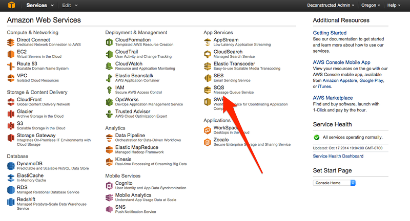
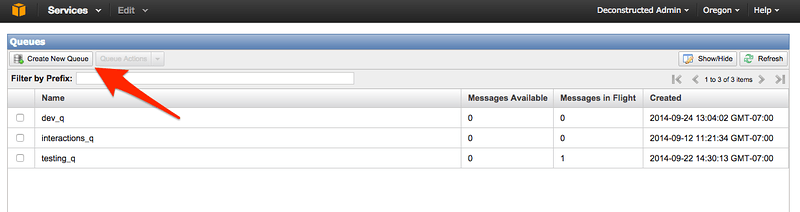
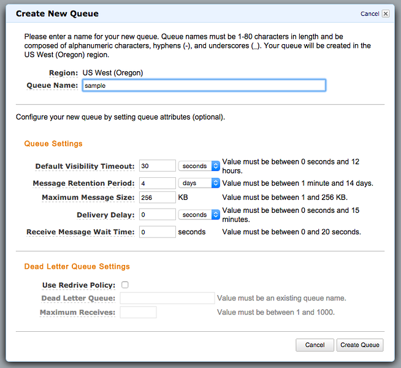
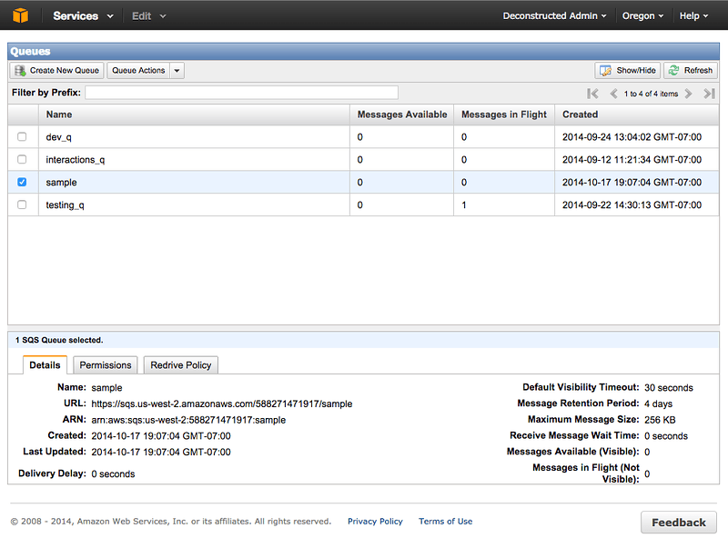
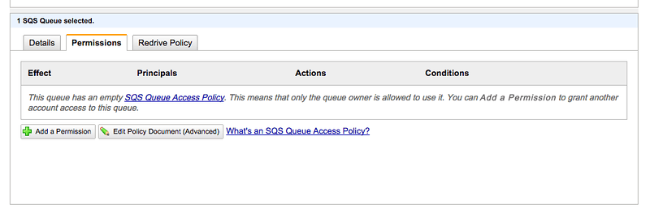
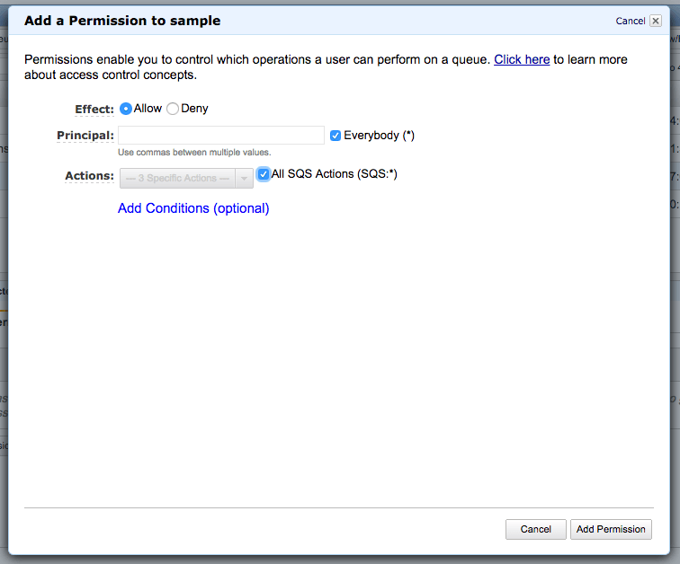

    

* *Part 1* – [Setting up an AWS SQS Queue for Use With Node.js Beanstalk Worker Instances](/articles/setting-up-an-aws-sqs-queue-for-use-with-node-js-beanstalk-worker-instances) (This is the current article you're reading now)
* *Part 2* – [Setting up a Hapi.js App that sends work to a Node.js AWS Worker via SQS](/articles/hapijs-aws-worker-publish/)
* *Part 3* – [AWS Beanstalk Worker with Node.js and SQS](/articles/aws-beanstalk-worker-with-node-js-and-sqs/)

Before diving straight in, I'm going to outline the specific goals and what I am using to accomplish these goals. The goal is to have a simple web application, that will get some element of data posted to a queue. The queue will then have data that a worker service needs to then process. As I step through each of these requirements I'll determine the actual push and pull mechanisms that will get the job done.

**[AWS Elastic Beanstalk Worker](http://aws.amazon.com/elasticbeanstalk/)**

[AWS Elastic Beanstalk](http://aws.amazon.com/elasticbeanstalk/) is a service used to deploy and scale web application and services. In this particular example I'll be using Node.js for all the work, but other options are available such as Java, .NET, PHP, Python, Ruby and even anything you can stick in a Docker Container. Simply put, you can run whatever you need in Beanstalk and gain all the advantages of the virtualized services and scaling of the toolset.

The worker feature that I'll be using in this how-to, referred to by AWS as Worker Tiers, is setup to handle background tasks at scale. Think of things like doing database cleanup, setting action flags, events, firing triggers or simply sending an email notification. The worker tier that I'll be using, again with Node.js, will simple be there to process messages that I'll put into the queue.

    

**[AWS Simple Queue Service (SQS)](http://aws.amazon.com/sqs/)**

[AWS Simple Queue Service](http://aws.amazon.com/sqs/), or [SQS](http://aws.amazon.com/sqs/) for short, is a distributed and scalable hosted queue service for storing messages that need to be reliably available between systems. By using SQS I can then create decoupled components of an application that are autonomous of each other in execution. This provides more options around scaling up or scaling down particular workloads, apps and services throughout the application ecosystem that I've built.

**[CloudWatch](http://aws.amazon.com/cloudwatch/)**

    

Even though the use of [CloudWatch](http://aws.amazon.com/cloudwatch/) is actually transparent to this project, I needed to bring it up, because without things being setup appropriately CloudWatch will definitely let you know that it is involved in this architecture.

CloudWatch is a monitoring service for cloud resources. In this particular scenario that I'm detailing here it is setup automatically by Elastic Beanstalk to monitor and autoscale instances as demand dictates.

**[Identity and Access Management (IAM)](http://aws.amazon.com/iam/)**

    

[AWS IAM](http://aws.amazon.com/iam/) provides security for individual AWS resources and also a way to manage users and administrators of those resources. In this particular scenario I won't cover the default user that I have setup, but assume that I'm using a user with permissions to all resources. I will be adding some roles to enable CloudWatch and Elastic Beanstalk to interoperate appropriately with the SQS under the premise of an Elastic Beanstalk Worker environment.

**[AWS Node.js SDK](http://aws.amazon.com/sdk-for-node-js/)**

The [Nodejs SDK](http://aws.amazon.com/sdk-for-node-js/) that Amazon provides for the AWS Web Services is pretty extensive. I have noticed it suffers a little from the "*[God Object](http://en.wikipedia.org/wiki/God_object)*" type of context where it does everything in one giant library, *however*, it really kind of makes sense for something like AWS's Services.

    

The SDK provides JavaScript objects for AWS services including S3, EC2, and almost every other practical service they have. The package is available for download the standard npm way.

      npm install aws-sdk

In the getting started section of the AWS documentation, the samples are generally given using a loadable json file with the secret key information for connecting to your AWS resources. In this scenario I'll actually use a different way to setup that configuration, which I'll elaborate on further into this series.

## Back to Business

The first order of business is to get a queue created. Since everything I'm going to put together in this sample is primarily focused around processing a queue, it seems like the perfect place to start. First open up the AWS Console and navigate to the SQS admin page.

Next click on the Create New Queue button to launch the create queue dialog.

On the dialog enter the queue name and change any of the queue settings that you need to. In this particular situation I didn't change any and just went with the defaults.

Now the queue is created. However I can't really do anything with it at this point. I need to open up permissions to whatever I want to have access it. Clicking on the just created queue and then selecting the Permissions tab just below that will bring up the tab dialog that provides options for adding various permission levels for access.

Adding permissions...

Add a Permission to sample

The queue is now all setup. In the next entry I'll setup a web application project that will send data to the queue. I'll also update this article with the links to the subsequent articles at the very top - and the bottom of the article here.

* *Part 1* – [Setting up an AWS SQS Queue for Use With Node.js Beanstalk Worker Instances](/articles/setting-up-an-aws-sqs-queue-for-use-with-node-js-beanstalk-worker-instances) (This is the current article you're reading now)
* *Part 2* – [Setting up a Hapi.js App that sends work to a Node.js AWS Worker via SQS](/articles/hapijs-aws-worker-publish/)
* *Part 3* – [AWS Beanstalk Worker with Node.js and SQS](/articles/aws-beanstalk-worker-with-node-js-and-sqs/)

**Reference:**

* [Testing AWS SQS Web Worker Github Repo](https://github.com/Adron/testing-aws-sqs-worker)
* [Testing AWS SQS Web App Github Repo](https://github.com/Adron/testing-aws-sqs-site)
