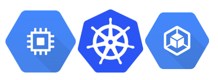

* [Part 1 - Setting up a GCP Container Cluster](/articles/setting-up-gcp-container-cluster/)
* [Part 2 - Working with a GCP Container Cluster](/articles/setting-up-gcp-container-cluster-part-2/) 
* Part 3 - Setup of Drone.io on a GCP Container Cluster - Currently being written

<div class="image float-right">
    
</div>

A couple of days I wrote up the experience around getting a Google Container Cluster up and running and adding a Terraform config to automate the process. Today my plan is to dig into getting containers into the Google Container Repository and then using those containers to launch various things within the Google Container Cluster. With my end goal being to get a Drone.io setup for production use.

<span class="more"></span>

In the last [blog entry of this series](/articles/setting-up-gcp-container-cluster/) I wrote up, I covered the steps and some of the issues I ran into getting a Google Cloud Container cluster up and running. In this article I'm going to dive into working with that container, specifically via the `gcloud` and `kubectl` commands. I'm assuming prerequisites at this point include `gcloud` and `kubectl` being installed. With `gcloud` also being setup via the `gcloud init` command already.

I've also made a few small changes to the Terraform config file since the previous use. I've copied the file contents below. The changes I've included below the file contents.

```javascript
 resource "google_container_cluster" "drone" {
   name = "drone"
   zone = "us-west1-b"
   initial_node_count = 3

   additional_zones = [
     "us-west1-b"
   ]

   network = "developer-space"
   subnetwork = "developer-space-west1"

   master_auth {
     username = "firsttry"
     password = "willchange"
   }

   node_config {
     oauth_scopes = [
       "https://www.googleapis.com/auth/compute",
       "https://www.googleapis.com/auth/devstorage.read_only",
       "https://www.googleapis.com/auth/logging.write",
       "https://www.googleapis.com/auth/monitoring"
     ]
     
     machine_type = "g1-small"
   }
 }
```

***The changes included:***

* I changed the name of the cluster to *drone*.
* I've added the additional zone, which is the same as the primary zone. Since the additional zone is identical to the primary zone there will only be 3 instances created. This is per the initial node count. If the additional zone were different than the primary zone, it would create 6 instances, 3 in the additional zone and 3 in the primary zone. I'm not particularly concerned about the high availability associated with the additional instances in another zone so I've configured it this way to cut down on prospective costs. The other effect of setting the additional zone, is that Terraform won't re-create the entire cluster every single time it runs.
* I've also set network and subnetwork, which if you're following along you wouldn't particularly need set, but I have my networks configured in a particular way so I like to designate which network which cluster or set of instances is going to be created in.
* Just a note, not a change, but using a g1-small is about the smallest size you can go and have a working cluster. Anything smaller than that and it tends to choke on itself, which is unfortunate.

Next step is getting connected to this cluster. Here's a few of the things you'll do over and over again when working with a container cluster.

## Using Google Container Cluster via `gcloud` and `kubectl`

For the next steps of what I need to do (to setup a cluster for use) there are a host of commands that are useful to determine what's going on, troubleshoot any issues that might come up, and generally get any insight into the cluster. Here's a run down of those key commands.

*   `gcloud container clusters describe [NAME]` - where NAME is the name of the cluster to get information from. The results which of which look like this.
    
    ```shell-script
    $ gcloud container clusters describe drone
    clusterIpv4Cidr: 10.132.0.0/14
    createTime: '2017-02-07T01:09:42+00:00'
    currentMasterVersion: 1.5.2
    currentNodeCount: 3
    currentNodeVersion: 1.5.2
    endpoint: 104.196.239.145
    initialClusterVersion: 1.5.2
    initialNodeCount: 3
    instanceGroupUrls:
    - https://www.googleapis.com/compute/v1/projects/that-big-universe/zones/us-west1-b/instanceGroupManagers/gke-drone-default-pool-d9a3b45a-grp
    locations:
    - us-west1-b
    loggingService: logging.googleapis.com
    masterAuth:
      clientCertificate: THIS IS WHERE A BUNCH OF AUTH KEY STUFF GOES FOR THE CLIENT CERT
      clientKey: THIS IS WHERE A BUNCH OF CLIENT KEY AUTH STUFF GOES
      clusterCaCertificate: THIS IS WHERE A BUNCH OF CLIENT AUTH CA CERTIFICATE STUFF GOES
      password: THIS SHOWS THE PASSWORD THE CLUSTER IS SETUP WITH - SEE ABOVE TERRAFORM FILE FOR CORRELATION.
      username: THIS SHOWS THE USERNAME THE CLUSTER IS SETUP WITH - SEE ABOVE TERRAFORM FILE FOR CORRELATION.
    monitoringService: monitoring.googleapis.com
    name: drone
    network: developer-space
    nodeConfig:
      diskSizeGb: 100
      imageType: GCI
      machineType: g1-small
      oauthScopes:
      - https://www.googleapis.com/auth/compute
      - https://www.googleapis.com/auth/devstorage.read_only
      - https://www.googleapis.com/auth/logging.write
      - https://www.googleapis.com/auth/monitoring
      serviceAccount: default
    nodeIpv4CidrSize: 24
    nodePools:
    - config:
        diskSizeGb: 100
        imageType: GCI
        machineType: g1-small
        oauthScopes:
        - https://www.googleapis.com/auth/compute
        - https://www.googleapis.com/auth/devstorage.read_only
        - https://www.googleapis.com/auth/logging.write
        - https://www.googleapis.com/auth/monitoring
        serviceAccount: default
      initialNodeCount: 3
      instanceGroupUrls:
      - https://www.googleapis.com/compute/v1/projects/that-big-universe/zones/us-west1-b/instanceGroupManagers/gke-drone-default-pool-d9a3b45a-grp
      management: {}
      name: default-pool
      selfLink: https://container.googleapis.com/v1/projects/that-big-universe/zones/us-west1-b/clusters/drone/nodePools/default-pool
      status: RUNNING
      version: 1.5.2
    selfLink: https://container.googleapis.com/v1/projects/that-big-universe/zones/us-west1-b/clusters/drone
    servicesIpv4Cidr: 10.135.240.0/20
    status: RUNNING
    subnetwork: developer-space-west1
    zone: us-west1-b
    ```
    More info:  https://cloud.google.com/sdk/gcloud/reference/container/clusters/describe

*   `gcloud container clusters get-credentials [NAME]` - where NAME is the name of the cluster, this command retrieves credentials for the cluster in which work will be done against.
    
    ```shell-script
    Fetching cluster endpoint and auth data.
    kubeconfig entry generated for drone.
    ```
    More info: https://cloud.google.com/sdk/gcloud/reference/container/clusters/get-credentials

*   `gcloud container clusters list` This command will provide a listing of the clusters that are in service. This is the first command to run to get the name of the cluster you want to work with. In this case, I'm working with the only cluster that I have named *drone*.
    
    ```shell-script
    $ gcloud container clusters list
    NAME   ZONE        MASTER_VERSION  MASTER_IP        MACHINE_TYPE  NODE_VERSION  NUM_NODES  STATUS
    drone  us-west1-b  1.5.2           104.196.239.145  g1-small      1.5.2         3          RUNNING
    ```
    More info: https://cloud.google.com/sdk/gcloud/reference/container/clusters/list
    
*   `kubectl config set-cluster [NAME]` - To use `kubectl` to manage the cluster, first the cluster to work against must be set. Use set-cluster to get this done. Where NAME is the name of the cluster to work against.

    ```shell-script
    $ kubectl config set-cluster drone
    Cluster "drone" set.
    ```
    More info: https://kubernetes.io/docs/user-guide/kubectl/kubectl_config_set-cluster/

*   `gcloud container get-server-config` - This `gcloud` command gets information about the configuration that is setup for the container cluster.

    ```shell-script
    $ gcloud container get-server-config
    Fetching server config for us-west1-b
    defaultClusterVersion: 1.5.2
    defaultImageType: GCI
    validImageTypes:
    - CONTAINER_VM
    - GCI
    validMasterVersions:
    - 1.5.2
    - 1.4.8
    validNodeVersions:
    - 1.5.2
    - 1.5.1
    - 1.4.8
    - 1.4.7
    - 1.4.6
    - 1.3.10
    - 1.2.7
    ```
    More info: https://cloud.google.com/sdk/gcloud/reference/container/get-server-config

*   `kubectl config get-clusters` - This command simply lists out the available clusters.

*   `kubectl config current-context` - This command prints out the current context in which the `kubectl` command is working in.

    ```shell-script
    $ kubectl config current-context
    gke_that-big-universe_us-west1-b_drone
    ```
    More info: https://kubernetes.io/docs/user-guide/kubectl/kubectl_config_current-context/

*   `kubectl cluster-info` - This command provides information about the cluster as shown.

    ```shell-script
    $ kubectl cluster-info
    Kubernetes master is running at https://104.196.239.145
    GLBCDefaultBackend is running at https://104.196.239.145/api/v1/proxy/namespaces/kube-system/services/default-http-backend
    Heapster is running at https://104.196.239.145/api/v1/proxy/namespaces/kube-system/services/heapster
    KubeDNS is running at https://104.196.239.145/api/v1/proxy/namespaces/kube-system/services/kube-dns
    kubernetes-dashboard is running at https://104.196.239.145/api/v1/proxy/namespaces/kube-system/services/kubernetes-dashboard
    
    To further debug and diagnose cluster problems, use 'kubectl cluster-info dump'.
    ```
    More info: https://kubernetes.io/docs/user-guide/kubectl/kubectl_cluster-info/
    
*   `kubectl describe nodes` - This command provides a lot of information about the actual running nodes in the cluster.
    ```shell-script
    $ kubectl describe nodes
    Name:			gke-drone-default-pool-d9a3b45a-l082
    Role:			
    Labels:			beta.kubernetes.io/arch=amd64
                beta.kubernetes.io/instance-type=g1-small
                beta.kubernetes.io/os=linux
                cloud.google.com/gke-nodepool=default-pool
                failure-domain.beta.kubernetes.io/region=us-west1
                failure-domain.beta.kubernetes.io/zone=us-west1-b
                kubernetes.io/hostname=gke-drone-default-pool-d9a3b45a-l082
    Taints:			<none>
    CreationTimestamp:	Mon, 06 Feb 2017 17:13:11 -0800
    Phase:			
    Conditions:
      Type			Status	LastHeartbeatTime			LastTransitionTime			Reason				Message
      ----			------	-----------------			------------------			------				-------
      NetworkUnavailable 	False 	Mon, 06 Feb 2017 17:14:09 -0800 	Mon, 06 Feb 2017 17:14:09 -0800 	RouteCreated 			RouteController created a route
      OutOfDisk 		False 	Mon, 06 Feb 2017 17:50:06 -0800 	Mon, 06 Feb 2017 17:13:11 -0800 	KubeletHasSufficientDisk 	kubelet has sufficient disk space available
      MemoryPressure 	False 	Mon, 06 Feb 2017 17:50:06 -0800 	Mon, 06 Feb 2017 17:13:11 -0800 	KubeletHasSufficientMemory 	kubelet has sufficient memory available
      DiskPressure 		False 	Mon, 06 Feb 2017 17:50:06 -0800 	Mon, 06 Feb 2017 17:13:11 -0800 	KubeletHasNoDiskPressure 	kubelet has no disk pressure
      Ready 		True 	Mon, 06 Feb 2017 17:50:06 -0800 	Mon, 06 Feb 2017 17:13:41 -0800 	KubeletReady 			kubelet is posting ready status. AppArmor enabled
    Addresses:		10.140.0.4,35.185.193.72,gke-drone-default-pool-d9a3b45a-l082
    Capacity:
     alpha.kubernetes.io/nvidia-gpu:	0
     cpu:					1
     memory:				1740088Ki
     pods:					110
    Allocatable:
     alpha.kubernetes.io/nvidia-gpu:	0
     cpu:					1
     memory:				1740088Ki
     pods:					110
    System Info:
     Machine ID:			9d264f9182ffa64366cd05fda65a9c20
     System UUID:			9D264F91-82FF-A643-66CD-05FDA65A9C20
     Boot ID:			eb0a6a3f-0316-4898-a0a8-03b8207a2125
     Kernel Version:		4.4.21+
     OS Image:			Google Container-VM Image
     Operating System:		linux
     Architecture:			amd64
     Container Runtime Version:	docker://1.11.2
     Kubelet Version:		v1.5.2
     Kube-Proxy Version:		v1.5.2
    PodCIDR:			10.132.1.0/24
    ExternalID:			7008904420460372122
    Non-terminated Pods:		(5 in total)
      Namespace			Name						CPU Requests	CPU Limits	Memory Requests	Memory Limits
      ---------			----						------------	----------	---------------	-------------
      kube-system			fluentd-cloud-logging-gke-drone-default-pool-d9a3b45a-l082		100m (10%)	0 (0%)		200Mi (11%)	200Mi (11%)
      kube-system			heapster-v1.2.0-2168613315-m2sv2		138m (13%)	138m (13%)	301856Ki (17%)	301856Ki (17%)
      kube-system			kube-dns-autoscaler-2715466192-2csx9		20m (2%)	0 (0%)		10Mi (0%)	0 (0%)
      kube-system			kube-proxy-gke-drone-default-pool-d9a3b45a-l082100m (10%)	0 (0%)		0 (0%)		0 (0%)
      kube-system			kubernetes-dashboard-3543765157-17nxs		100m (10%)	100m (10%)	50Mi (2%)	50Mi (2%)
    Allocated resources:
      (Total limits may be over 100 percent, i.e., overcommitted.
      CPU Requests	CPU Limits	Memory Requests	Memory Limits
      ------------	----------	---------------	-------------
      458m (45%)	238m (23%)	568096Ki (32%)	557856Ki (32%)
    Events:
      FirstSeen	LastSeen	Count	From					SubObjectPath	Type		Reason			Message
      ---------	--------	-----	----					-------------	--------	------			-------
      37m		37m		1	{kubelet gke-drone-default-pool-d9a3b45a-l082}				Normal		Starting		Starting kubelet.
      37m		37m		1	{kubelet gke-drone-default-pool-d9a3b45a-l082}				Warning		ImageGCFailed		unable to find data for container /
      37m		37m		1	{kube-proxy gke-drone-default-pool-d9a3b45a-l082}			Normal		Starting		Starting kube-proxy.
      37m		37m		19	{kubelet gke-drone-default-pool-d9a3b45a-l082}				Normal		NodeHasSufficientDisk	Node gke-drone-default-pool-d9a3b45a-l082 status is now: NodeHasSufficientDisk
      37m		37m		19	{kubelet gke-drone-default-pool-d9a3b45a-l082}				Normal		NodeHasSufficientMemory	Node gke-drone-default-pool-d9a3b45a-l082 status is now: NodeHasSufficientMemory
      37m		37m		19	{kubelet gke-drone-default-pool-d9a3b45a-l082}				Normal		NodeHasNoDiskPressure	Node gke-drone-default-pool-d9a3b45a-l082 status is now: NodeHasNoDiskPressure
      36m		36m		1	{kubelet gke-drone-default-pool-d9a3b45a-l082}				Normal		NodeReady		Node gke-drone-default-pool-d9a3b45a-l082 status is now: NodeReady
    
        ETC ETC ETC EACH NODE WOULD HAVE INFORMATION DISPLAYED HERE
    ```
    
*   `kubectl describe pods` - This command describes what pods are running. Currently I have none running so this isn't a super useful command until some pods are actually running in the kubernetes cluster.

*   `kubectl get pods --all-namespaces` - This command actually gives a full list of pod in all the namespaces of the cluster. This would provide insight into what other pods the Kubernetes system itself has put onto the server.

*   `kubectl config view` - This is another command that provides specific configuration information.

### Summary
 
That covers the commands that will help us troubleshoot and get things running in the Google Container Engine (i.e. Kubernetes Cluster). Next post I'll dive into and step through the specifics of getting Drone.io setup. Until then, cheerio and happy hacking.

* [Part 1 - Setting up a GCP Container Cluster](/articles/setting-up-gcp-container-cluster/)
* [Part 2 - Working with a GCP Container Cluster](/articles/setting-up-gcp-container-cluster-part-2/) 
* Part 3 - Setup of Drone.io on a GCP Container Cluster - Currently being written