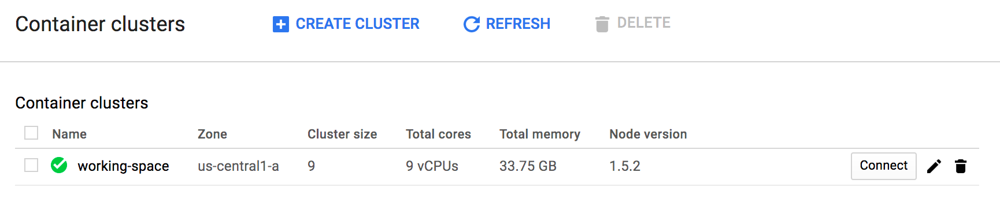
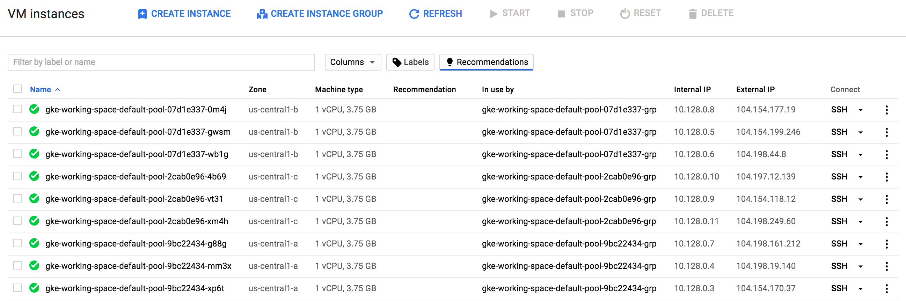
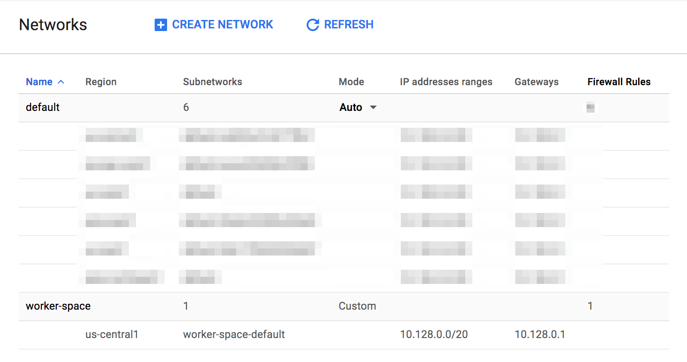
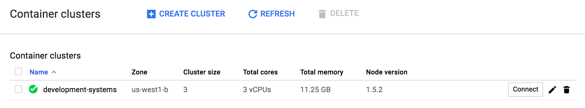

* [Part 1 - Setting up a GCP Container Cluster](/articles/setting-up-gcp-container-cluster/)
* [Part 2 - Working with a GCP Container Cluster](/articles/setting-up-gcp-container-cluster-part-2/) 
* Part 3 - Setup of Drone.io on a GCP Container Cluster - Currently being written

I set out to create a container cluster to work with in Google Cloud. These are the notes of that effort I undertook. On the heels of this article I'm putting together the notes also on getting Drone.io fully setup with an appropriate domain name and the like for use in full production grade work. For now, here's the lowdown on the steps I took to get educated on and informed about setup and use of the Google Container Cluster.

First exploratory script I ran based on instructions [here](https://cloud.google.com/container-engine/docs/clusters/operations).

```
gcloud container clusters create working-space \
  --zone us-central1-a \
  --additional-zones us-central1-b,us-central1-c
```

<span class="more"></span>

Here's the container cluster listing.



This is the list of instances running providing the nodes for the cluster.



I deleted that after I confirmed it did what I expected. Which was mostly true.

Observations:

* This command did execute and launch 9 instances. This I assumed is what it would do since I had selected a default `--zone` but also selected two additional with `--additional-zones`. This spooled up 3 instances in each zone for us within the cluster.
* In the container clusters listing in the Google Cloud Console, there's a button now that prompts with the gcloud container cluster get-credentials command and the kubectl command to connect. This is helpful, as the last time I was testing out this one had to go and dig into.

I went ahead and deleted that cluster via the Google Cloud Console. The next command I tried out was as shown.

```
gcloud container clusters create secondary-delete \
  --network worker-space
```

Since this was done on a freshly installed gcloud install on a new machine, I'd missed that I had not installed kubectl. However gcloud kindly informed me.

```
$ gcloud container clusters create secondary-delete \
>   --network worker-space
WARNING: Accessing a Container Engine cluster requires the kubernetes commandline
client [kubectl]. To install, run
  $ gcloud components install kubectl

ERROR: (gcloud.container.clusters.create) ResponseError: code=400, message=Subnetwork must be provided for manual-subnet Network "worker-space".
```

A quick `gcloud components install kubectl` fixed that. I ran the command again and oops, I needed to designate the subnetwork, not particularly the network.


I wanted to bake this into a Terraform config, so the next thing I wired together was exactly that. A quick change and reran the command.

```
$ gcloud container clusters create secondary-delete   --network worker-space --subnetwork worker-space-default
ERROR: (gcloud.container.clusters.create) ResponseError: code=400, message=Subnetwork "projects/that-big-universe/regions/us-west1/subnetworks/worker-space-default" is not valid for Network "worker-space".
```

Dammit, error central. I went and did some RTFMing at this point. The section for network and subnetwork read as follows:

> --network=NETWORK
The Compute Engine Network that the cluster will connect to. Google Container Engine will use this network when creating routes and firewalls for the clusters. Defaults to the 'default' network.

> --subnetwork=SUBNETWORK
The name of the Google Compute Engine subnetwork ([https://cloud.google.com/compute/docs/subnetworks](https://cloud.google.com/compute/docs/subnetworks)) to which the cluster is connected. If specified, the cluster's network must be a "custom subnet" network.

Ok, seems like `gcloud container clusters create secondary-delete --network worker-space --subnetwork worker-space-default` should have worked. I tried out a few more ideas to see what the issue could actually be.

```
$ gcloud compute networks subnets list
NAME                      REGION           NETWORK       RANGE
...default networks were listed here...
worker-space-default      us-central1      worker-space  10.128.0.0/20
```

So even `gcloud` finds that the network name is *worker-space-default* and the network is *worker-space*? Is that right? That's actually a little confusing. In the interface it looks like this.



Ah, I try this.

```
$ gcloud container clusters create secondary-delete --network worker-space --subnetwork us-central1
ERROR: (gcloud.container.clusters.create) ResponseError: code=400, message=Subnetwork "projects/that-big-universe/regions/us-west1/subnetworks/us-central1" is not valid for Network "worker-space".
```

Then I realize that it's injecting *us-west1* into that string for the subnetwork. But that's not true. My worker-space and its subnetwork is in central1 not in west1. So a quick RTFM again and realized that maybe adding the zone back, with these network and subnetwork parameters set, I might get a successful cluster creation. I tried this.

```
$ gcloud container clusters create secondary-delete --network worker-space --subnetwork worker-space-default --zone us-central1
```

This also didn't work, so I went with a zone of `us-central1a`.

```
$ gcloud container clusters create secondary-delete --network worker-space --subnetwork worker-space-default --zone us-central1b
ERROR: (gcloud.container.clusters.create) ResponseError: code=400, message=zone "us-central1b" does not exist.
```

Ok, WTF?! RTFMing doesn't really help at this point either. Now I'm just getting frustrated. I'm doubtfully going to use `gcloud` to build this in production anyway, so I'll go ahead and try to get Terraform building it.

## Terraform for Google Cloud Container Cluster

I added this to the script in the *adron-infrastructure* branch of my repo [here](https://github.com/Adron/adron.github.io/tree/adron-infrastructure).

```
resource "google_container_cluster" "development" {
  name = "development-systems"
  zone = "us-west1-b"
  initial_node_count = 3

  master_auth {
    username = "someusername"
    password = "willchange"
  }

  node_config {
    oauth_scopes = [
      "https://www.googleapis.com/auth/compute",
      "https://www.googleapis.com/auth/devstorage.read_only",
      "https://www.googleapis.com/auth/logging.write",
      "https://www.googleapis.com/auth/monitoring"
    ]
  }
}
```

The console container cluster display once it completes.



The console instances listed again. This time of course, just like the node count in the config above and the zone being only set to west1-b, I've got 3 instances.


Alright, that worked beautifully. If anybody has any idea what the issue is with my aforementioned attempts to create a cluster using gcloud and the network and subnetwork please ping me via [@Adron](https://twitter.com/Adron) and we'll DM or email if you would. (Also, for more info on getting started with GCP with Terraform, check out my article "[Working With Google Compute Engine (GCE) using Terraform (With a load of Bash Scripts too) ](http://blog.adron.me/articles/working-with-google-compute-engine/)")

Next step I needed to connect kubectl to the cluster. This is one of the spaces where a lot of Google documentation is lacking since it also assumes you've followed some pre-baked route to gain credentials. For instance, int he interface the thing I pointed to earlier, just uses kubectl and gcloud does some crazy black magic in the background that require tertiary RTFMing in order to figure out what is actually going on, retrace those steps, and connect yourself. The first thing I tried was to set the cluster.

```
kubectl config set-cluster development-systems
```

Then did a quick `kubectl config view` which showed that things were set correctly. Then I tried to run `kubectl cluster-info` just to see what's up.

```
$ kubectl cluster-info
error: google: could not find default credentials. See https://developers.google.com/accounts/docs/application-default-credentials for more information.
```

So no go. Default credentials... another thing I'm not really sure. I tried to run `gcloud container clusters get-credentials development-systems  --zone us-west1-b --project that-big-universe` and it failed. Grumble grumble come on. I tried again however, because something seemed odd with the network before, and this time I got some results! Win!

```
$ gcloud container clusters get-credentials development-systems \
>     --zone us-west1-b --project that-big-universe
Fetching cluster endpoint and auth data.
kubeconfig entry generated for development-systems.
```

I then try to get a `kubectl cluster-info`.

```
$ kubectl cluster-info
error: google: could not find default credentials. See https://developers.google.com/accounts/docs/application-default-credentials for more information.
```

Nope. Oh yeah, I gotta set kube's proxy!

```
$ kubectl proxy
error: google: could not find default credentials. See https://developers.google.com/accounts/docs/application-default-credentials for more information.
```

No. Alright, what then? At this point I'm pretty frustrated, but whatevs, this is gonna work so I keep researching. A quick search for default credentials leads to [this](https://developers.google.com/identity/protocols/application-default-credentials). I read through it and this whole GOOGLE_APPLICATION_CREDENTIALS needs to be set. Ok, that's cool. So I set it. It needs to be a credentials file for the service account used. Which actually makes sense but only because I've used Google Cloud before, but for somebody just diving into using the container service on Google this is kind of a whole derailment to go read up on a bunch of other topics. Albeit, it is necessary reading. Anyway...  back to setting the credentials file. For more info on how to set this up and working with GCP, check out my previous article "[Working With Google Compute Engine (GCE) using Terraform (With a load of Bash Scripts too)](http://blog.adron.me/articles/working-with-google-compute-engine/)".

```
export GOOGLE_APPLICATION_CREDENTIALS=~/thepathtosecrets/account.json
```

I added this to my bash_profile and sourced that file.

```
source ~/.bash_profile
```

Then I ran `kubectl cluster-info`.

```
$ kubectl cluster-info
Kubernetes master is running at https://104.196.234.30
GLBCDefaultBackend is running at https://104.196.234.30/api/v1/proxy/namespaces/kube-system/services/default-http-backend
Heapster is running at https://104.196.234.30/api/v1/proxy/namespaces/kube-system/services/heapster
KubeDNS is running at https://104.196.234.30/api/v1/proxy/namespaces/kube-system/services/kube-dns
kubernetes-dashboard is running at https://104.196.234.30/api/v1/proxy/namespaces/kube-system/services/kubernetes-dashboard
```

Ah, magic! It's working! So a few other commands just to verify and determine what the state of things are.

```
$ kubectl top node
NAME                                                 CPU(cores)   CPU%      MEMORY(bytes)   MEMORY%
gke-development-systems-default-pool-f30f476e-gtnj   34m          3%        1529Mi          41%
gke-development-systems-default-pool-f30f476e-ncln   47m          4%        1879Mi          50%
gke-development-systems-default-pool-f30f476e-s5pc   38m          3%        1691Mi          45%
```

That looks good. So on to getting some containers launched.

# Summary

At this point I've learned a number of things. One, is that using Terraform I lose a few of the other credentials that are auto-magically available if you setup the cluster via the `gcloud` commands. Using `gcloud` generally handles a lot of the management of ssh keys, credentials, and related security stuff so that you don't have to. There are of course positives and negatives around this, for instance, if I go and created a cluster via Terraform my credentials are out of sync with what `gcloud` is actually using. At least in the scenario above I had to go set the credentials manually and add them to the ~/.bash_profile. Overall, once familiar with, I know this all will be super easy to dig through, but it definitely takes some exploration and lots of breaking things before getting it all figured out and mapped in one's brain. For part II I'm digging into running containers in the cluster and also getting container images stored in Google's image container registry. Hopefully I can get the network and subnetwork confusion sorted out too and get that implemented.

* [Part 1 - Setting up a GCP Container Cluster](/articles/setting-up-gcp-container-cluster/)
* [Part 2 - Working with a GCP Container Cluster](/articles/setting-up-gcp-container-cluster-part-2/) 
* Part 3 - Setup of Drone.io on a GCP Container Cluster - Currently being written