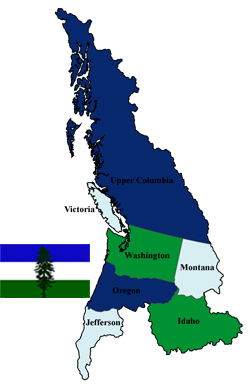

    

First, I will be available to start work with a possible start date of November the 1st. I'm currently wrapping up some big projects and completing training for the Home Depot Team. If your company is looking for someone with my wild array of technical skills and soft skills, you can [check out my resume & details](/docs/about) and initiate [job talk with me here](/docs/job-talk/)!

On to the rest of the news. If you've seen me speak lately I've mentioned the open source efforts we've had going on at [Home Depot](http://www.homedepot.com/) and related efforts I was working on. Some I'm working dilligently to release via the [Home Depot OSS Organization on Github](https://github.com/homedepot/) and I'll still be releasing others soon via my Github account ([@Adron](https://github.com/Adron)) and blogging about it here on [Composite Code](http://blog.adron.me).

Since this is one of those rare times in my career where I'm not 100% sold on what I'll do next, I'm open to fielding prospects and seeing what is out there. This is a different approach for me, as I usually determine a company, particular work that needs done and go after that gap. But I'd like to get a feel for what companies feel they need at this particular time. Since I have a wide range of skills, I can step into a number of positions and immediately start to contribute to projects within a company.

Here are some theoretical positions I'd find attractive.

**Building or Expanding a Team**

> Need someone to hire, build, and create a cohesive, diverse, and powerful culture of core contributors (developers, designers, advocates, evangelists, or similar). I can knock this one out of the park for the right company. Yes, I'm a bit particular, but I'm not just going to whimsically work for any company (the best people won't work for just any old company anyway). If you are looking to put a team together and want somebody that can do that for you, I'd like to sit down to a conversation soon. [Let's talk jobs](/docs/job-talk/).

**Coding Architect**

> Have some architecture problems, that seem a bit unique or problematic? If you need someone to come in and push forward on design, patterns, practices, and actual implementation then this would also be a conversation I'd be interested in having. I'd be happy to dive into whatever the stack might be (or help decide on the stack): Java (Scala/Kotlin), Golang, Node.js or even .NET (C#/F#) for the right company. [Let's talk jobs](/docs/job-talk/).

**Development & Operations Architect**

> Have some architecture that needs to go along with an application and want to build or insure a solid continuous integration and delivery pipeline (or messaging based queue for delivery to production)? This is another possibility I'd be happy to talk about. I really love working with systems to build out reliable immutable infrastructure, data storage mechanisms (distributed, RDBMS, whatever the need calls for) and insure development can continue forward with extremely high confidence levels. [Let's talk jobs](/docs/job-talk/).

**Developer Advocate/OSS Project Lead**

> If you have an open source project I'd love to take lead on it and also provide advocacy for that project. This role is not to be confused with evangelist, as that's a fine role for other people, but I want to be in the code and advocating from a position with the team. I've done this before with projects like the Iron Foundry for Cloud Foundry and others, and loved it. [Let's talk jobs](/docs/job-talk/).

If any of these sound like a need you have, please [reach out with additional information](/docs/job-talk/) and I will be in contact ASAP.

Besides the above theoretical jobs, here are a few other things that I would like in a job. Things that just make it all worthwhile, here's a list.

**Work Environ / Soft Skills / Culture**

* Flexible hours remote or remote (out of office). Whatever the case, I'd like to work with a company that has the ability and acumen to manage the workflow and efforts among team members remotely. If you're a company that wants to upgrade the development and operational characteristics of the culture, I can also help your company incorporate highly effective remote capabilities.

    

* If there is travel, I prefer to keep it to a productively effective 10-15% of the time. Traveling dramatically decreases overall ability to contribute to actual work in an effective way. I do love to travel, speak, and get involved with the worldwide community but I always like to make sure that this involvement doesn't stymie me from contributing to actual coding, design, and related efforts.  NOTE: If travel is within the Cascadian Bioregion (see image: includes YVR, PDX, SEA, etc) it's easy to increase my travel to 15-25% of the time as travel within the region is so easy. I probably should include SFO too, it's super easy to get there and doesn't cause disruption to daily workflow. (i.e. < 2 hr trip)
* Design, build, and communicate. These are the things I like to do. I like to create what will work for high volume or high speed systems, then build prototypes and communicate how these work. Maybe I would be the one deploying to production, maybe the system is production that I'm deploying, but whatever the case is I'm happy to lead efforts on architecture and work with teams to build that architecture.
* I love to provide leadership for teams, I love to build teams, and I like working with teams. Albeit I'm particular about team diversity and culture, I can bring my own skills and the ability to bring people together on a team and expand teams. If the culture is off kilter, I can help with that. If the culture is spot on, I can work effectively with that. Whatever the case, I'm a high communication, GSD type of guy provided the right environment and reigns removed.

    

**Technical Skills**

* I've found Google Cloud Platform (GCP) a pleasure to work with lately. That combined with Terraform, Packer, and related HashiCorp tooling has been a lot of fun and provided an extremely high value for us at Home Depot.

    

* AWS has been another I've worked with that has been of stellar value, not particularly at Home Depot but at multitudes of startups and during consulting. AWS is still for many things my go to cloud provider option.
* Azure is another I've used that would be an interesting service to use again. It's been well over 2 years since I worked with or provided Azure support or consulting. I've got a soft spot in my heart for this cloud provider since I led teams back in 2010 writing some of the first *white papers* for the service!
* I'm comfortable with C#, JavaScript, Java (mostly), and am looking forward to writing more Golang and happily will dive into Scala, Erlang, F#, and a whole host of other languages.
* I'm happy to work with container tech (Rocket/CoreOS) or Docker and I'll also help keep your company grounded that it might not be the panacea you're looking for. But they definitely have lots of awesome uses!
* I'd prefer a Unix/Linux environment to work in, but I'll happily help remove Windows Servers from deployment requirements!  ;-)

[Contact me](/docs/) or let's [talk jobs](/docs/), cheers!
