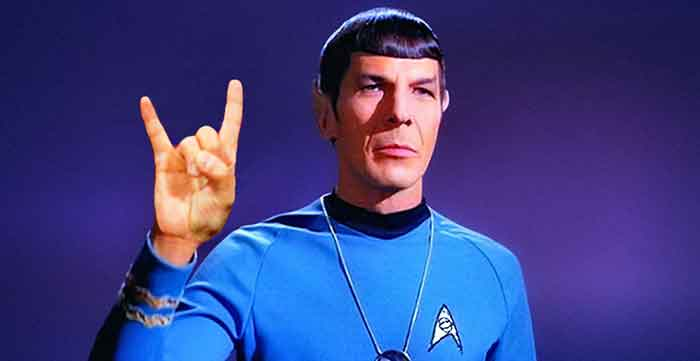

Spock and I are excited to announce our first set of speakers for <a href="http://nodepdx.org/" target="_blank">Node PDX 2016</a>, which you've seen slowly coming out each day! I hope you're ready and have your <a href="http://nodepdx.org/#tickets" target="_blank">tickets</a> bought already. So far I've introduced <a href="https://compositecode.com/2016/05/18/node-pdx-2016-speaker-tomomi-imura-aka-girlie_mac/">Tomomi</a>, <a href="https://compositecode.com/2016/05/19/node-pdx-2016-speaker-jonny-oropeza/" target="_blank">Jon</a>, and <a href="https://compositecode.com/2016/05/24/node-pdx-2016-speaker-liz-abinante/" target="_blank">Liz</a>. Today I'll introduce Adam Ulvi a bit later.

We've also announced the <a href="http://nodepdx.org/lagniappe.html#geektrain" target="_blank">Geek Train for Node PDX</a> and the <a href="http://nodepdx.org/lagniappe.html#bikes" target="_blank">Node PDX Bike Ride</a>. A little <a href="http://www.merriam-webster.com/dictionary/lagniappe" target="_blank">lagniappe</a> if you will.  ;)

<h2><a href="http://nodepdx.org/" target="_blank">Node PDX 2016</a></h2>

The <strong>Geek Train</strong> provides super cheap $15 train fare from anywhere north of Portland along the Amtrak Cascades route. I'll actually meet the train in Seattle and ride from Seattle back to Portland for the conference. How that works is if you're in Bellingham, Everett, Seattle, Tacoma, or wherever along the northern stretch can <a href="https://ti.to/nodepdx/nodepdx-2016/with/gl6purbdlmo" target="_blank">purchase a ticket from us here</a>. Once you purchase a ticket we'll all have tickets for a specific train and will board along the line and join up in a specific car on the train (which we'll have assigned day of the trip).

The <strong>bike ride</strong> will make a loop through west and east of the Willamette River with a chance to check out all sorts of parts of the city. We'll stop and try some of the wicked tasty locally roasted coffee and roll into one of the local taprooms that has dozens of local brews on tap. Between those tasty beverages I'll point out some of the most excellent architecture, bridge design (ya like bridges eh?), neighborhoods, and other things that are characteristic of Portland. This will be a slow ride, so no need to have alley cat like reflexes and riding skills, just come and enjoy a chill, casual, and fun slow ride through Portland.

<h2><a href="http://dotnetfringe.org/" target="_blank">.NET Fringe 2016</a></h2>

For .NET Fringe we'll have the announcements for speakers coming very soon. We've taken a slightly different approach with a voting mechanism among organizers which we'll be wrapping up and then will hurry up with the announcement, I know everybody needs to know ASAP!

We'll also be setting up a Geek Train &amp; .NET Fringe bike ride too, we've just got to get everything posted. So keep an eye on the .NET Fringe site or <a href="http://dotnetfringe.org/#signup" target="_blank">subscribe to updates</a> and it'll have updates popping up real soon.
