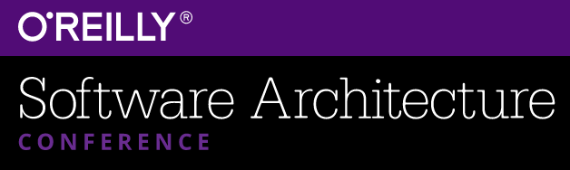

I'll be off on some coding adventures in the coming months. I also hope to catch up with a lot of people and their respective projects, learn a few things, and if it's possible maybe teach a few people a thing or three about immutable infrastructure, lessons I've learned, and how to avoid infrastructure catastrophes while building the next bad ass awesome application. This blog entry is about the details of my logistics, and I'll follow up with more details of the coding adventure along the way. For now: details, details, and details.

*takes place in [London](http://conferences.oreilly.com/software-architecture/engineering-business-eu) October 19-21, 2016 and [San Francisco](http://conferences.oreilly.com/software-architecture/engineering-business-ca) November 14-16, 2016*

> ### Moving Enterprise Practices and Development to Open Source

> *in London*

* Official Talk URI: http://conferences.oreilly.com/software-architecture/engineering-business-eu/public/schedule/detail/52257
* My Talk URI: http://blog.adron.me/talks/Building-Immutably-Continuous-Delivery-Minimal-Inputs-San-Francisco/

In this talk I’ll tell the story of our efforts at Home Depot, and provide bullet points and suggestions for helping you to acheive the move to open source practices in your enterprise. The benefits are huge, and overall it’s a lot more fun to boot!

Key Points:

* Steps we took to get into the open.
* Practices to take up and start using.
* Things to avoid when moving to open source models.
* How to make the most of things for the community and the enterprise.
* Tooling, interoperability, services, and how to get it done.

> ### Building Immutably to Continuous Delivery with Minimal Inputs

> *in London and in San Francisco*

Official Talk URI:

* London http://conferences.oreilly.com/software-architecture/engineering-business-eu/public/schedule/detail/52254 
* San Francisco http://conferences.oreilly.com/software-architecture/engineering-business-ca/public/schedule/detail/52258

My Talk URI:

* London http://blog.adron.me/talks/Building-Immutably-Continuous-Delivery-Minimal-Inputs-London
* San Francisco http://blog.adron.me/talks/Building-Immutably-Continuous-Delivery-Minimal-Inputs-San-Francisco/

Prerequisite knowledge

Basic understanding of web applications, architecture & design, and basic knowledge of windows & linux server systems.

Materials or downloads needed in advance

[Github Account](https://github.com), [AWS](https://aws.amazon.com/) (or [GCE](https://cloud.google.com/), [Azure](https://azure.microsoft.com), etc) Account, and [CodeShip Account](https://codeship.com/). Also a computer with OS-X, Windows, or Linux loaded with Node.js is also required.

This workshop focuses on building a continuously delivered pipeline using Node.js (however easily transferable to Ruby/Rails/Java/Scala/.NET etc.). The workshop will trace the steps from inception to deployed application (with a domain pointed appropriately and all) that can then be developed against to continue whatever effort and intent of the developer(s)!

Key Points:

* The parts: Application, Domain Name, Infrastructure, Integration, & Delivery
* Build an Application: Steps for building & actually building a simple Node.js Application to deploy.
* Getting a domain name, determining name servers & DNS servers, setting it up and getting it pointed at our application.
* Setting up and determining the deployment scenario on AWS & discussion of other infrastructure choices.
* Deploying the application through the complete process of code, integrate, test, build, deploy.

> ### Organizing Infrastructure Config & Workflow

> *September 7-8, 2016 @ Napa Valley, California*

* Official Talk URI: https://www.hashiconf.com/talks/organizing-infrastructure-config-workflow.html
* My Talk URI: http://blog.adron.me/talks/Organizing-Infrastructure-Config-and-Workflow/

I'm super stoked about this talk, as I'm getting to co-present with Evan Brown. Evan's a friend of mine since I met him a whiel back while he worked at AWS, however he's now a Senior Software Engineer at Google. We're going to tag team style this talk to bring you as much information as we can about organzing your infrastructure configuration and workflow.

My abstract for this talk goes something like this, "*When starting with the various products Terraform, Packer, Vagrant, and others, it isn’t always apparent where and in what way one should organize the actual project. In this talk I’d like to delve into what I’ve done to organize solutions for development, production, and related pipelines. I’ll talk from my point of view and what I’ve seen others do to keep their workloads organized and their infrastructure and application pipelines clean and well organized.*"

