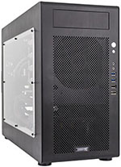

    

January 24th, 2017 UPDATE: After I wrote this, I spoke with the System 76 team and I'm getting the chance to go out and tour their Denver Headquarters. This happened well after I made my purchase, which all of the following was written after. But just for full transparency, I've added this note. Also, I'm aiming to get a full write up of my System76 trip put together with Denver tidbits and more! Until then, here's the review...

In the trailing days of 2016, after having moved to Redmond, Washington I sat working at my desktop workstation. This workstation, which still exists, is a iMac with an i7, 16GB RAM, 256 GB SSD, and a 1GB Video Card with a 1TB secondary drive. The machine is a 27" all in one style design, and the screen is rather beautiful. But as I did a build and tried to run Transport Tycoon at the same time in the background the machine sputtered a bit. It was definitely maxed out doing this Go code build, putting together a Docker image build, and spinning it up for go live at the same time my game ran in the background. I thought, this machine has served me extremely well, at over 5 years old it had surpassed the standard 5 year lifespan of peak Apple oomf. At the moment, I thought, maybe it's time to dig into a serious machine with some premium hardware again.

In that moment I thought about the last dedicated, custom built, super powerful workstation machine I had. It was a powerful machine, nice form factor, and easily drove two giant 27" screens. However this machine had lived and finished it's useful life over 6 years before 2016 had even started. But it was a sweet machine, that offered a lot of productive gaming and code writing efficiencies. It was thus, time to get in gear and get a machine again.

Immediately I thought through a few of the key features I wanted and other prerequisites of purchase.

1. Enough RAM and processor power to drive my aforementioned gaming, docker, and code building scenario with ease.
2. SSD drive of at least 1TB with at least a beefy 8GB Video Card.
3. It needed to run, with full support, not-Windows. Ubuntu would be fine, but if any Linux was installed from factory or at least fully supported on the hardware I put together, that would suffice.
4. If I were to buy it from a company, it had to be a company that wasn't some myopic afterthought of 50s era suburbia (i.e. I didn't really want to deal with Dell or Alienware again after the XPS 13 situation). This definitely narrowed down the options.

I started digging into hardware specifications and looking into form factors, cases, and all the various parts I'd need for a solid machine. In parallel I started checking out several companies.

* [System76](https://system76.com/) - Located in Denver, I was curious about this company and had been following them for some time. I had seen a few of the laptops over the years but had never seen or used any of their desktops.
* [Los Alamos Computers](https://lacpdx.com) which is now [LAC Portland](https://lacpdx.com)! - Holy smokes, I had not realized this company moved. They definitely meet the 4th criteria above.
* [Puget Systems](https://www.pugetsystems.com/) is a company located somewhere in the Puget Sound area and used to be called Puget Sound Systems. After digging I found they are located in a suburb of Seattle, in a town called Auburn. I didn't want to rule them out so I kept them on the list and started researching.
* [Penguin Computing](http://www.penguincomputing.com/) is another one of the companies, and kidn of a mainstay of Linux machines. They were a must have in the run up.
* [Think Penguin](https://www.thinkpenguin.com/) is another I dove into.
* [Emperor Linux](http://emperorlinux.com/) is another company I found specializing in Linux machines.
* [Zareason](http://zareason.com/) was another, that specialized in Linux machines.

## First Decision > Build or Buy?

I wrangled hardware specifications and the idea of building my own machine for some time. I came to the conclusion that the time versus money investment for me was on the side of buying a built machine. This first decision was pretty easy, but educating myself on the latest hardware was eye opening and a lot of fun. In the end however, better to let a builder get it done right instead of me creating a catastrophe for myself and nuking a whole weekend!

> **Decision** Buy!

## Second Decision > Who should I buy from?

I dug through each of the computer builders previously mentioned. I scouted out where they were located, what the general process was they used to build the machines, what testing, what involvement in the community they have, and finally a cost and parts review.

Each of the builders has a lot of positives in regards to Linux, the only one that I was hesitant about at first in regards to Linux was Puget Computing. Because by default the machines come with Windows 10. However after asking around and reviewing other reviews online, I came to find they do have Linux and a solid skill set around Linux. Puget remained a leader in the selection process.

I went through Los Alamos Computers, which I realized are now LAC Portland (Win for Portland!), then Penguin, Think Penguin, and Emperor Linux. All had great skills and ethos around Linux. LAC definitely had the preeminently preferable choice in physical location (I mean, I do love Portland!), but each were short in either their customer facing desktop options. Albeit for a company or other reason, I'd likely buy a Thinkpad or other computing platform running Linux from them. But for this scenario each were disqualified for my personal workstation.

The last two I started checking out were Zareason and System76. I had been following what System76 for a while and a few things had caught my eye on their site. It led me to realize that they're located out of Denver. Being a transit nerd, one of their website video photo coffee shop scenes had the RTD Light Rail passing in the background. But all things aside I started checking out cases and hardware that each builder puts in a box.

<ul class="faq js-faq" id="my-faq">
  <li class="faq-item">
    <h4 class="faq-question">[Zareason](http://zareason.com) had several cases as shown below. With each of these I checked out the hardware options. (open for details)</h4>
    

      One of the other side notes of the Zareason site is that you can navigate directly to it at the http address, and they don't for https. I just found this a bit odd. But here's the machines that I reviewed.
      <table>
        <tr>
        </tr>
      </table>
      

        
        [Zeto](http://zareason.com/shop/Zeto.html)
      

      

        
        [Limbo 560](http://zareason.com/shop/Limbo-560.html)
      

      

        
        [Valta X99i](http://zareason.com/shop/Valta-X99i.html)
      

      <!--  -->
    

  </li>
  <li class="faq-item">
    <h4 class="faq-question">Next up I checked out a number of [Puget Systems](https://www.pugetsystems.com). (open for details)</h4>
    

      The religious reference names were a bit strange. But whatever, to each their own.
      

          
          [Deluge](https://www.pugetsystems.com/deluge.php)
      

      

          
          [Spirit](https://www.pugetsystems.com/spirit.php)
      

      

          
          [Genensis II](https://www.pugetsystems.com/genesis.php)
      

      <!--  -->
    

  </li>
  <li class="faq-item">
    <h4 class="faq-question">Next I started looking at [System76](https://www.pugetsystems.com) machines. (open for details)</h4>
    

      

          
          [Leopard Workstation](https://system76.com/desktops/leopard)
      

      

          
          [Silverback Workstation](https://system76.com/desktops/silverback)
      

      <!--  -->
    

  </li>
</ul>

After working through and reviewing prices, features, hardware, and options things were close. I started reviewing location and what I could derive about each company's community involvement in Linux, how they're involved locally, and what the word is about those companies in their respective communities. Out of the three, I ended up not finding any customers to talk to about Zareason. For Puget, I found one friend that had a box purchased from a few years ago, and for System76 I actually found 2 different feedback bits from users within an hour or so of diffing around.

Kenny Spence [@tekjava](https://twitter.com/tekjava) - Kenny and I have known each other for more years than I'm going to count. We got to meetup here in Seattle recently and he showed me his System76 laptop. The build quality was good and the overall review he gave me was a *+1*. Before this he'd mentioned in Twitter DM convo that this was the case, and I'd taken his word for it back then.

Dev Shop X - A group of individuals I reached out to I had met 3 years ago at the Portland [@OSBridge](https://twitter.com/osbridge) Conference. I spoke to them again and found they were still using the System76 machines with no real complaints. They'd also bought the XPS 13 laptops well before the model I did and had a few complaints. With a short conversation we ended with them offering a *+1* for System76.

With the reviews from trusted sources, seeing the involvement and related culture of System76 I decided that they would be the builder of choice.

> **Decision** [System76](https://system76.com) [Leopard WS](https://system76.com/desktops/leopard)!

## Leopard Workstation

With the decision made, I pulled the trigger on the purchase. In spite of the holiday season, I still received the machine in short order. It arrived at my door via UPS in a box, ya know, like a computer does when its shipped somewhere.  ;-)

I cleared off the desk next, and dug into the box.

The computer was packaged cleanly and neatly with minimal waste compared to some I've seen. So far so good. I pulled pieces gently from the box. The first thing I extracted was the static bag which had all of the extra cords and respective attachments that had come with various parts of the computer hardware that were unnecessary. Another plus in my opinion, as many would likely not notice this having not built computers themselves, nor even cared, but I'm glad to have the extra pieces for this or other things I might need them for.

The next thing I pulled out of the box was a thank you letter envelope with cool sticker and related swag.

Stickers!

That was it for peripheral things just floating around in the box. Next, out came the computer itself.

It was wrapped in a static free bag itself. As it should be. I did notice a strange ink like bit of dusted debris in and around the box. I'm not really sure, and still am not sure today what exactly it was. I cleaned it up immediately. It wasn't excessive, but was leaving slight marks on the white table which required a little scrubbing to remove.

After all things were removed from the box I removed them from envelopes and static free bags and placed them on the desk for a simple shot of all the parts in the box.

Next I went through the steps of desk cleanup again and then connected my 28 port USB Hub, Razor Mouse, and a keyboard to the machine. It was finally time to boot this machine up!

As for the screen which you see, it's an LG 34" Extra Wide Screen monitor with slight curved view to it. Yes, it's awesome, and yes it actually makes it relatively easy to not need dual monitors.

BOOTING!

Ubuntu started, monitor fussing.

I toyed around and had for whatever reason plugged in the HDMI, when I should have used the other monitor connection. It immediately provided more resolution options when I changed the connection and the monitor and related elements detected appropriately!

On the side of the machine is a clear window cut through the case to view the internals. The cords were managed well and overall build was very clean. Upon boot up the graphics card immediately lit up too. The nice blue tone provided a nice light within the room.

Ubuntu booted up cleanly, and I might crazy bloody fast.

Here's a non-flash shot of the machine and monitor side by side.

I then changed the respective positioning and the lighting, as you can see actually changed dramatically just by repositioning the hardware and the rear light I was shooting with.

Lights off shot. The widow is beautiful!

A slightly closer shot of the GTX 1080 humming away inside.

### The Ubuntu on Leopard WS Review

So far I've done a ton of coding & game playing on the machine. Here's a break down of some specifics and some respective comments with a full read on the specifications of the machine.

* Ubuntu 16.10 (64-bit)
* 4.0 GHz i7-6850K (3.6 up to 4.0 GHz – 15 MB Cache – 6 Cores – 12 threads)
* High Performance Self-Contained Liquid Cooler
* 32 GB Quad Channel DDR4 at 2400MHz (2× 16 GB)
* 8 GB GTX 1080 with 2560 CUDA Cores
* Chipset Intel® X99
* Front: 2× USB 3.0 Type-A, 1× USB 2.0 Type-A, 1× eSATA
* Rear: 3× USB 3.0 Type-A, 1× USB 3.1 Type-A, 1× USB 3.1 Type-C, 4× USB 2.0, Type-A, 1× PS/2
* Gigabit Ethernet, optional Intel® Wireless-AC (a/b/g/n/ac)
* GTX 1080: DVI-D, HDMI, 3× Display Port
* Audio Front: Headphone Jack, Mic Jack
* Audio Rear: 8 channel (HDMI, S/PDIF), Mic Jack, Line In, Line Out
* Power Supply 750 W 80+ Certified (80% or greater power efficiency)
* Dimensions 15.8″ × 8.3″ × 19.5″ (40.13 × 21.08 × 49.53cm)

#### Gaming

Using Steam I downloaded several games including my latest addiction Transport Tycoon. The others included Warhammer 40k: Dawn of War, Stronghold 3, Stellaris, Sid Meier's Civ V, Master of Orion, and Cities: Skylines. Each of these games I loaded up and played for at least 20-30 minutes, with every graphics detail maxed out and full audio feature enabled. Where the option existed to run it at full resolution of 	3440x1440 I ran the game at that resolution.

Not a blip, stir, or flake out of any sort. The color was solid (which obviously is also largely the monitor) and being able to move around these games in their respective 3d worlds was exception. All the while the speed of elapsed time in games like Transport Tycoon and Cities: Skylines barely slowed at all no matter how massive the city or layout was.

At this point I've also added about 16 hours of Transport Tycoon play to this, and I've built absurdly extensive layouts (100s of trains plus massively grown cities) and this processor and video card handles it. The aforementioned previous desktop easily choked to 1/10th the speed of this beast while running the game.

> More on the gaming elements of this machine in the coming days.

#### Coding

I used [Jetbrains Toolbox](https://www.jetbrains.com/toolbox/) to download [IntelliJ](https://www.jetbrains.com/idea/), [Webstorm](https://www.jetbrains.com/webstorm/), [CLion](https://www.jetbrains.com/clion/), [DataGrip](https://www.jetbrains.com/datagrip/), [Project Rider](https://www.jetbrains.com/rider/), and [RubyMine](https://www.jetbrains.com/ruby/). I dug around for some sample projects and slung together some basic "hello world!" apps to build with each of the IDEs. All built at absurd rates, but nothing real specific as I didn't load any large projects just yet.

One of the things I did do was load Go so that I could continue work on the [Data Diluvium](http://datadiluvium.com/) Project that I've started ([Repo on Github](https://github.com/Adron/datadiluvium)). To hack around with Go I also installed [Atom](https://atom.io/) and [Visual Studio Code](https://code.visualstudio.com/). Both editors on this particular machine were screaming fast and with the 34" display, I could easily have both to test out features side by side. Albeit, that makes shortcut combos a nightmare! DON'T DO THIS AT HOME!

Build time for the C, Go, and C# Projects I tried out were all crazy fast, but I'm holding off posting any results as I want to get some more apples to apples comparisons put together before posting. I'm also aiming to post versus some other hardware just so there are some baselines in which to compare the build times against.

> More on the coding and related projects in the coming days too.

#### Important Software

You may think, if you're not an Ubuntu or Linux user, what about all the other stuff like office software and ... *big long list goes here*. Well, ***most*** of the software that we use is either available or a comparable product is available on Linux these days. There's really not many things that keep me - or would keep anybody tied to - OS-X/MacOS or Windows. Here are a few that I've tried out and am using regularly that are 1 to 1 across Windows, OS-X, and Linux.

* Jetbrains - as mentioned before these work across all the platforms. They're excellent developer tools.
* Spotify - even though it states that there hasn't been support or what not for the app for many months, it still works seemlessly on Linux. That's what you get when you build an app for a solid platform - one doesn't have to *fix* shit every week like on OS-X or Windows.
* Slack - Slack is available on Linux too. After all the native app (or pseudo native) is built on Electron, which at its core runs on Node.js. So thus, feature parity is pretty much 100%. If you're going to use slack, it's not an excuse to be stuck on Windows or OS-X. The choice of platform is yours.

# Summary

    

NOTE: Nobody paid me a damned penny to write any of this btw, I reviewed all of these things because I love writing about my nerd adventures. No shill shit here. With that stated...

I have more things to review across all of these platforms and much more to write about this mean machine from System76. However, this review has gotten long enough. The TLDR; of this is, if you're looking for a machine then System76 definitely gets the horns from me! Highly recommended!
