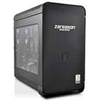
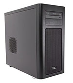
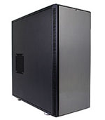

In the trailing days of 2016, after having moved to Redmond, Washington I sat working at my desktop workstation. This workstation, which still exists, is a iMac with an i7, 16GB RAM, 256 GB SSD, and a 1GB Video Card with a 1TB secondary drive. The machine is a 27" all in one style design, and the screen is rather beautiful. But as I did a build and tried to run Transport Tycoon at the same time in the background the machine sputtered a bit. It was definitely maxed out doing this Go code build, putting together a Docker image build, and spinning it up for go live at the same time my game ran in the background. I thought, this machine has served me extremely well, at over 5 years old it had surpassed the standard 5 year lifespan of peak Apple oomf. At the moment, I thought, maybe it's time to dig into a serious machine with some premium hardware again.

In that moment I thought about the last dedicated, custom built, super powerful workstation machine I had. It was a powerful machine, nice form factor, and easily drove two giant 27" screens. However this machine had lived and finished it's useful life over 6 years before 2016 had even started. But it was a sweet machine, that offered a lot of productive gaming and code writing efficiencies. It was thus, time to get in gear and get a machine again.

Immediately I thought through a few of the key features I wanted and other prerequisites of purchase.

1. Enough RAM and processor power to drive my aforementioned gaming, docker, and code building scenario with ease.
2. SSD drive of at least 1TB with at least a beefy 8GB Video Card.
3. It needed to run, with full support, not-Windows. Ubuntu would be fine, but if any Linux was installed from factory or at least fully supported on the hardware I put together, that would suffice.
4. If I were to buy it from a company, it had to be a company that wasn't some myopic afterthought of 50s era suburbia (i.e. I didn't really want to deal with Dell or Alienware again after the XPS 13 situation). This definitely narrowed down the options.

I started digging into hardware specifications and looking into form factors, cases, and all the various parts I'd need for a solid machine. In parallel I started checking out several companies.

* [System76](https://system76.com/) - Located in Denver, I was curious about this company and had been following them for some time. I had seen a few of the laptops over the years but had never seen or used any of their desktops.
* [Los Alamos Computers](https://lacpdx.com) which is now [LAC Portland](https://lacpdx.com)! - Holy smokes, I had not realized this company moved. They definitely meet the 4th criteria above.
* [Puget Systems](https://www.pugetsystems.com/) is a company located somewhere in the Puget Sound area and used to be called Puget Sound Systems. After digging I found they are located in a suburb of Seattle, in a town called Auburn. I didn't want to rule them out so I kept them on the list and started researching.
* [Penguin Computing](http://www.penguincomputing.com/) is another one of the companies, and kidn of a mainstay of Linux machines. They were a must have in the run up.
* [Think Penguin](https://www.thinkpenguin.com/) is another I dove into.
* [Emperor Linux](http://emperorlinux.com/) is another company I found specializing in Linux machines.
* [Zareason](http://zareason.com/) was another, that specialized in Linux machines.

## First Decision > Build or Buy?

I wrangled hardware specifications and the idea of building my own machine for some time. I came to the conclusion that the time versus money investment for me was on the side of buying a built machine. This first decision was pretty easy, but educating myself on the latest hardware was eye opening and a lot of fun. In the end however, better to let a builder get it done right instead of me creating a catastrophe for myself and nuking a whole weekend!

> **Decision** Buy!

## Second Decision > Who should I buy from?

I dug through each of the computer builders previously mentioned. I scouted out where they were located, what the general process was they used to build the machines, what testing, what involvement in the community they have, and finally a cost and parts review.

Each of the builders has a lot of positives in regards to Linux, the only one that I was hesitant about at first in regards to Linux was Puget Computing. Because by default the machines come with Windows 10. However after asking around and reviewing other reviews online, I came to find they do have Linux and a solid skill set around Linux. Puget remained a leader in the selection process.

I went through Los Alamos Computers, which I realized are now LAC Portland (Win for Portland!), then Penguin, Think Penguin, and Emperor Linux. All had great skills and ethos around Linux. LAC definitely had the preeminently preferable choice in physical location (I mean, I do love Portland!), but each were short in either their customer facing desktop options. Albeit for a company or other reason, I'd likely buy a Thinkpad or other computing platform running Linux from them. But for this scenario each were disqualified for my personal workstation.

The last two I started checking out were Zareason and System76. I had been following what System76 for a while and a few things had caught my eye on their site. It led me to realize that they're located out of Denver. Being a transit nerd, one of their website video photo coffee shop scenes had the RTD Light Rail passing in the background. But all things aside I started checking out cases and hardware that each builder puts in a box.

### Zareason

[Zareason](http://zareason.com) had several cases as shown below. With each of these I checked out the hardware options.

  
  [Zeto](http://zareason.com/shop/Zeto.html)

  
  [Limbo 560](http://zareason.com/shop/Limbo-560.html)

  
  [Valta X99i](http://zareason.com/shop/Valta-X99i.html)

One of the other side notes of the Zareason site is that you can navigate directly to it at the http address.

### Puget Systems

Next up I checked out a number of [Puget Systems](https://www.pugetsystems.com). The religious reference names were a bit strange. But whatever, to each their own.

    
    [Deluge](https://www.pugetsystems.com/deluge.php)

    
    [Spirit](https://www.pugetsystems.com/spirit.php)

    
    [Genensis II](https://www.pugetsystems.com/genesis.php)

### System76

Next I started looking at [System76](https://www.pugetsystems.com) machines.

    
    [Leopard Workstation](https://system76.com/desktops/leopard)

    
    [Silverback Workstation](https://system76.com/desktops/silverback)

After working through and reviewing prices, features, hardware, and options things were close. I started reviewing location and what I could derive about each company's community involvement in Linux, how they're involved locally, and what the word is about those companies in their respective communities. Out of the three, I ended up not finding any customers to talk to about Zareason. For Puget, I found one friend that had a box purchased from a few years ago, and for System76 I actually found 2 different feedback bits from users within an hour or so of diffing around.

Kenny Spence [@tekjava](https://twitter.com/tekjava) - Kenny and I have known each other for more years than I'm going to count. We got to meetup here in Seattle recently and he showed me his System76 laptop. The build quality was good and the overall review he gave me was a *+1*. Before this he'd mentioned in Twitter DM convo that this was the case, and I'd taken his word for it back then.

Dev Shop X - A group of individuals I reached out to I had met 3 years ago at the Portland [@OSBridge](https://twitter.com/osbridge) Conference. I spoke to them again and found they were still using the System76 machines with no real complaints. They'd also bought the XPS 13 laptops well before the model I did and had a few complaints. With a short conversation we ended with them offering a *+1* for System76.

With the reviews from trusted sources, seeing the involvement and related culture of System76 I decided that they would be the builder of choice.

> **Decision** [System76](https://system76.com)!

http://photos.adron.me/Software/System76/
