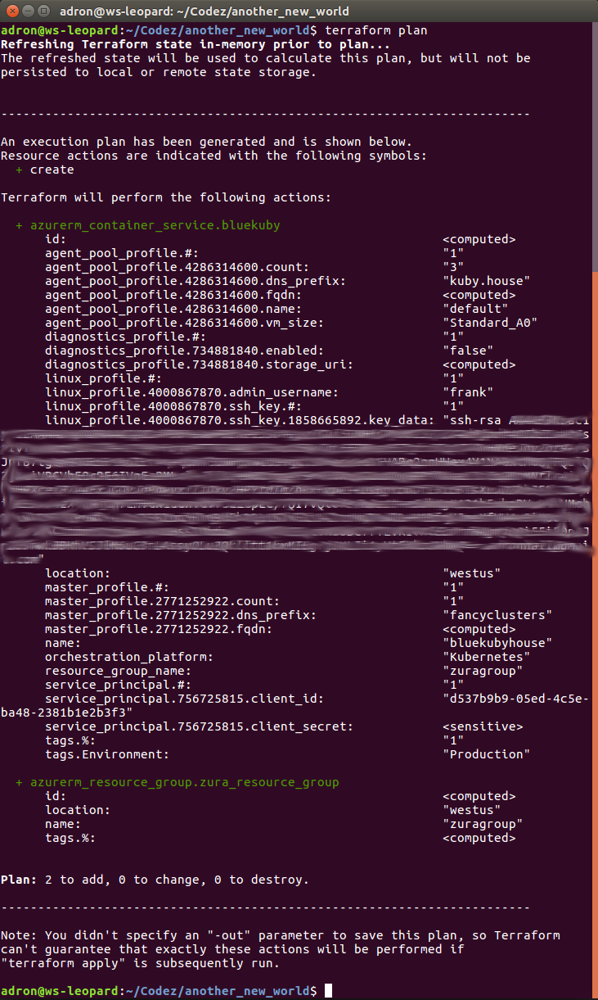

<div class="image float-right">
    
</div>

In the previous post I wrote about building a Kubernetes Cluster with Terraform, I covered the bases of building a cluster in Google Cloud Platform. Today I'm going to tackle the Azure Platform. There are a lot of similarities being the same task, but there are some differences which I'll take a look at. The repository to this write up is located in *[another_new_world](https://github.com/Adron/another_new_world)* on Github.

First things first, locally you’ll want to have the respective CLI tools installed for Azure, Terraform, and Kubernetes.

<span class="more"></span>

* Install the [Azure CLI](https://docs.microsoft.com/en-us/cli/azure/install-azure-cli?view=azure-cli-latest) and get it configured with `az configure` command.
* Install the latest [Terraform](https://www.terraform.io/intro/getting-started/install.html)
* With Azure CLI installed you can then easily install kubectl with `az acs kubernetes install-cli [--client-version] [--install-location]` command.

Dive in time!

<div class="image float-right">
    
</div>

Alright, first let's take a look at the before, before we look at the after. In Azure, the user interface is very tablet oriented with a sideways scroll. Some people love it, some adamantly despise it. I'm kind of in the, "enjoy it but wouldn't use it for work" camp. But it's rather nice looking to show a demo, elaborate on where and what is located where within the cloud service, and provides a nice way to visualize resources.

Let's take a look at what we start with before building anything. The initial dashboard as one would expect, empty.


If you click on the all resources button on the left hand menu. Hover over to see which is which, or the three bars to see the descriptions displayed for all of the icons. Here we can view any and all resources created. This is an extremely useful view to get an idea of all the resources that are setup and running.


The organizational structures of Azure's Resource Groups can be found here, and is another section to note. Many resources can be grouped per Resource Group, per the meaning of the word itself.
 


It is also a good idea, if using Azure, the familiarize yourself with the screens, tabs, menus, and other related collateral that popup on the sides. Remember, when navigating this interface that it was designed for touch screens and tablet like devices, and everything will make sense. At least, it will make more sense, when trying to navigate and find various properties and features.


 
Alright. That's the starting point, so let's get started on building out a Kubernetes Cluster using Terraform. The first thing we'll need is to setup our Azure connection for Terraform. I've created this in a file called `connections.tf`.

``` javascript
provider "azurerm" {
  subscription_id = "${var.subscription_id}"
  client_id = "${var.client_id}"
  client_secret = "${var.client_secret}"
  tenant_id = "${var.tenant_id}"
}
```

The next thing I need now is a resource for an Azure Resource Group. That configuration looks like this.

``` javascript
resource "azurerm_resource_group" "zura_resource_group" {
  name     = "zuragroup"
  location = "West US"
}
```

I added the above resource group to a file called `kubernetes.tf` in the [repository](https://github.com/Adron/another_new_world). Setting the name to what I wanted and assigning it to the West US location. After that I then added the Kubernetes configuration.

``` javascript
resource "azurerm_container_service" "bluekuby" {
  name                   = "bluekubyhouse"
  location               = "${azurerm_resource_group.zura_resource_group.location}"
  resource_group_name    = "${azurerm_resource_group.zura_resource_group.name}"
  orchestration_platform = "Kubernetes"

  master_profile {
    count      = 1
    dns_prefix = "${var.azure_cluster_prefix}"
  }

  linux_profile {
    admin_username = "${var.linux_admin_username}"

    ssh_key {
      key_data = "${var.ssh_key}"
    }
  }

  agent_pool_profile {
    name       = "default"
    count      = "${var.azure_node_count}"
    dns_prefix = "kuby.house"
    vm_size    = "Standard_A0"
  }

  service_principal {
    client_id     = "${var.client_id}"
    client_secret = "${var.client_secret}"
  }

  diagnostics_profile {
    enabled = false
  }

  tags {
    Environment = "Production"
  }
}
```

In this file I setup the `location` and `resource_group_name` to the respective resource group parameters `location` and `name`. The `dns_prefix` for the `master_profile` I set to a variable called `azure_cluster_prefix` which I'll create and set in a `variables.tf` file and the respective `terraform.tfvars` file. The ssh key data is set to the `ssh_key` variable, a variable I'll declare in the `variables.tf` file but assign via environment variable.

The `terraform.tf` file then looks like this.

``` javascript
variable "linux_admin_username" {
  type        = "string"
  description = "Linux admin username."
}

variable "ssh_key" {
  type        = "string"
  description = "SSH Key for Kubernetes Clusters."
}

// Azure Variables
variable "azure_node_count" {
  type        = "string"
  description = "Count of cluster instances to start."
}

variable "azure_cluster_prefix" {
  type        = "string"
  description = "The prefix for the Azure cluster."
}

// Secrets variables
variable "subscription_id" {}
variable "client_id" {}
variable "client_secret" {}
variable "tenant_id" {}

// Output variables
output "get_credentials_command" {
  value = "az acs kubernetes get-credentials --name=\"${azurerm_container_service.bluekuby.name}\" --resource-group=\"${azurerm_resource_group.zura_resource_group.name}\""
}
```

Note that I added an output variable that would take pertinent data and provide the get-credential command for azure, to connect and work with the Kubernetes cluster once it is created.

The secret variables are also assigned via environment variables to keep any secrets out of the repository.

Last, I created a `terraform.tfvars` file with the following.

``` javascript
// Azure Variables
azure_node_count = 3
azure_cluster_prefix = "fancyclusters"
linux_admin_username = "frank"
```

Now I can run `terraform init` to pull in dependencies for the provider. In this case, the command will pull in the azurerm provider.


Now run a `terraform plan` to determine the change diff.



Everything looks good, so I'm clear to run `terraform apply`.

**References:**

* [Github Repo](https://github.com/Adron/another_new_world)