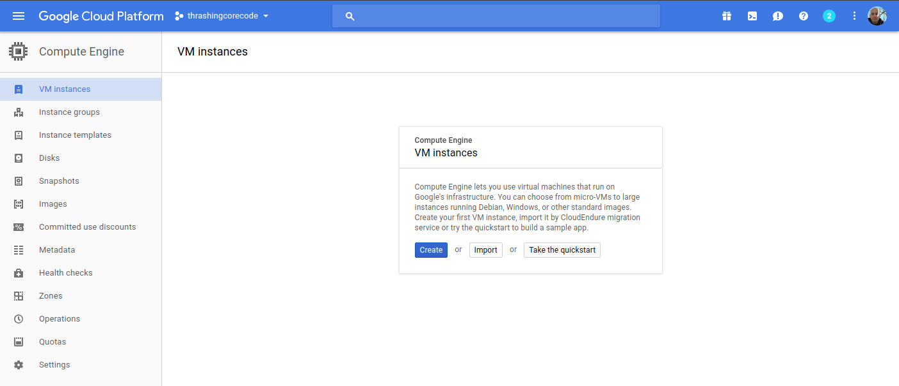
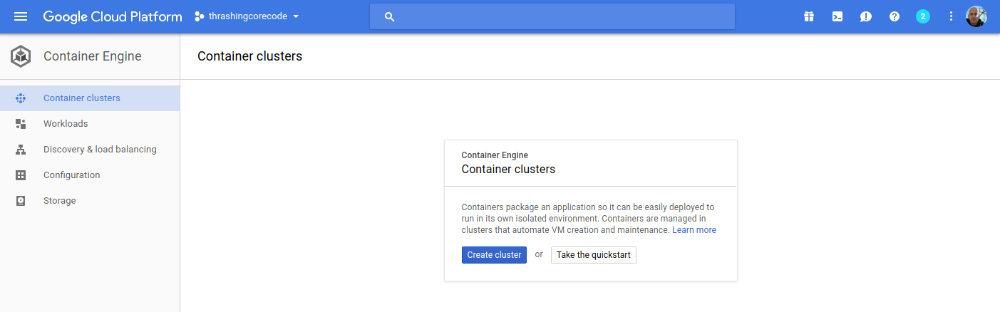
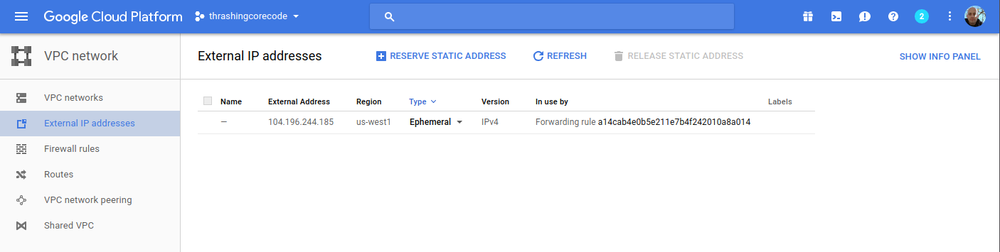
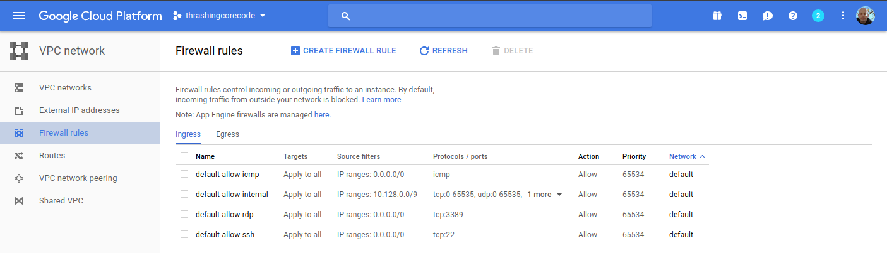
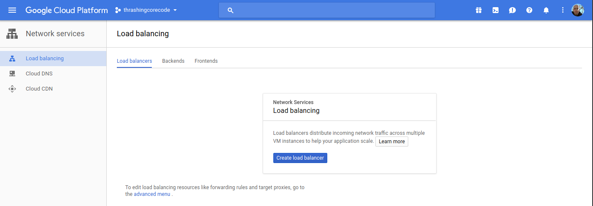

<div class="image float-right">
    
</div>

In this blog entry I'm going to detail the exact configuration and cover in some additional details the collateral resources you can expect to find once the configuration is executed against with Terraform.

A lot of this material I wrote about with [Setting up a GCP Container Cluster - Part I](/articles/setting-up-gcp-container-cluster/) and [Setting up a GCP Container Cluster - Part II](/articles/setting-up-gcp-container-cluster-part-2/). I had started on a Part 3 around setting up Drone.io on a Kubernetes/GCP Container Cluster but stopped midway through with other demands. This post is a more up to date post of all those things plus more. With this post completed I've stepped back into getting Drone.io setup and am now *finally* finishing that blog entry! *#win*!

First things first, locally you'll want to have the respective CLI tools installed for Google Cloud Platform, Terraform, and Kubernetes.

<span class="more"></span>

* [Install the gcloud CLI](https://cloud.google.com/sdk/downloads) and get it configured with [gcloud init](https://cloud.google.com/sdk/gcloud/reference/init)
* [Install the latest Terraform](https://www.terraform.io/intro/getting-started/install.html)
* With gcloud CLI installed you can then easily install kubectl with `gcloud components install kubectl` command.

Now that all the prerequisites are covered, let's dive into the specifics of setup.

<div class="image float-right">
    
</div>

If you take a look at the Google Cloud Platform Console, it's easy to get a before and after view of what is and will be built in the environment. The specific areas where infrastructure will be built out for Kubernetes are in the following areas, which I've taken a few screenshots of just to show what the empty console looks like. Again, it's helpful to see a before and after view, it helps to understand all the pieces that are being put into place.

The first view is of the Google Compute Engine page, which currently on this account in this organization I have no instances running.



This view shows the container engines running. Basically this screen will show any Kubernetes clusters running, Google just opted for the super generic Google Container Engine as a title with Kubernetes nowhere to be seen. Yet.



Here I have one ephemeral IP address, which honestly will disappear in a moment once I delete that forwarding rule.



These four firewall rules are the default. The account starts out with these, and there isn't any specific reason to change them at this point. We'll see a number of additional firewall settings in a moment.



Load balancers, again, currently empty but we'll see resources here shortly.



Alright, that's basically an audit of the screens where we'll see the meat of resources built. It's time to get the configurations built now.

## Time to Terraform Our New World

Using Terraform to build a Kubernetes cluster is pretty minimalistic. First, as I always do I add a few files the way I like to organize my Terraform configuration project. These files include:

* .gitignore - for the requisite things I won't want to go into the repository.
* connections.tf - for the connection to GCP.
* kubernetes.tf - for the configuration defining the characteristics of the Kubernetes cluster I'm working toward getting built.
* README.md - cuz ***docs first***. No seriously, I don't jest, write the damned docs!
* terraform.tfvars - for assigning variables created in variables.tf.
* variables.tf - for declaring and adding doc/descriptions for the variables I use.

In the [.gitignore](https://github.com/Adron/our_new_world/blob/master/.gitignore) I add just a few items. Some are specific to my setup that I have and IntelliJ. The contents of the file looks like this. I've included comments in my .gitignore so that one can easily make sense of what I'm ignoring.

```
# A silly MacOS/OS-X hidden file that is the bane of all repos.
.DS_Store

# .idea is the user setting configuration directory for IntelliJ, or more generally Jetbrains IDE Products.
.idea
.terraform
```

The next file I write up is the [connections.tf](https://github.com/Adron/our_new_world/blob/master/connections.tf) file.

``` javascript
provider "google" {
  credentials = "${file("../secrets/account.json")}"
  project     = "thrashingcorecode"
  region      = "us-west1"
}
```

The path `../secrets/account.json` is where I place my account.json file with keys and such, to keep it out of the repository. For more on this practice check out my post *[Quick Start Connections With Terraform and Kubernetes]()* and *[Working With Google Compute Engine (GCE) using Terraform (with a load of Bash Scripts Too)](http://blog.adron.me/articles/working-with-google-compute-engine/)* posts.

The project in GCP is called *thrashingcorecode*, which whatever you've named yours you can always find right up toward the top of the GCP Console.


Then the region is set to us-west1 which is the data centers that are located, most reasonably to my current geographic area, in The Dalles, Oregon. These data centers also tend to have a lot of the latest and greatest hardware, so they provide a little bit more *oompf*!

The next file I setup is the [README.md](https://github.com/Adron/our_new_world/blob/master/README.md), which you can just check out in the repository [here](https://github.com/Adron/our_new_world/blob/master/README.md).

Now I setup the [variables.tf](https://github.com/Adron/our_new_world/blob/master/variables.tf) and the [terraform.tfvars](https://github.com/Adron/our_new_world/blob/master/terraform.tfvars) files. The variables.tf includes the following input and output variables declared.

``` javascript
// General Variables

variable "linux_admin_username" {
  type        = "string"
  description = "User name for authentication to the Kubernetes linux agent virtual machines in the cluster."
}

variable "linux_admin_password" {
  type ="string"
  description = "The password for the Linux admin account."
}

// GCP Variables
variable "gcp_cluster_count" {
  type = "string"
  description = "Count of cluster instances to start."
}

variable "cluster_name" {
  type = "string"
  description = "Cluster name for the GCP Cluster."
}

// GCP Outputs
output "gcp_cluster_endpoint" {
  value = "${google_container_cluster.gcp_kubernetes.endpoint}"
}

output "gcp_ssh_command" {
  value = "ssh ${var.linux_admin_username}@${google_container_cluster.gcp_kubernetes.endpoint}"
}

output "gcp_cluster_name" {
  value = "${google_container_cluster.gcp_kubernetes.name}"
}
```

In the terraform.tfvars file I have the following assigned. Obviously you wouldn't want to keep your production Linux username and passwords in this file, but for this example I've set them up here as the repository sample code can only be run against your own GCP org service, so remember, if you run this you've got public facing default linux account credentials exposed right here!

```
cluster_name = "ournewworld"
gcp_cluster_count = 1
linux_admin_username = "frankie"
linux_admin_password = "supersecretpassword"
```

Now for the meat of this effort. The [kubernetes.tf](https://github.com/Adron/our_new_world/blob/master/kubernetes.tf) file. The way I've set this file up is as shown.

```
resource "google_container_cluster" "gcp_kubernetes" {
  name               = "${var.cluster_name}"
  zone               = "us-west1-a"
  initial_node_count = "${var.gcp_cluster_count}"

  additional_zones = [
    "us-west1-b",
    "us-west1-c",
  ]

  master_auth {
    username = "${var.linux_admin_username}"
    password = "${var.linux_admin_password}}"
  }

  node_config {
    oauth_scopes = [
      "https://www.googleapis.com/auth/compute",
      "https://www.googleapis.com/auth/devstorage.read_only",
      "https://www.googleapis.com/auth/logging.write",
      "https://www.googleapis.com/auth/monitoring",
    ]

    labels {
      this-is-for = "dev-cluster"
    }

    tags = ["dev", "work"]
  }
}
```
