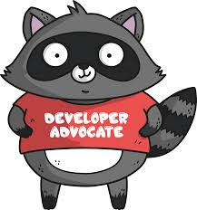

    

Recently a whole slew of people got hired at Microsoft. Many of us have taken notice. It's left a lot of people with questions like:

* Why would Erik, Ashley, or Jesse work at Microsoft?
* Doesn't it seem suspicious?
* I wonder what kind of cash they allocated to that payroll budget?
* Does Microsoft hire anybody that actually uses Microsoft tooling anymore?
* I'm confused, what is even going on?

The answers may be more obvious for those of us that have kept an eye on Microsoft. There has been this grand upheaval and cultural change that has occurred. CEO Satya Nadella has legitimately shifted the culture in a way that much of the company has wanted to go. Somehow, he's also managed to start changing the culture even for those that weren't sure or didn't want to go.

Satya has taken what core individuals like Scott Guthrie, Scott Hanselman, and many others have hoped for and pushed for over the years and started to enable the people within Microsoft to make this happen. You can read plenty about how Microsoft has gotten it's groove back, and about the work the Scotts and others have done to get that groove going. But I'm not particularly writing about that, but it has inspired this article in a big way. I'm going to elaborate on what I've observed and what I know to make a strong, effective, useful, and community focused developer advocate and developer advocates team.

The developer advocate team over at Microsoft is led by Jeff Sandquist, Brian Liston, and a few others. They're solid individuals with good ideas about how to build and have an advocate team contribute effectively to the community in which it works. Here are the top three obvious things they've done that have made the team effective, relevant, intelligent, and useful.

1. The team is diverse. I'm not even going to play around, diverse teams with many ideas and a range of people do better. End of story, it really ought not to be complicated these days. But one can't just start a team and say "I want my team to be diverse". That's a start, but the important part is does one know how to build a diverse team? In technology, if one doesn't have insight into actual human begins this doesn't pan out so well. One has to have the ability to communicate effectively to people out of the *tech nerd guy stereotype trope* in order to actually build this type of team. Jeff, Brian, and crew appear to have this ability. I'll write more on this later, but suffice it to say, this is a top skillset of a developer advocate team's leadership.

2. The team has to be skilled at a variety of complementing technologies. If someone knows X, and the next person knows X, and nobody knows Y, then the team is going to be fairly weak and likely broken in representing and providing value around Y, and in some sense even around X. At this point the Developer Advocates that have been introduced have some pretty extensive skillsets around key technologies that the Microsoft Technical Evangelists have traditionally been extremely weak in. This current team has some skills in the Windows space, but there's been a big focus in filling the massive skills gap around Linux, cloud technology (ironic there's traditionally been such a gap on the cloud team), non-MS languages like Go, distributed systems, data analysis and intelligent (or data science or whatever one may call these roles), and more. The Advocate team (also not called evangelists anymore, finally) is finally in a good position to actually start doing advocacy around actual cloud technology. I'm excited for the potential of the prospects!

3. The third thing that has stood out, is that they've hired people that know how to do the *advocacy* thing already. They're not trying to define or redefine it on Microsoft's terms but instead have brought people onboard that are already natural advocates of things they find interesting. Take Erik St Martin ([@erikstmartin](https://twitter.com/erikstmartin)) for example; co-authored a book, "[Go in Action](https://www.manning.com/books/go-in-action)" with Brian Ketelson ([@bketelson](https://twitter.com/bketelson)), co-hosts [Go Time FM](https://twitter.com/gotimefm). That brings up another great example with Brian Ketelson. Both of these guys are hug advocates in their own right, without connection to any specific big company or what not. These are the types of people that bring huge strength to a team with already proven ability to delivery. Then there's Jesse Frazelle, but seriously, I really don't even need to mention the work she's done with containers (cough cough, docker, etc). Another person you should be watching is Anthony Chu ([@nthonyChu](https://twitter.com/nthonyChu)), who's been a steady Azure and great technologies advocate over the years, also [joined up](https://anthonychu.ca/post/joining-microsoft-cloud-developer-advocate/). You can read more about the individual team members [here](), and I hear through the secret grapevine that there are more en route to join. Simply put, Microsoft isn't pulling their punches!

Before a lot of the Microsoft team had been formed into the epic legion it is today, there were a number of articles pointing to this rebirth into a newly relevant organization. One that was solid is Ars Technica's "[Microsoft’s renewed embrace of developers, developers, developers, developers](https://arstechnica.com/information-technology/2017/05/microsofts-renewed-embrace-of-developers-developers-developers-developers/)" by Peter Bright ([@drpizza](https://twitter.com/drpizza)). One of the first, as anyone who reads & subscribes to [Red Monk] analysis would suspect, was published by James Governor ([@monkchips](https://twitter.com/monkchips)) with "[On Hiring Jesse Frazelle: Microsoft's Developer Advocacy Hot Streak Continues](http://redmonk.com/jgovernor/2017/09/06/on-hiring-jessie-frazelle-microsofts-developer-advocacy-hot-streak-continues/)". The writing has been on the proverbial wall.

## So now what?

Now the thing to wait and see is if the team and the team's leadership can direct all of this energy into their respective efforts. The team is big, lots of people, lots of focus points. How will they use each others' strengths while building up along core competencies? How will they provide value without detracting from product and push product without losing community value? There are a lot of questions to be answered and I'll be keeping a close eye on their efforts. As I do with all of the advocacy teams I find fellow interests in. The advocacy, effectiveness, and reasons for it all has been an interest of my own for some time. So much so you can expect more than a few more articles on this topic, until then, cheers!
