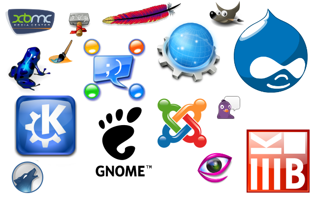

Bringing a closed source, or just simply an internally managed code base, into the wild of open source software can be an arduous and surreal process. In this article I'm going to ramble on about exactly that, with a few learned lessons and key successes I've had.

I'm currently helping the Home Depot Quote Center determine what is useful software to open source, and then helping them move toward open sourcing that software. In the past I've managed the open source development of .NET Extensions of Cloud Foundry, called Iron Foundry, which provided .NET support to the Cloud Foundry Platform. I've also helped organize and run open source efforts for plugins at New Relic, Basho, and a host of other smaller companies. Sometimes I've been a code contributor, sometimes I'm just interacting with contributors and managing pull requests. Either way it has been a lot of fun and every time it has been a seriously intense learning opportunity.

## Lesson 1: Open Source &amp; Individual Freedom

One thing to keep in mind, which I realize, but find myself being reminded of, is that people are truly free to either contribute, use, or completely disregard or ignore your open source project. The analogy of herding cats is often used to describe software development, and open source software development is like herding cats hopped up on a bunch of catnip that whimsically decide to do whatever they want.

Of course, an open source project might have paid contributors. If a project has paid contributors we at least get back to a contained room of cat herding. But either way, never forget that someone may or may not build that feature, or close the issue, or submit a pull request the way you've set out to have the project run. Which brings me to the next lesson.

## Lesson 2: Write Up Roles, Rules, Process, & Guidelines

As soon as the team goes from one person to two, effort should immediately be put into creating roles, rules, and process for how contributions will be accepted, pull requests will be committed, how to submit or work on issues, and the whole host of work flow associated with getting things done for the project.

**Roles**, in this particular instance, can be broken down in different ways. Sometimes a project might have somebody managing the pull requests coming in, someone else or even several people are managing the product development issues for new features, another person might be handing bug issues that come up, and the possibilities continue. Some simple examples often look like this:

* Project Leader - (Manager, Boss, Head Honcho, or whatever the title) would be in charge of and might even be the person who started the project.
* Contributor - Individual submitting features via pull request to the project.
* Feature Creator - Individual submitting feature requests and ideas via issues listings.

Slightly more complex examples might be something like this:

* Project Creator - Again, the person who created, started, and owns the project.
* Feature Architect - Some who specifically designs features from a technical stand point.
* Feature User Experience - Someone who works with users of the OSS project to determine how and in which ways the community is using the project and determine ways to make the experience better.
* Feature Contributor - Someone who contributes code for features, implementing based on contributor specs, etc.

Beyond that, one just merely needs to detail the roles as much as necessary to help people determine what and how they'll be contributing to the project.

<strong>Rules</strong> for a project can cover a wide range of things. One increasingly popular and sometimes useful thing to add, especially with a diverse group of people working on a project, is a basic code of conduct. This helps outline what is or is not appropriate behavior on the issue threads and general public conversation within the group. We have to remember that open source often has people involved that aren't exactly employees or directly related to the person that started a project. Because of this individuals often come to a project without any particular guidelines about what is or isn't appropriate behavior.

Other rules that are dramatically simpler and easier to deal with, are breaking down and defining what is considered an acceptable pull request, how things should be documented, code standards, and other related technical rules.

<strong>Process</strong> for a project is often key to keeping people involved over time. Without a good process in which contributors really feel like they're part of the team and getting their pull requests accepted, things can fall apart pretty quickly. Nothing like a bored programmer to go find something else to do that has nothing to do with your open source project!

A good process helps to define the steps that a contributor would need to go through to contribute a piece of code to a feature, who they would need to communicate with, how to submit a pull request, and finally how to wrap up getting the pull request pulled from the latest code. This is as important to people and it is to defining the technical steps for the system itself to be sustaining from an ongoing continuous integration and deployment point of view.

Once these core things are formalized it dramatically decreases tedious communication about working through the most basic of tasks while working on a project.

## Lesson 3: Branding &amp; Marketing

"Oh my god what are you talking about Adron, what's that crap got to do with an open source project?" I can hear the naysayers immediately on this topic. But rest assured, branding and marketing will either make or break a project. If you're repo is kind of clunky and cluttered it sends a bad message that you aren't really paying attention to your project. If someone comes to your repo and immediately sees a reasonable logo, or some type of consistent README.md with useful information and messaging (that's marketing by the way) about what, where, how, and why this project exists, you're exponentially more likely to get people involved in contributing and even more dramatically more likely to get people using the project.

In the OSS Manifesto a baseline of files are suggested for an OSS project:

* Have a readme file
* Have a contributing file
* List all core team members in the readme file
* Have a license file
* Have a changelog
* Follow semantic versioning
* Tag all major releases
* Provide documentation

I'll add to this, throw in an *.svg or reasonably usable *.png of a logo or some easily identifiable symbol for the project. Every major project has some sort of logo, it really doesn't even matter if its a pretty lousy looking logo, it just needs to be there to make the project easily identifiable.

## Lesson 4: The Software Needs to Work

Having the respective readme, contributing file, general doc, listing of all core members; these things I've listed so far are all nice but there's one more thing I've not mentioned yet. That is having a working publicly accessible <strong><em>continuous integration</em></strong> build that is working. Any and every open source project should have a repository setup with a running build. Any new pull requests gets accepted or even the smallest commit should get a build started.

There are many ways, more so for open source projects than probably any other kind, to get a continuous integration build going. Check out products and services like <a href="https://codeship.com/" target="_blank">Codeship</a>, <a href="https://www.jetbrains.com/teamcity/" target="_blank">TeamCity</a>, <a href="https://www.appveyor.com/" target="_blank">Appveyor</a>, or <a href="https://travis-ci.org/" target="_blank">Travis CI</a>. These are just a few of the many options to get a continuous integration setup running for your open source project.

## Lesson 5: There will be other lessons to learn

An open source project is a pretty wild ride of code chops, organizational skills, and keep systemic development sustainable for a project. It can be tough, but a lot of fun, and very rewarding.

With that, happy hacking and stay tuned, there's more to come!