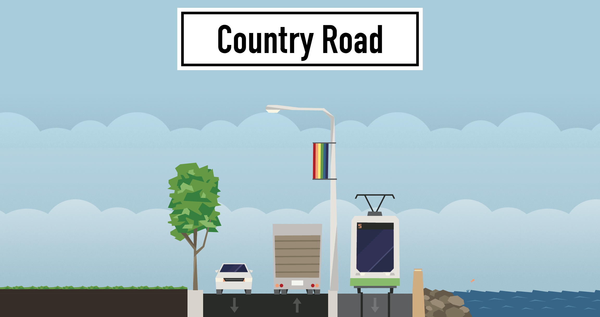
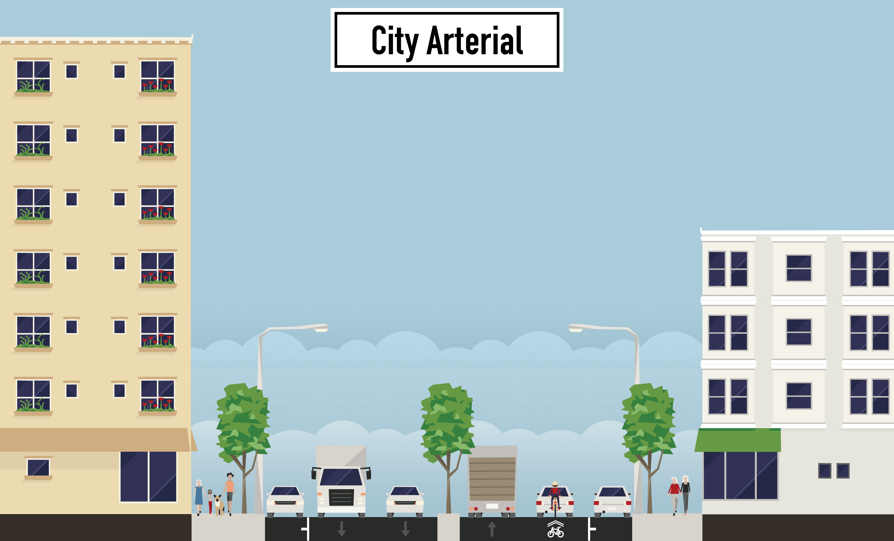
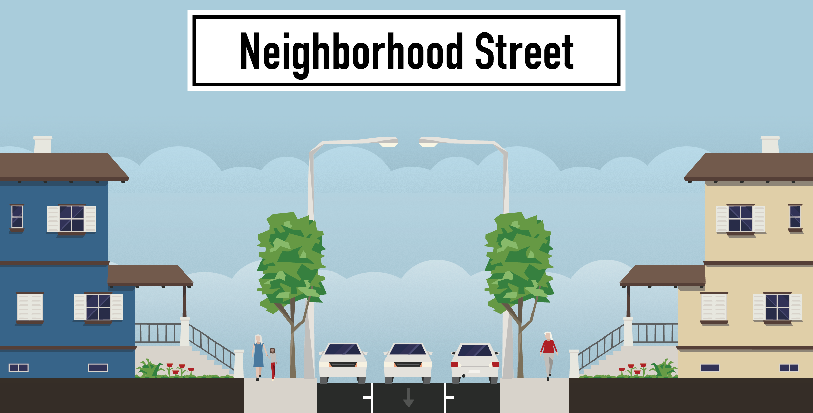

A few weeks ago I posed a code challenge that was extremely open ended. It left a lot of elements to the imagination of the reader of the problem to research, determine, or just make up. In that same sense, here is the question that I posed on [Monday, September the 18th](/articles/thrashing-code-metal-monday-09-18-2017/). The code challenge as I was saying wasn't some simple, solve it in 5 minutes, type of thing. This was something where we humans actually have real problems to solve in the world. So here we go, this is going to get seriously intense (and long cuz' I'm gonna describe every bit of my process). I'll start with a quick recap of the problem.

> Given that roadways have three primary functions they’re used for: *active transport*, *storage or parking*, and *nil or no use*. Solve for what percentage of time a roadway experiences each. Details are further elaborated on here:

> Ask: Well what type of road is it, how many lanes, how many parking spots? What is the layout?

> Answer: Here are three types of roads specifically to solve for in a first attempt. These are specified just to have a starting point.

<div class="image float-right">
    [](https://streetmix.net/)
</div>

> * Country roadway: Two lanes, no parking spaces, and no area to pull off on. Each lane has a capacity of ~800-1200 cars per hour. Traffic on the particular road is about 8000 per day.

<div class="image float-right">
    [](https://streetmix.net/)
</div>

> * City arterial, 6-lanes: Two lanes each way, one lane parking on each side. Each lane has a theoretical capacity of about ~700-1000 cars per hour (that lane changing brings down the number). Traffic usually is about 12,000 per day.

<div class="image float-right">
    [](https://streetmix.net/)
</div>

> * Neighborhood street, 3-lanes: Single travel lane in the center, one parking lane on either side. Ability to move about ~500 cars per hour but only experiences about ~1500 cars per day.

> The challenge here far exceeds merely some algorithm to solve for X, but instead ponders what would need to be included to find transport use (driving or in movement), storage (parked car), and no car, no movement, and nobody parked anywhere to be seen (and empty road).

<span class="more"></span>

## My Solution

Key known things at this point.

1. There are three roads we want to solve for: country roadway, city arterial, and neighborhood street.
2. Respectively each has ~800-1200 cars per hour, ~700-1000 cars per hour, and the last specifically has ~500 cars per hour capacity but only about ~1500 per day.
3. Respectively each has 2 lanes, 6 lanes, and 3 lanes. Along with this a few other facts here and there.
4. We have no idea how many cars can park on or near one of these roads. We need to determine that.
5. We have no idea when these cars arrive or are not arriving. So maybe we'll just determine how long it takes for them to go by.

Let's just set some scope and guidelines for making these calculations.

1. The roadways we'll measure will be for exactly 1 kilometer.
2. The roadways, for initial simplicity of creating a solution, will not have any interruptive side roads, lights, stop signs, or such, but will just be merely 1 kilometer long without interruptions.
3. For parked cars, I'm going to say the average length of a car is equal to a Toyota Camry. That used to be one of the most sold cars in the US, and is a pretty in between size. It's not a huge truck, but it also isn't a Mini Cooper! The dimensions for a 2017 Toyota Camry are 191″ L x 72″ W x 58″ H. Let's imagine that in the front and rear of the car we need at least some space, so I'll calculate that at half a meter in front and half a meter in back. So 191 inches is 4.851 meters (*that's based on 39.3701 inches per meter*), plus the space in front and back, gives us 5.851 meters. For the width, the Camry is 72 inches giving us 1.828 meters width, and a height of 58 inches doesn't really matter in these calculations. In summary, our parking places will need to be 1.828 meters wide by 5.851 meters in length.
4. I wrote the capacity of each roadway per hour, and for these calculations I'll continue to assume the capacity per hour is what the road actually experiences.
5. For the time period to determine parked, moving, or empty space, I'll start working with a 12 hour period. I'll just assume we're talking about a 12 hour period that is inclusive of the work day.

That gives me a few points now to really start working with. Let's also make the following rules:

* I'll refer to parking, or storage of a car on the road simply as storage or ***S*** from now on.
* For a moving car, truck, bus, or other vehicle in use for transport I'll refer to simply as transport, transporting, or ***T***.
* For road space that is not in use and has no vehicles, I'll call that dead space, or ***D***.

Now let's work with this added information combined with the assumptions I've drawn up.

## S | Storage

**S** should be easy to determine as I only need to determine what can fit on the side of a road. The *country road* is easy, since there is no parking. The other two I wrote there is a lane of parking on each side of the street. For those two, that would be 1 kilometer divided by the 5.851 meters, then multipled by 2 since there are two sides to the road. There are a thousand meters in a kilometer so our initial work looks like this.

S = 1000 / 5.851 * 2.

Which gives us 170.910955392 parking spaces per side, I'll round down just to have a clean 170 spots per roadside, giving us 340 parking sports per kilometer of roadway. This should suffice on both of the roads listed above.

I also added time above, because time is fundamental element to determine the actual metrics above, but that leaves me with a question of how frequently to spaces rotate.

***TO THE GOOGLES***

I did some research here about parking in various cities to get an idea for turnover rate. I specifically searched for `parking turnover in seattle` and `parking turnover in portland`. Holy smokes I hit the jackpot of data right off with those. My google-fu is on point. If you ever were curious if someone was actually thinking about where, when, how, and what we can park, rest assured there is a massive amount of thought that goes into it.

**Portland Links:**

* [State of Parking](https://www.portlandoregon.gov/transportation/article/554181)
* [Public Parking in The City of Portland](https://www.portlandoregon.gov/transportation/article/547703)
* [PBOT page with many of the above and other links](https://www.portlandoregon.gov/transportation/68834)
* [Central City Parking Occupancy and Turnover Analysis](https://www.portlandoregon.gov/transportation/article/547325)

**Seattle Links:**

* [Seattle Parking Management Study](http://www.seattle.gov/transportation/pdf/SeattleParkingStudyFinalReport.pdf)
* [Performance Based Parking](https://www.seattle.gov/transportation/parking/docs/SDOT_PbPP_FinRpt.pdf)

I then went about reading through them all and then realized, this is vastly more complex then it needs to be for the immediate moment. With that conclusion, I realized it ought to just be a variable and I'll make one up upon executing the function.

There's one more thing that just popped into my head, to help get an actual measurement of things I'd also need to know what percent of the spots stay empty over time. I'll measure the number of parking spots empty per hour. This is so we can also determine later how much empty parking lends to unused roadway space.

With that, here we go.

Time Being Measured in Hours= T
Parking Space (Length in meters) = P
Roadway Distance (Length in meters) = R
Turnover Rate (Cars Parked Per Hour) = H
Empty Spots (Average # Per Hour) = E

```
S = ((P / R) - E) * H * T
```

## T | Transport / Transporting

Whew, I've got **S**, next up is **T** for the number of vehicles moving by per hour. I actually provided the cars per hour on the roadway, but that leaves us to determine how much of the roadway is actually being used to move that number of cars. Let's try to get a decent ballpark figure.

For the *country road* I stated that it has 8000 cars per day, which for 12 hours would theoretically be half that right? I didn't state which time what capacity of cars came through, so let's just go with 4000 for 12 hours.

For the other two roads, I didn't state a total, just the capacity of the roadway to have cars move through the space.

## D | Dead Space


https://thinkgrowth.org/https-medium-com-mrogati-bobross-2bc000f0d4bd
