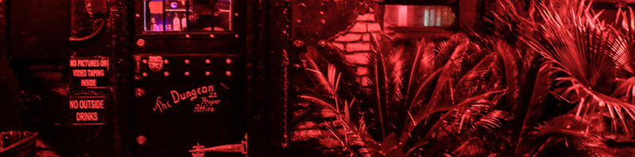
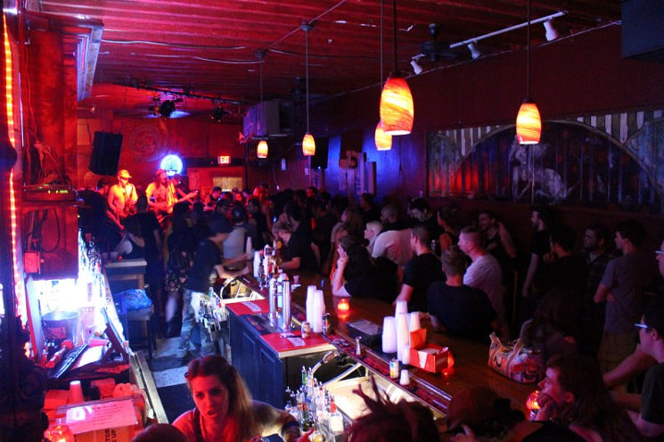

I've been getting a fair dose of New Orleans cajun grub lately so I went back to my roots and picked out a few bands from NOLA (That's New Orleans, Lousiana FYI). Be prepared, NOLA Metal is a special level of sludgy heaviness and growl combined with some slightly psychodelic melodies thrown in. 

With that, enjoy your coding heavy monday metal! 

Top 3 for Spotify

<iframe width="300" height="56" src="https://embed.spotify.com/follow/1/?uri=spotify%3Aartist%3A3xtIpqzIOfQUxKce8BU4Ka&amp;size=detail&amp;theme=dark" scrolling="no" frameborder="0" style="border:none; overflow:hidden;" allowtransparency="true"></iframe>

<iframe width="300" height="56" src="https://embed.spotify.com/follow/1/?uri=spotify%3Aartist%3A1m0B9ak05G0jqDY4ACLhQu&amp;size=detail&amp;theme=dark" scrolling="no" frameborder="0" style="border:none; overflow:hidden;" allowtransparency="true"></iframe>

<iframe width="300" height="56" src="https://embed.spotify.com/follow/1/?uri=spotify%3Aartist%3A5kuYamMO00pHPdRQcAXWTl&amp;size=detail&amp;theme=dark" scrolling="no" frameborder="0" style="border:none; overflow:hidden;" allowtransparency="true"></iframe>

Top 3 Videos for Youtube

<iframe width="853" height="480" src="https://www.youtube.com/embed/AxcaIKMAJ3Y" frameborder="0" allowfullscreen></iframe>

<iframe width="853" height="480" src="https://www.youtube.com/embed/_u8rVrUDgRU" frameborder="0" allowfullscreen></iframe>

<iframe width="853" height="480" src="https://www.youtube.com/embed/TPF4vIXpAsA" frameborder="0" allowfullscreen></iframe>

