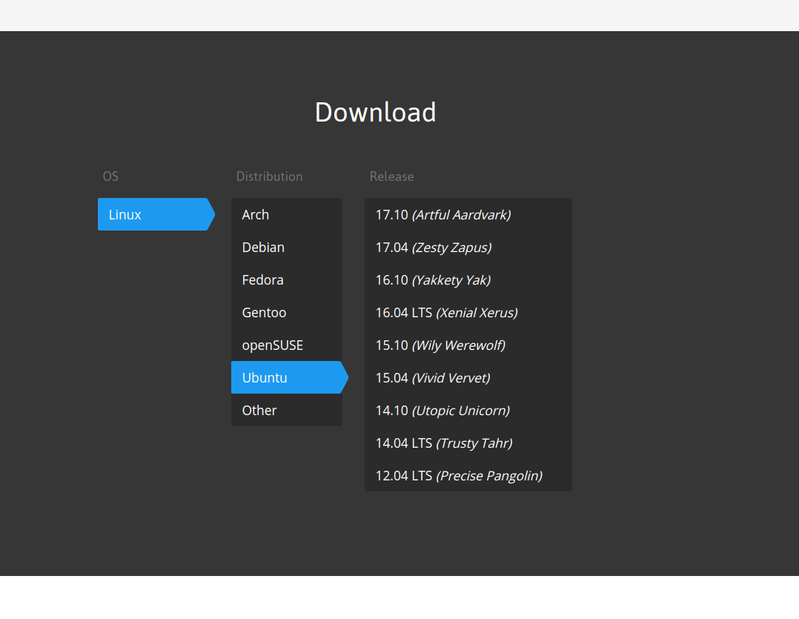

***Gnome Pomodoro***

Today started off with an intent to document everything I found partially interesting or that might be useful to others. So here goes.

First thing I did was finally decide I was going to pull the trigger on something I could use to time myself between work session. As some may call it, measuring pomodoros or some such. Whatever it's called I wanted an application for this on my Linux machine so I dug up this Gnome Pomodoro tool and found the [site here](http://gnomepomodoro.org/).

[](http://gnomepomodoro.org/)

The first thing I did was realize upon searching through the menu for the installation or download steps that I didn't recall what version of Ubuntu I'm running on this particular box. Neither did I remember the commands to figure this out. It seemed time that I add those commands to my docs on the ["Git and Bash Commands I Never Remember"](http://blog.adron.me/docs/git-and-bash-commands-i-never-remember/) page. Upon determining I have 16.04 LTS (Xenial Xerus) I pulled up the command and installed the application.

```
sudo apt-get install gnome-shell-pomodoro
```

<span class="more"></span>

***Ordering Git Branches for Tutorials***

When presenting code or any other material from a Git repository it's good to have a starting and finished state of the repository. One way to do this is to create state branches.


***Training Material People Want - What is it?***

I had a few meetings today discussing training and teaching topics. Some of the topics I started off with included the following;

* CI/CD Task List - covers infosec/security/code coverage/financial impact/more. Basically an exhaustive list of how to setup CI/CD and the differences one may define.
* Multi-Cloud - What it is, how to do it, and why one would probably not want to actually do this.
* Application Observability - How to wire up an application for observance. Can we see it, does it provide an effective picture of what events are actually taking place?

Slowly another dozen topics came up from that conversation along with a range of questions. Is something newer around bash related to the deployment of cloud native applications something that might be useful? What about service based, core operability languages, something beyond scripting but something that can get into serious performance, cross-platform capabilities and the like? Would that be useful?

Other questions came up around ACS & AKS at Azure and the related Kubernetes work that Microsoft has been doing. There's almost painfully a point of confusiong around all of the Kubernetes offerings from Google Cloud Platform, Amazon Web Services, and Azure these days to the point of just not using it.

After thoroughly taking apart a number of topic ideas a few themes started to come up;

* For one avenue connecting the ideas of Go, Cloud Native, Chaos Engineering, and the daily task list of things one can put together from an operational perspective with Go.

* The next was pushing forward with training around test or behavior driven development, the workflow of enterprise development, the workflow of individuals within that development, enterprise design patterns, and how some of the most in demand material needed is that around "boring" topics that help enterprises to fill highly skilled positions. 

There's a lot of possibilities there, any other thoughts? What would you like to see in training materials or videocasts? Ping me [@Adron](https://twitter.com/adron) if you want to discuss or just let me know of some topic ideas.

***Organizing Some Pair Programming***

