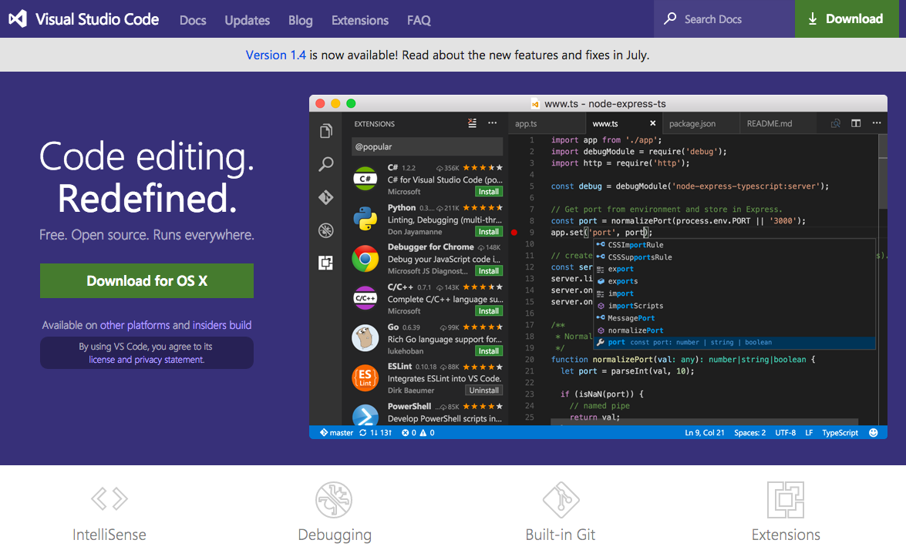
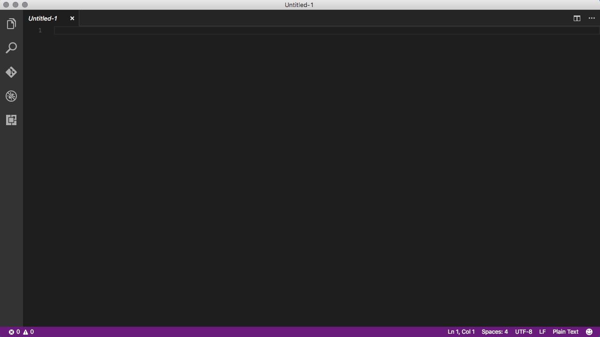
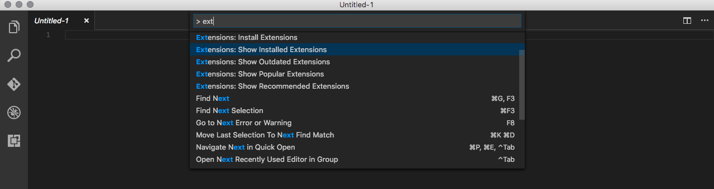
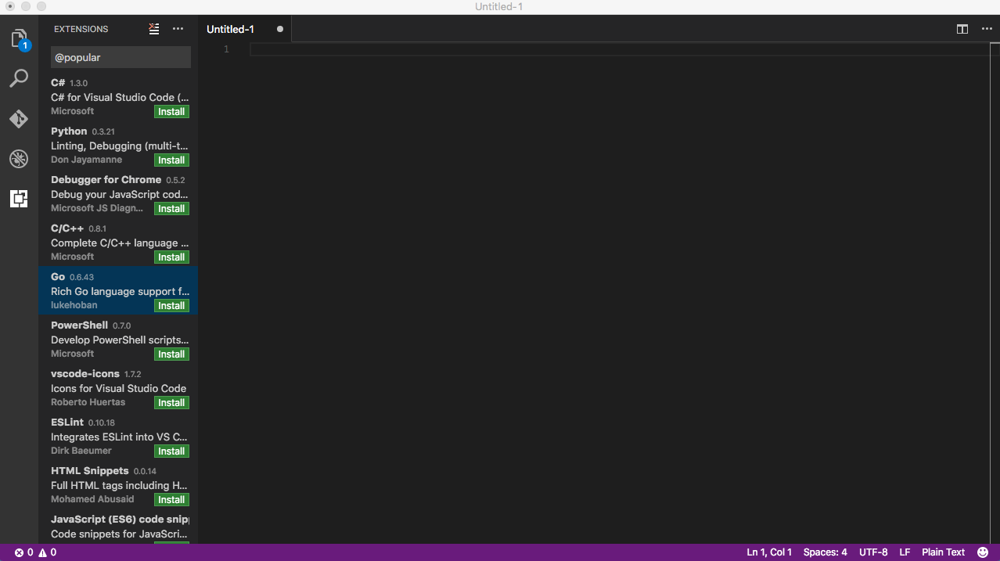
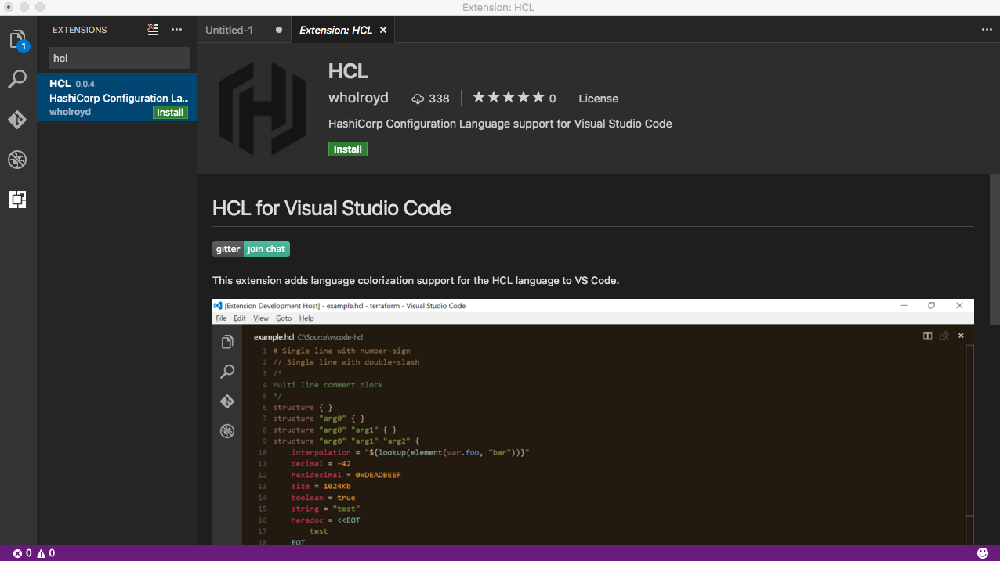
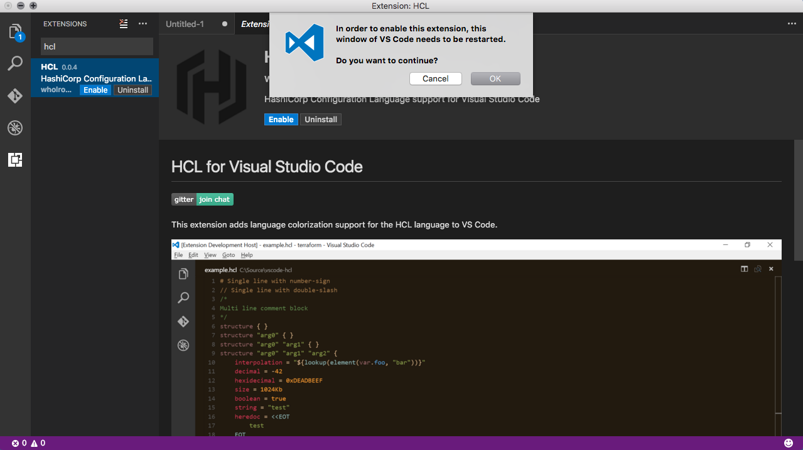
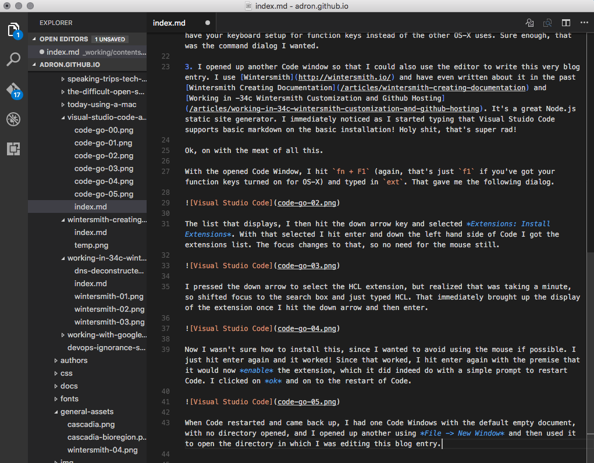
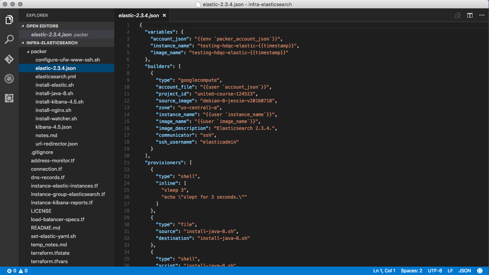
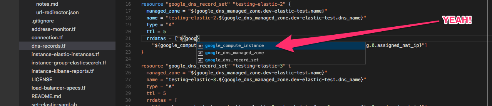

I sat down to setup Visual Studio Code for some Go coding. That is, #golang or "golang" on Google, because heaven forbid a language is named something that isn't ubiquitous like the word "go". But anyway, I digress, because this blog entry isn't even about golang. It's about HCL. You see, I sat down to toy about with golang but then I had to knock out a few tasks with Terraform, Packer, and such. To do that I needed the HCL support that Visual Studio Code has. I knew there was a plugin for Hashicorp Configuration Language (i.e. HCL). So I decided to do that work in Visual Studio Code and try out the HCL Plugin. Maybe next blog entry I'll get around to writing some golang in Visual Studio Code?

The first thing I needed to do though, was download and get Visual Studio Code. I'd neglected to learn much about it or use Code (I'll just call it that from now on, Visual Studio Code is way to much to write, plus it's not really got much in familial relation to Visual Studio). That download, it all started [here](https://code.visualstudio.com). I opened it upon finishing installation to a brand new Visual Studio Code Window.

I toyed about a moment looking at the Visual Studio Code website, then toyed around with the editor, and noticed three things immediately.

1. When I navigated to `https://code.visualstudio.com` I noticed I was redirected or someway navigated to a link that immediately shoved some type of session mess into the URI. My link of `https://code.visualstudio.com` turned into `https://code.visualstudio.com/b?utm_expid=101350005-27.GqBWbOBuSRqlazQC_nNSRg.1`. Now I'm not sure about you but that type of behavior on a website actually pisses me off and makes me paranoid. I went through various things to determine what was going on, but suffice it to say I determined it was just an annoying contrivance that the site managers make the site do. Whatever...

2. The second thing I noticed was that I had no idea what to do to install plugins. Was it the same as Atom as I'd heard? Was it some other command? I assumed since I'd used Code a few times before, it was likely the command line I tried a few based on other tooling. First `⌘ + space`, nope, that was dumb. I have that mapped to [Spotlight](https://en.wikipedia.org/wiki/Spotlight_(software)). Ok, so then I tried `⌥ + space`, nope. `⌘ + ⌥ + ^ + F12`, naw. Ok, dammit, I guess it's `⌘` key plus something I'll bet. Then I tried a whole slew and sure enough, **`⌘ + p`** was the magic sauce. But wait, it wasn't. At this point I thought "maybe I should look this up" but I decide to stay stubborn and try some other things I *think* I remember about Code. I try the `fn + F1`, or what might be just `F1` if you have your keyboard setup for function keys instead of the other OS-X uses. Sure enough, that was the command dialog I wanted.  

3. I opened up another Code window so that I could also use the editor to write this very blog entry. I use [Wintersmith](http://wintersmith.io/) and have even written about it in the past [Wintersmith Creating Documentation](/articles/wintersmith-creating-documentation) and [Working in -34c Wintersmith Customization and Github Hosting](/articles/working-in-34c-wintersmith-customization-and-github-hosting). It's a great Node.js static site generator. I immediately noticed as I started typing that Visual Stuido Code supports basic markdown on the basic installation! Holy shit, that's super rad!

Ok, on with the meat of all this.

With the opened Code Window, I hit `fn + F1` (again, that's just `f1` if you've got your function keys turned on for OS-X) and typed in `ext`. That gave me the following dialog.

The list that displays, I then hit the down arrow key and selected *Extensions: Install Extensions*. With that selected I hit enter and down the left hand side of Code I got the extensions list. The focus changes to that, so no need for the mouse still.

I pressed the down arrow to select the HCL extension, but realized that was taking a minute, so shifted focus to the search box and just typed HCL. That immediately brought up the display of the extension once I hit the down arrow and then enter.

Now I wasn't sure how to install this, since I wanted to avoid using the mouse if possible. I just hit enter again and it worked! Since that worked, I hit enter again with the premise that it would now *enable* the extension, which it did indeed do with a simple prompt to restart Code. I clicked on *ok* and on to the restart of Code.

When Code restarted and came back up, I had one Code Windows with the default empty document, with no directory opened, and I opened up another using *File -> New Window* and then used it to open the directory in which I was editing this blog entry. 

To get the word wrap back (which I'd manually clicked before) I recalled the shortcut key is `⌥ + Z`. This is super useful when editing markdown like this, so it's a keyboard shortcut to set to memory.

Now at this point I should have some HCL. I kick of my pulling down an existing project that I'm working on. I opened it by using the `⌘ + O` keys. The project opened up and I immediately opened one of the /*.json files that I have for a Packer image.

That looked good so far. Let's see about intellisense and Terraform. I used `ctrl + shift + E` to get into the Explorer part of the editor. Then scrolled with the down arrow to the *dns-records.tf* file. I atttempted to select the file with the `return` button, but that invoked the *rename* functionality. I tried a few other things, the *space bar*, other unusable combinations, and then `ctrl + return`.

*Nothing*. This was a bit frustrating, to get this far and stumble because I need to use the bloody mouse. Whatever, I clicked on the mouse to open the *dns-records.tf* file. I then clicked into the file and tried out something around the intellisense (or is it autocomplete in Code?).

This test I found rather interesting. The options, once I started typing *goog* immediately showed as *google_compute_instance*, *google_dns_managed_zone*, and *google_dns_record_set*. A somewhat odd selection indeed of these resources. You see, there are many other HCL resources for Google Compute Engine besides these three. But these specific three displayed in the dropdown. I looked throughout the file, and assumed that these three were retrieved from words in the file. Maybe the intellisense is more autocomplete then intellisense. Whatever the case however as I'm happy with just autocomplete. I don't particularly need intellisense, especially since I haven't used it now for about 6 years.

So that's my first tour of Visual Studio Code and HCL. My next tour and test is going to be finding some more of these bloody shortcuts I haven't been able to find and to actually write some golang in the editor too.

For now, I've got some HCL to put together for the coming [Monday night Elastic UG meetup](https://www.meetup.com/The-Portland-Elasticsearch-Meetup-Group/events/228010912/) on [Elastic w/ Terraform, Packer, & That Immutability Magic](http://blog.adron.me/talks/elastic-with-terraform-packer-and-immutability-magic/).